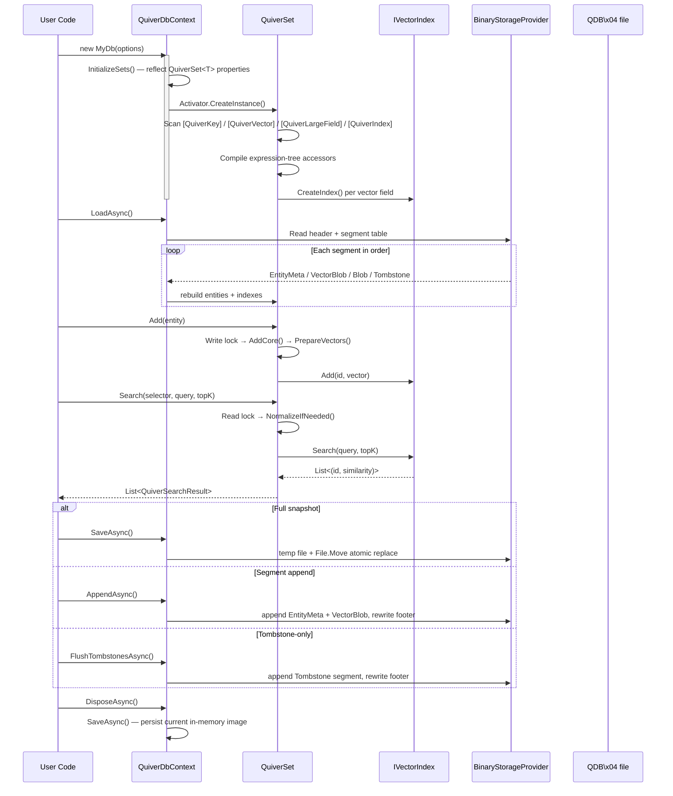

# Vorcyc Quiver 4.0.1

[English Document](README.md) | [中文文档](README_zh.md)


> **A pure .NET embedded vector database** — zero native dependencies, in-process deployment, EF Core-style code-first modeling.

| Item | Value |
|---|---|
| Version | 4.0.1 |
| Target Framework | .NET 10 |
| License | MIT |
| NuGet | [](https://www.nuget.org/packages/Vorcyc.Quiver) |
| Source | https://github.com/vorcyc/Vorcyc.Quiver |
| WIKI | https://github.com/vorcyc/Vorcyc.Quiver/wiki |
| Namespace | `Vorcyc.Quiver` |

> **Name Origin**: Quiver — a container for arrows; a vector is mathematically an arrow.

---

## What is Quiver?

**Quiver** is a pure .NET embedded vector database with zero native dependencies, running as an in-process library without requiring a standalone database server. It draws on EF Core's `DbContext` design pattern — annotate entity classes with attributes such as `[QuiverKey]`, `[QuiverVector]`, `[QuiverLargeField]`, and `[QuiverIndex]`, and the framework automatically handles model discovery, index construction, and persistence at runtime.

### Core Capabilities

| Capability | Description |
|---|---|
| **Code-First Declarative Modeling** | Like EF Core, annotate entity classes with attributes; the framework auto-discovers `QuiverSet<T>` collections via reflection — zero configuration required. |
| **Multiple ANN Index Algorithms** | Built-in **Flat** (brute-force), **HNSW** (Hierarchical Navigable Small World), **IVF** (Inverted File Index), **KDTree** — from small-scale exact search to million-scale approximate search. |
| **Binary-First Persistence (v4 Segmented)** | `SaveAsync` writes a full atomic snapshot; `AppendAsync` / `FlushTombstonesAsync` append new segments and only rewrite the footer — O(Δ) disk cost, no WAL memory doubling. |
| **Mmap Vector Storage** | `VectorMemoryMode.MemoryMapped` / `Auto` backs vector arenas with a read-only memory-mapped view, cutting resident memory for large vector sets while keeping SIMD-friendly access. |
| **Concurrency Safety** | `QuiverSet<T>` uses `ReaderWriterLockSlim` internally — concurrent multi-threaded search and write are inherently safe. |
| **9 Distance Metrics + Custom** | Cosine, Euclidean, DotProduct, Manhattan, Chebyshev, Pearson, Hamming, Jaccard, Canberra, plus custom `ISimilarity<float>`. |
| **SIMD Acceleration** | All similarity computations use `Vector<float>` SIMD, auto-adapting to SSE4 / AVX2 / AVX-512. No `System.Numerics.Tensors` dependency. |
| **Schema Migration** | Declare property-rename and value-transform rules via `ConfigureMigration<T>()`; new/deleted fields are handled automatically. |
| **File Utilities** | `QuiverDbFile.MergeAsync` (multi-file merge with `FirstWriterWins` / `LastWriterWins`) and `InspectAsync` (per-segment CRC verification). |

**Typical Use Cases**: Semantic search · RAG (Retrieval-Augmented Generation) · Face recognition · Image-to-image search · Recommendation systems · Multimodal retrieval

> ⚠️ **Native AOT**: Quiver is **not compatible with Native AOT publishing** (`PublishAot=true`). The framework uses runtime reflection for `QuiverSet<T>` discovery and compiles expression-tree accessors at startup. Target standard JIT / .NET 10 runtimes only.

---

## Quick Start

### 1. Install

```
dotnet add package Vorcyc.Quiver
```

### 2. Define Entity

```csharp
using Vorcyc.Quiver;

public class Document
{
	[QuiverKey]
	public string Id { get; set; } = string.Empty;

	public string Title { get; set; } = string.Empty;

	public string Category { get; set; } = string.Empty;

	[QuiverVector(384, DistanceMetric.Cosine)]
	public float[] Embedding { get; set; } = [];
}
```

### 3. Define Database Context

```csharp
public class MyDocumentDb : QuiverDbContext
{
	public QuiverSet<Document> Documents { get; set; } = null!;

	public MyDocumentDb() : base(new QuiverDbOptions
	{
		DatabasePath = "documents.vdb",
		DefaultMetric = DistanceMetric.Cosine
	})
	{ }
}
```

### 4. Add, Search, Save

```csharp
// DisposeAsync does NOT auto-save by default (SaveOnDispose defaults to false).
// Call SaveAsync() explicitly, or set SaveOnDispose = true in QuiverDbOptions.
await using var db = new MyDocumentDb();
await db.LoadAsync(); // silently returns if file doesn't exist

// Add entity
db.Documents.Add(new Document
{
	Id = "doc-001",
	Title = "Introduction to Vector Databases",
	Category = "Tutorial",
	Embedding = new float[384] // replace with your model's embedding output
});

// Search Top-5 most similar documents
float[] queryVector = new float[384];
var results = db.Documents.Search(
	e => e.Embedding,
	queryVector,
	topK: 5
);

foreach (var result in results)
	Console.WriteLine($"{result.Entity.Title}  similarity={result.Similarity:F4}");

await db.SaveAsync(); // explicitly save to disk
```

### 5. Incremental Append (Batch Ingest)

```csharp
// Use synchronous `using` for batched ingest — `await using` calls SaveAsync()
// on dispose and would overwrite freshly appended segments if cleared first.
using var db = new MyDocumentDb();
await db.LoadAsync();

foreach (var batch in EnumerateBatches())
{
	foreach (var doc in batch) db.Documents.Add(doc);
	await db.AppendAsync();   // O(Δ) segment append, no full rewrite
	db.Documents.Clear();     // free memory; on-disk segments are unaffected
}

// Optional manual compaction (background merge can also do this automatically)
await db.SaveAsync();
```

---

## End-to-End Flow



---

## Documentation

Full chapter documentation is available in the [English Wiki](wiki_en/Home.md):

| # | Chapter |
|---|---|
| 01 | [Release Notes](wiki_en/01-Release-Notes.md) |
| 02 | [Product Overview](wiki_en/02-Product-Overview.md) |
| 03 | [Architecture Overview](wiki_en/03-Architecture.md) |
| 04 | [Quick Start](wiki_en/04-Quick-Start.md) |
| 05 | [Core Concepts](wiki_en/05-Core-Concepts.md) |
| 06 | [Distance Metrics](wiki_en/06-Distance-Metrics.md) |
| 07 | [Index Types](wiki_en/07-Index-Types.md) |
| 08 | [CRUD Operations](wiki_en/08-CRUD.md) |
| 09 | [Vector Search](wiki_en/09-Vector-Search.md) |
| 10 | [Persistent Storage](wiki_en/10-Persistence.md) |
| 11 | [Migration System](wiki_en/11-Migration-System.md) |
| 11a | [Schema Migration](wiki_en/11-Schema-Migration.md) |
| 12 | [Multi-Vector Field Support](wiki_en/12-Multi-Vector-Fields.md) |
| 13 | [Thread Safety and Concurrency](wiki_en/13-Thread-Safety.md) |
| 14 | [Lifecycle Management](wiki_en/14-Lifecycle.md) |
| 15 | [Configuration Options](wiki_en/15-Configuration.md) |
| 16 | [Internal Implementation Details](wiki_en/16-Internal-Implementation.md) |
| 17 | [Complete Examples](wiki_en/17-Examples.md) |
| 18 | [API Reference Cheat Sheet](wiki_en/18-API-Reference.md) |
| 19 | [Usage Recommendations](wiki_en/19-Usage-Recommendations.md) |

---

## Keywords

`Embedded Vector Database` · `Pure .NET` · `ANN` · `Approximate Nearest Neighbor Search` · `HNSW` · `IVF` · `KDTree` · `Code-First` · `Embedding` · `Semantic Search` · `Face Recognition` · `Image-to-Image Search` · `RAG` · `SIMD` · `Schema Migration` · `ISimilarity` · `Mmap` · `SQ8 Quantization` · `Matryoshka Truncation`
