# Quiver 技术文档

> **产品定位**：纯 .NET 实现的嵌入式向量数据库 —— 零原生依赖，进程内运行，无需独立部署数据库服务器  
> **框架版本**：.NET 10  
> **命名空间**：`Vorcyc.Quiver`  
> **设计理念**：类似 EF Core 的 `DbContext` 模式，通过声明式属性标记实现向量数据库的自动发现、索引构建和持久化  
> **核心特性**：Code-First 声明式实体定义 · 多种 ANN 索引（Flat / HNSW / IVF / KDTree） · 多种持久化格式（JSON / XML / Binary） · WAL 增量持久化 · 读写分离锁并发安全 · SIMD 加速相似度计算  
> **关键字**：`嵌入式向量数据库` `纯 .NET` `ANN` `近似最近邻搜索` `相似度检索` `HNSW` `IVF` `KDTree` `Code-First` `EF Core 风格` `Embedding` `语义搜索` `人脸识别` `以图搜图` `RAG` `SIMD` `WAL` `Write-Ahead Log` `增量持久化` `崩溃恢复`  
> **释名**：Quiver —— 箭袋，装箭（Arrow）的容器，向量的数学本质就是箭头

### 创作梗概

Quiver 的创作灵感，最早可追溯到

- **表结构不可自定义** —— `Ash` 的存储架构由框架内部固定，使用者只能按照预设的字段布局存取数据，无法根据业务需求自由定义实体的属性和结构。当需要为不同场景（如人脸识别、文档检索、多模态搜索）设计差异化的数据模型时，这一限制显得尤为突出。
- **仅支持暴力搜索** —— `Ash` 的检索方式为逐条遍历、逐一计算相似度的暴力搜索（Brute-Force），时间复杂度为 O(n×d)。在数据量较小时尚可接受，但当向量规模增长到数万乃至数十万条时，搜索延迟急剧上升，缺乏近似最近邻（ANN）索引的支持使其难以胜任对响应速度有要求的生产场景。
- **不支持并发操作** —— `Ash` 的内部数据结构未做任何线程同步保护，在多线程环境下同时执行读写操作会导致数据竞争和不可预期的异常。对于需要并发查询的服务端场景（如 ASP.NET Web API 同时处理多个搜索请求），使用者必须在外部自行加锁，既增加了使用复杂度，又容易因锁粒度不当引发性能瓶颈或死锁风险。

在反思这些痛点的过程中，EF Core 的设计哲学带来了关键启发——尤其是其"通过代码定义架构（Code-First）"的理念：开发者只需用特性（Attribute）标记实体类的属性，框架便自动完成模型发现、关系映射和数据持久化，整个过程声明式且无侵入。

最终，让使用者专注于业务语义而非底层细节。

---

### 产品简介

**Quiver** 是一款纯 .NET 实现的嵌入式向量数据库，无任何原生依赖，以进程内库的形式运行，无需独立部署数据库服务器。它借鉴 EF Core 的 `DbContext` 设计模式，让开发者通过 `[QuiverKey]`、`[QuiverVector]`、`[QuiverIndex]` 等声明式特性定义实体与索引策略，框架在运行时自动完成模型发现、索引构建和持久化管理。

**核心能力一览**：

- **Code-First 声明式建模** —— 像 EF Core 一样用特性标记实体类，框架自动反射发现并注册 `QuiverSet<T>` 集合，零配置即可使用。
- **多种 ANN 索引算法** —— 内置 Flat（暴力搜索）、HNSW（分层可导航小世界图）、IVF（倒排文件索引）、KDTree（KD 树）四种索引，覆盖从小数据量精确搜索到百万级近似搜索的全场景需求。
- **灵活的持久化方案** —— 支持 JSON（可读调试）、XML（兼容性）、Binary（高性能生产）三种存储格式，以及 WAL（Write-Ahead Log）增量持久化机制，高频写入场景下持久化复杂度从 O(N) 降至 O(Δ)。
- **开箱即用的并发安全** —— `QuiverSet<T>` 内部通过 `ReaderWriterLockSlim` 实现读写分离锁，多线程并发搜索与写入天然安全，无需外部加锁。
- **SIMD 硬件加速** —— 基于 `TensorPrimitives` 的 SIMD 指令加速向量相似度计算与 L2 归一化，充分利用现代 CPU 的向量化能力。

**典型应用场景**：语义搜索、RAG（检索增强生成）、人脸识别、以图搜图、推荐系统、多模态检索等。

---

## 目录

1. [架构概览](#1-架构概览)
2. [快速开始](#2-快速开始)
3. [核心概念](#3-核心概念)
   - [实体定义与特性标记](#31-实体定义与特性标记)
   - [数据库上下文 QuiverDbContext](#32-数据库上下文-quiverdbcontext)
   - [向量集合 QuiverSet\<T\>](#33-向量集合-quiversett)
4. [距离度量](#4-距离度量)
5. [索引类型](#5-索引类型)
   - [Flat（暴力搜索）](#51-flat暴力搜索)
   - [HNSW（分层可导航小世界图）](#52-hnsw分层可导航小世界图)
   - [IVF（倒排文件索引）](#53-ivf倒排文件索引)
   - [KDTree（KD 树）](#54-kdtreekd-树)
   - [索引选择决策指南](#55-索引选择决策指南)
6. [CRUD 操作](#6-crud-操作)
7. [向量搜索](#7-向量搜索)
   - [Top-K 搜索](#71-top-k-搜索)
   - [阈值搜索](#72-阈值搜索)
   - [带过滤的搜索](#73-带过滤的搜索)
   - [Top-1 搜索](#74-top-1-搜索)
   - [异步搜索](#75-异步搜索)
   - [默认字段便捷方法](#76-默认字段便捷方法)
8. [持久化存储](#8-持久化存储)
   - [WAL 增量持久化](#86-wal-增量持久化)
9. [多向量字段支持](#9-多向量字段支持)
10. [线程安全与并发](#10-线程安全与并发)
11. [生命周期管理](#11-生命周期管理)
12. [配置选项](#12-配置选项)
13. [内部实现细节](#13-内部实现细节)
14. [完整示例](#14-完整示例)
15. [API 参考速查表](#15-api-参考速查表)

---

## 1. 架构概览

### 1.1 分层架构

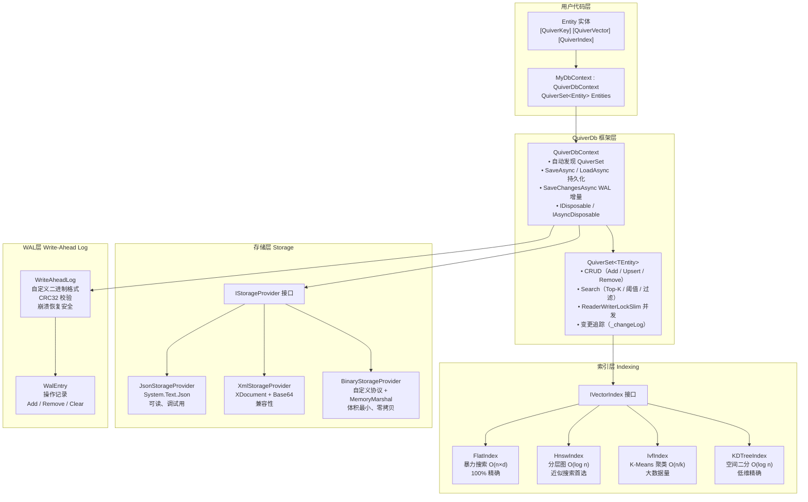

### 1.2 核心组件总览

| 组件 | 类型 | 职责 |
|------|------|------|
| `QuiverDbContext` | `abstract class` | 数据库上下文基类，管理 QuiverSet 集合的反射自动发现、持久化读写、生命周期 |
| `QuiverSet<TEntity>` | `class` | 向量集合，提供完整 CRUD + 多种搜索模式，内部 `ReaderWriterLockSlim` 读写锁 |
| `IVectorIndex` | `internal interface` | 向量索引统一契约，定义 `Add` / `Remove` / `Clear` / `Search` / `SearchByThreshold` |
| `IStorageProvider` | `internal interface` | 持久化统一契约，支持 `SaveAsync` / `LoadAsync` |
| `StorageProviderFactory` | `internal static class` | 工厂方法，根据 `StorageFormat` 枚举创建对应的 `IStorageProvider` 实例 |
| `QuiverVectorAttribute` | `Attribute` | 标记向量字段，指定维度 (`dimensions`) 和距离度量 (`metric`) |
| `QuiverKeyAttribute` | `Attribute` | 标记实体主键（每个实体有且仅有一个） |
| `QuiverIndexAttribute` | `Attribute` | 配置索引类型及调优参数（可选，默认 Flat） |
| `QuiverDbOptions` | `class` | 全局配置：存储路径、默认度量、格式、JSON 选项、WAL 配置 |
| `QuiverSearchResult<T>` | `record` | 搜索结果 DTO，包含 `Entity` 和 `Similarity` |
| `WriteAheadLog` | `internal sealed class` | WAL 文件读写引擎，自定义二进制格式 + CRC32 校验，崩溃恢复安全 |
| `WalEntry` | `internal sealed record` | WAL 变更记录，包含操作类型、目标类型名、JSON 载荷 |
| `WalOperation` | `internal enum` | WAL 操作类型：Add / Remove / Clear |

### 1.3 类关系图

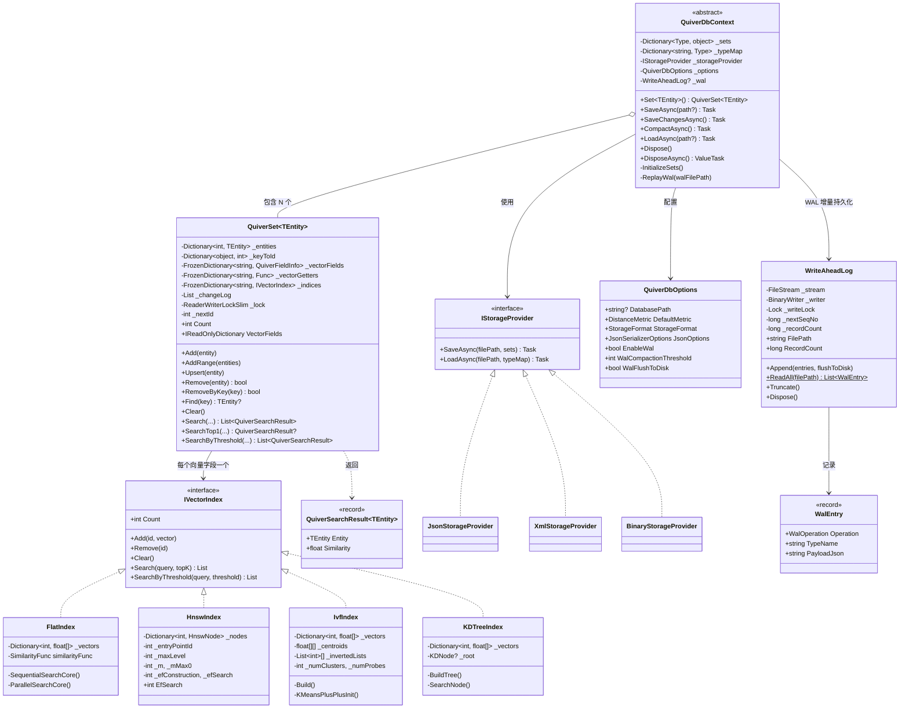

---

## 2. 快速开始

### 2.1 定义实体类

```csharp
using Vorcyc.Quiver;

public class Document
{
    [QuiverKey]
    public string Id { get; set; } = string.Empty;

    public string Title { get; set; } = string.Empty;

    public string Category { get; set; } = string.Empty;

    [QuiverVector(384, DistanceMetric.Cosine)]
    public float[] Embedding { get; set; } = [];
}
```

### 2.2 定义数据库上下文

```csharp
public class MyDocumentDb : QuiverDbContext
{
    public QuiverSet<Document> Documents { get; set; } = null!;

    public MyDocumentDb() : base(new QuiverDbOptions
    {
        DatabasePath = "documents.json",
        StorageFormat = StorageFormat.Json,
        DefaultMetric = DistanceMetric.Cosine
    })
    { }
}
```

### 2.3 基本使用

```csharp
// 创建数据库，使用 await using 确保自动保存
await using var db = new MyDocumentDb();
await db.LoadAsync(); // 加载已有数据（文件不存在时静默返回）

// 添加实体
db.Documents.Add(new Document
{
    Id = "doc-001",
    Title = "向量数据库入门",
    Category = "教程",
    Embedding = new float[384] // 实际应为模型输出的嵌入向量
});

// 搜索 Top-5 最相似的文档
float[] queryVector = new float[384]; // 查询向量
var results = db.Documents.Search(
    e => e.Embedding,
    queryVector,
    topK: 5
);

foreach (var result in results)
{
    Console.WriteLine($"文档: {result.Entity.Title}, 相似度: {result.Similarity:F4}");
}

// 作用域结束时 DisposeAsync 自动保存数据到磁盘
```

### 2.4 WAL 增量模式快速开始

启用 WAL 后，日常写入仅追加变更到 WAL 文件，复杂度 O(Δ)，比全量快照快数个数量级：

```csharp
// WAL 模式数据库上下文
public class MyWalDb : QuiverDbContext
{
    public QuiverSet<Document> Documents { get; set; } = null!;

    public MyWalDb() : base(new QuiverDbOptions
    {
        DatabasePath = "documents.vdb",
        StorageFormat = StorageFormat.Binary,
        EnableWal = true,              // 启用 WAL
        WalCompactionThreshold = 10_000, // WAL 记录超过 1万条自动压缩
        WalFlushToDisk = true            // fsync 保证持久性
    })
    { }
}

// 使用
await using var db = new MyWalDb();
await db.LoadAsync(); // 加载快照 + 回放 WAL 增量变更

db.Documents.Add(new Document
{
    Id = "doc-001",
    Title = "向量数据库入门",
    Category = "教程",
    Embedding = new float[384]
});

// 仅追加变更到 WAL，O(Δ) 复杂度
await db.SaveChangesAsync();

// 需要时可手动压缩：创建全量快照 + 清空 WAL
await db.CompactAsync();

// 作用域结束时 DisposeAsync 自动调用 SaveChangesAsync
```

### 2.5 端到端流程

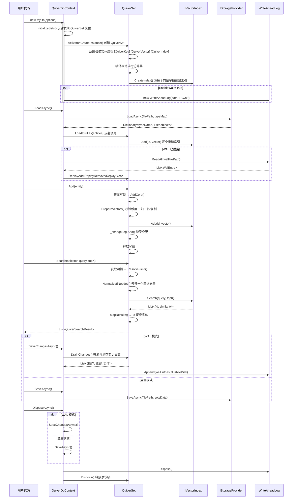

---

## 3. 核心概念

### 3.1 实体定义与特性标记

实体类通过 Attribute 声明向量数据库的元数据。`QuiverSet<TEntity>` 构造时通过反射扫描这些特性来自动发现和注册字段。

#### `[QuiverKey]` — 主键标记

每个实体**必须有且仅有**一个 `[QuiverKey]` 属性。支持任意类型（`string`、`int`、`Guid` 等）。运行时主键值通过编译后的表达式树访问器读取，内部以 `object` 装箱存储在 `Dictionary<object, int>` 中实现 O(1) 查找和去重。

```csharp
[QuiverKey]
public string PersonId { get; set; } = string.Empty;
```

**约束**：
- 主键值不能为 `null`（写入时校验）
- 主键在集合内必须唯一（`Add` 时校验，`Upsert` 时自动处理）
- 缺少 `[QuiverKey]` 属性时，`QuiverSet` 构造抛出 `InvalidOperationException`

#### `[QuiverVector(dimensions, metric)]` — 向量字段标记

标记属性为向量特征字段。**属性类型必须为 `float[]`**。一个实体可标记多个向量字段（多模态场景）。

```csharp
// 128 维向量，使用余弦相似度（默认）
[QuiverVector(128)]
public float[] Embedding { get; set; } = [];

// 384 维向量，显式指定欧几里得距离
[QuiverVector(384, DistanceMetric.Euclidean)]
public float[] TextFeature { get; set; } = [];
```

**参数说明**：

| 参数 | 类型 | 默认值 | 说明 |
|------|------|--------|------|
| `dimensions` | `int` | — (必填) | 向量维度，运行时校验 `vector.Length == dimensions` |
| `metric` | `DistanceMetric` | `Cosine` | 距离度量类型 |

> **常见维度**：128（轻量模型）、384（MiniLM）、768（BERT-base）、1024（BERT-large）、1536（OpenAI Ada-002）、3072（OpenAI text-embedding-3-large）。

**运行时行为**：
- 写入时（`AddCore` / `PrepareVectors`）：校验维度是否匹配，不匹配抛出 `ArgumentException`
- `Cosine` 度量：执行 L2 归一化后存入索引（`NormalizeToArray`）
- 非 `Cosine` 度量：执行防御性复制（`vector.Clone()`），防止外部修改数组导致索引损坏

#### `[QuiverIndex(indexType)]` — 索引配置（可选）

与 `[QuiverVector]` 标记在同一属性上使用，为该向量字段指定索引策略。**未标记时默认使用 Flat 暴力搜索**。

```csharp
// HNSW 索引：高维向量的近似搜索首选
[QuiverVector(768)]
[QuiverIndex(VectorIndexType.HNSW, M = 32, EfConstruction = 300, EfSearch = 100)]
public float[] Embedding { get; set; } = [];

// IVF 索引：大数据量场景
[QuiverVector(128)]
[QuiverIndex(VectorIndexType.IVF, NumClusters = 100, NumProbes = 15)]
public float[] Feature { get; set; } = [];

// KDTree 索引：仅适合低维 < 20
[QuiverVector(16)]
[QuiverIndex(VectorIndexType.KDTree)]
public float[] LowDimFeature { get; set; } = [];
```

**`QuiverIndexAttribute` 完整参数**：

| 参数 | 适用索引 | 默认值 | 说明 |
|------|---------|--------|------|
| `IndexType` | 全部 | `Flat` | 索引类型枚举 |
| `M` | HNSW | 16 | 每层最大邻居连接数，第 0 层自动 `M × 2` |
| `EfConstruction` | HNSW | 200 | 构建时候选集大小 |
| `EfSearch` | HNSW | 50 | 搜索时候选集大小，须 ≥ topK |
| `NumClusters` | IVF | 0 (自动 √n) | K-Means 聚类数量 |
| `NumProbes` | IVF | 10 | 搜索时探测的聚类数 |

### 3.2 数据库上下文 QuiverDbContext

`QuiverDbContext` 是向量数据库的核心入口，设计上模仿 EF Core 的 `DbContext`。

#### 自动发现机制

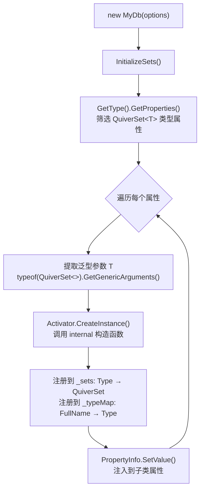

**关键行为**：

- **自动发现**：构造时通过反射扫描子类的**所有** `QuiverSet<T>` 公共属性，自动创建实例并注入（无需手动 `new`）。
- **持久化**：通过 `SaveAsync()` / `LoadAsync()` 将所有集合数据委托给 `IStorageProvider` 序列化/反序列化。
- **生命周期**：实现 `IDisposable` 和 `IAsyncDisposable`。同步 `Dispose` 仅释放资源；异步 `DisposeAsync` 会**先自动保存再释放**。

```csharp
public class MyDb : QuiverDbContext
{
    // 声明即注册，无需手动初始化。构造后属性值由框架自动注入。
    public QuiverSet<FaceFeature> Faces { get; set; } = null!;
    public QuiverSet<Document> Documents { get; set; } = null!;

    public MyDb(string path, StorageFormat format)
        : base(new QuiverDbOptions
        {
            DatabasePath = path,
            StorageFormat = format
        })
    { }
}
```

**泛型方法访问**：

```csharp
// 以下两种方式等价：
var set1 = db.Faces;              // 直接属性访问
var set2 = db.Set<FaceFeature>(); // 泛型方法访问（支持动态类型查找）
// Set<T>() 内部查找 _sets 字典，未找到抛出 InvalidOperationException
```

### 3.3 向量集合 QuiverSet\<TEntity\>

`QuiverSet<TEntity>` 是面向单个实体类型的向量集合，提供完整的 CRUD 和搜索能力。

#### 内部数据结构

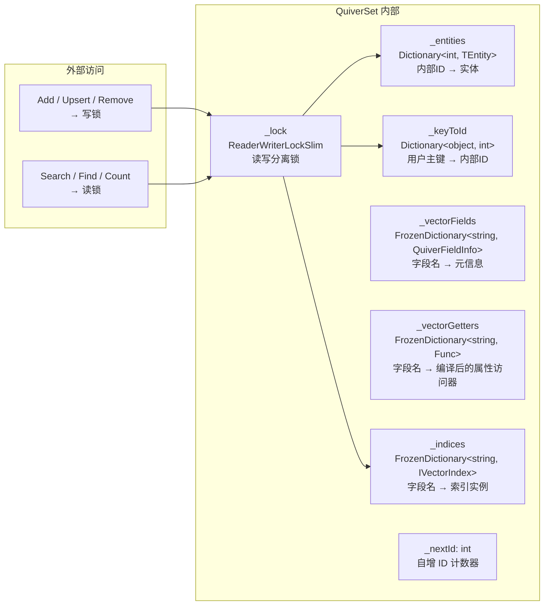

#### 构造时初始化流程

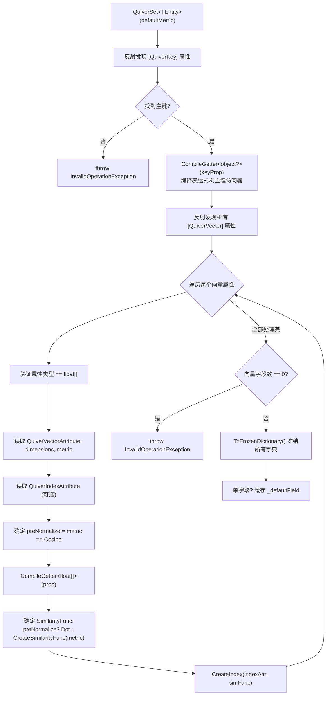

**性能优化要点**：

| 优化点 | 技术 | 效果 |
|--------|------|------|
| 属性访问 | 表达式树编译 `Func<TEntity, T>` | 纳秒级，比反射 `PropertyInfo.GetValue` 快 ~100 倍 |
| 元数据查找 | `FrozenDictionary` | 零堆分配，针对小 key 集优化哈希策略 |
| Cosine 计算 | 预归一化 + `TensorPrimitives.Dot` | 避免每次搜索重复计算范数 |
| L2 归一化 | `TensorPrimitives.Norm` + `Divide` | SIMD 加速 |
| 相似度函数 | 直接绑定 `TensorPrimitives` 方法组 | 零 lambda 开销 |

---

## 4. 距离度量

`DistanceMetric` 枚举定义了三种向量相似度计算方式：

| 度量类型 | 数学公式 | 值域 | 适用场景 | 预归一化 |
|---------|----------|------|---------|---------|
| `Cosine` | $\cos(\theta) = \frac{a \cdot b}{\|a\| \times \|b\|}$ | [-1, 1] | 文本嵌入、语义搜索 | ✅ 自动启用 |
| `Euclidean` | $\frac{1}{1 + \|a - b\|_2}$ | (0, 1] | 空间坐标、物理距离 | ❌ |
| `DotProduct` | $a \cdot b = \sum_i a_i b_i$ | $(-\infty, +\infty)$ | 已归一化向量、MIPS | ❌ |

### 4.1 Cosine 预归一化优化原理

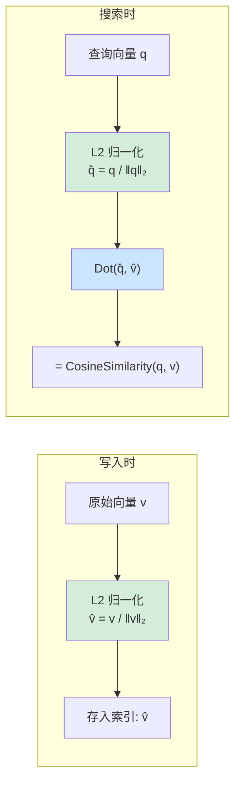

**为什么 Dot 替代 Cosine 更快？**

- `CosineSimilarity(a, b)` = 一次点积 + 两次范数计算 = **3 次向量遍历**
- 预归一化后，`Dot(â, b̂)` = 一次点积 = **1 次向量遍历**
- 归一化开销在写入/查询时各只执行一次，搜索时对 N 个候选只做点积

**SIMD 加速实现**：

```csharp
// 使用 TensorPrimitives 的 SIMD 优化实现
private static void NormalizeVector(ReadOnlySpan<float> source, Span<float> destination)
{
    var norm = TensorPrimitives.Norm(source);    // SIMD 加速 L2 范数
    if (norm > 0f)
        TensorPrimitives.Divide(source, norm, destination); // SIMD 加速向量除法
    else
        destination.Clear(); // 零向量安全处理，避免 NaN
}
```

### 4.2 度量选择建议

```csharp
// Cosine — 最常用，文本/语义搜索
[QuiverVector(384, DistanceMetric.Cosine)]
public float[] TextEmbedding { get; set; } = [];

// Euclidean — 关心绝对距离的场景（地理坐标、物理空间）
[QuiverVector(3, DistanceMetric.Euclidean)]
public float[] Position { get; set; } = [];

// DotProduct — 向量已预归一化或需要最大内积搜索 (MIPS)
[QuiverVector(128, DistanceMetric.DotProduct)]
public float[] Feature { get; set; } = [];
```

### 4.3 相似度函数映射

框架内部根据度量类型创建不同的 `SimilarityFunc` 委托（`ReadOnlySpan<float>, ReadOnlySpan<float> → float`），可直接绑定 `TensorPrimitives` 静态方法组：

| 度量 | PreNormalize | 绑定的函数 |
|------|-------------|-----------|
| `Cosine` | `true` | `TensorPrimitives.Dot` |
| `DotProduct` | `false` | `TensorPrimitives.Dot` |
| `Euclidean` | `false` | `(a, b) => 1f / (1f + TensorPrimitives.Distance(a, b))` |
| `Cosine` (fallback) | `false` | `TensorPrimitives.CosineSimilarity` |

---

## 5. 索引类型

### 5.1 Flat（暴力搜索）

遍历所有向量计算相似度，结果 **100% 精确**，是默认索引类型。

| 属性 | 值 |
|------|-----|
| 实现类 | `FlatIndex` |
| 时间复杂度 | O(n × d) |
| 空间复杂度 | O(n × d) |
| 精确度 | 100% |
| 适合数据量 | < 10,000 |
| 并行阈值 | > 10,000 条时自动启用 `Parallel.ForEach` |

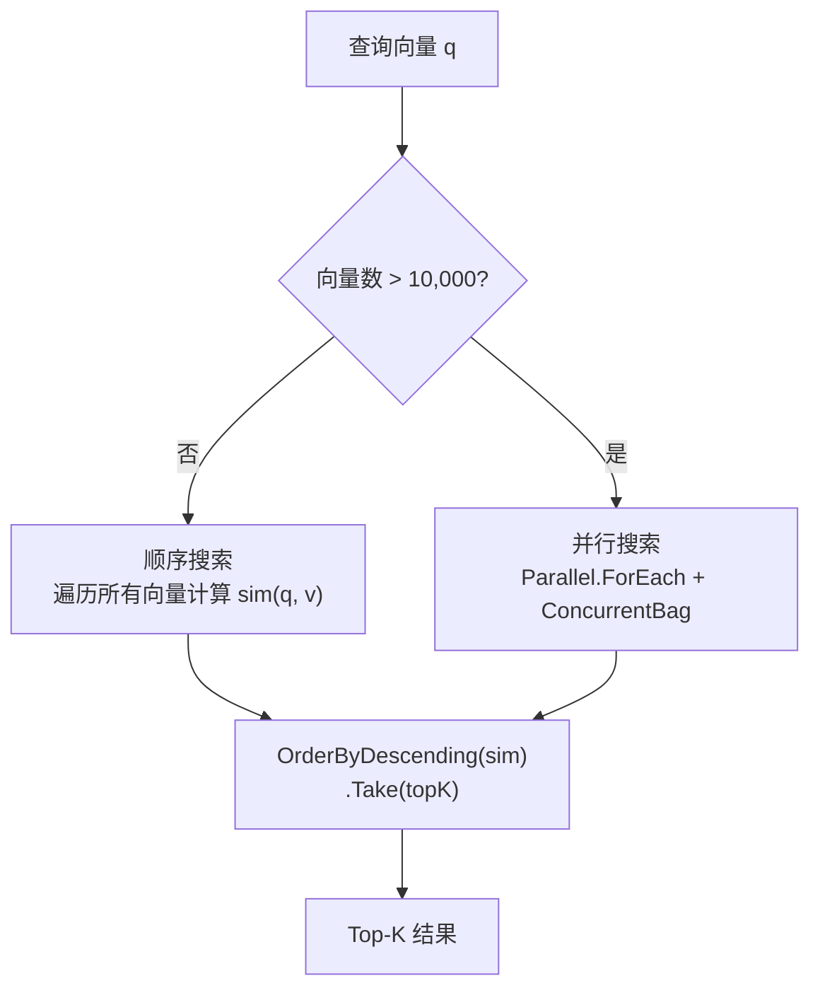

**搜索策略切换**：

```csharp
// 小数据量（≤ 10K）：顺序遍历更快，避免线程调度开销
private List<(int, float)> SequentialSearchCore(float[] query, int topK)
{
    var results = new List<(int Id, float Sim)>(_vectors.Count);
    foreach (var (id, vector) in _vectors)
        results.Add((id, similarityFunc(query, vector)));
    return results.OrderByDescending(r => r.Sim).Take(topK).ToList();
}

// 大数据量（> 10K）：Parallel.ForEach 多线程并行计算
private List<(int, float)> ParallelSearchCore(float[] query, int topK)
{
    var results = new ConcurrentBag<(int Id, float Similarity)>();
    Parallel.ForEach(_vectors, kvp =>
        results.Add((kvp.Key, similarityFunc(query, kvp.Value))));
    return results.OrderByDescending(r => r.Similarity).Take(topK).ToList();
}
```

```csharp
// 使用方式：默认索引，无需标记 [QuiverIndex]
[QuiverVector(128)]
public float[] Embedding { get; set; } = [];
```

### 5.2 HNSW（分层可导航小世界图）

多层近邻图结构，**近似搜索的通用首选**。类似"高速公路 → 省道 → 乡道"的分层导航。

| 属性 | 值 |
|------|-----|
| 实现类 | `HnswIndex` |
| 搜索复杂度 | O(log n) |
| 插入复杂度 | O(log n) × efConstruction |
| 空间复杂度 | O(n × M) |
| 适合数据量 | 10K ~ 10M |
| 删除策略 | 惰性删除（残留引用自动清理） |

#### HNSW 分层结构

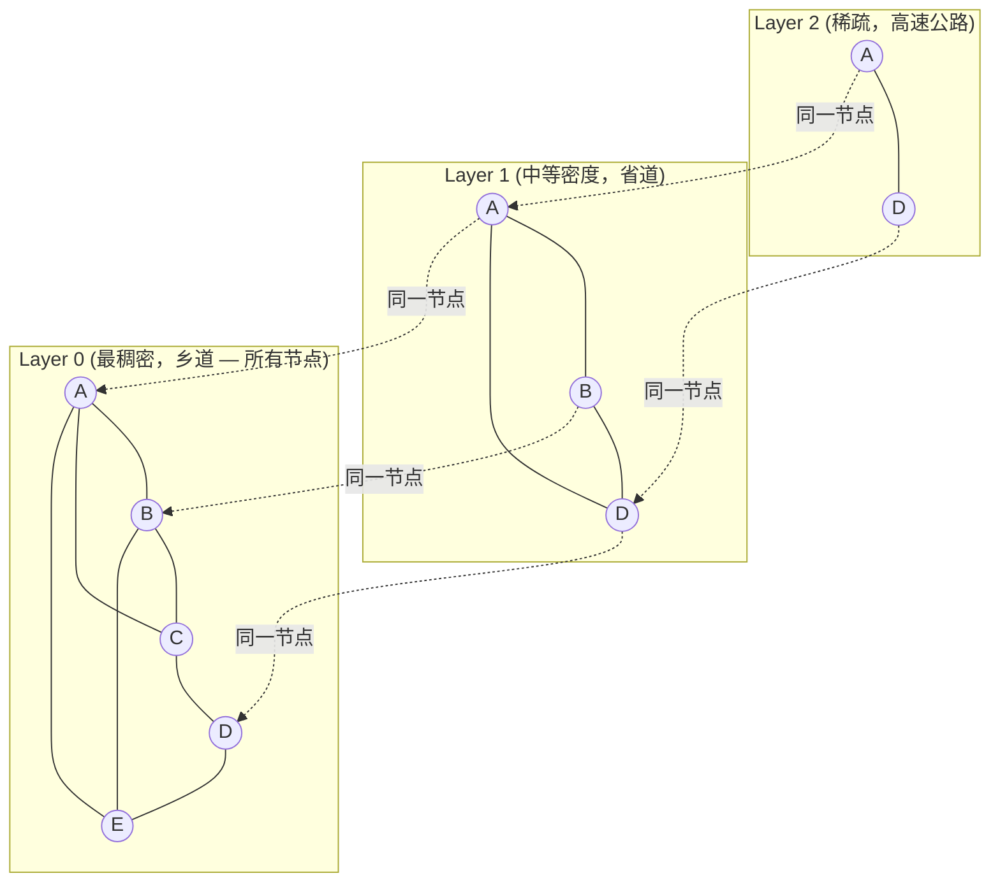

#### 插入算法流程

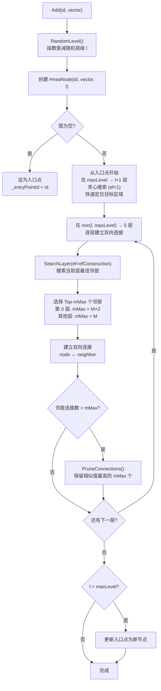

#### 搜索算法流程

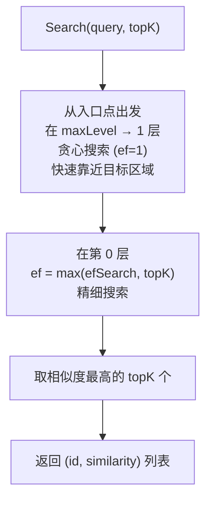

**参数调优指南**：

| 参数 | 默认值 | 推荐范围 | 增大效果 | 减小效果 |
|------|--------|---------|---------|---------|
| `M` | 16 | 12 ~ 48 | ↑召回率 ↑内存 ↑构建时间 | ↓内存 ↓召回率 |
| `EfConstruction` | 200 | 100 ~ 500 | ↑图质量 ↓插入速度 | ↑插入速度 ↓图质量 |
| `EfSearch` | 50 | 50 ~ 500 | ↑召回率 ↓搜索速度 | ↑搜索速度 ↓召回率 |

> **`EfSearch` 可运行时动态调整**，无需重建索引：`hnswIndex.EfSearch = 200;`

```csharp
[QuiverVector(768, DistanceMetric.Cosine)]
[QuiverIndex(VectorIndexType.HNSW, M = 32, EfConstruction = 300, EfSearch = 100)]
public float[] Embedding { get; set; } = [];
```

### 5.3 IVF（倒排文件索引）

基于 **K-Means 聚类**划分向量空间，搜索时只探测最近的几个聚类。

| 属性 | 值 |
|------|-----|
| 实现类 | `IvfIndex` |
| 构建复杂度 | O(n × k × d × iter) |
| 搜索复杂度 | O(k × d + nProbe × n/k × d) |
| 适合数据量 | 100K+ |
| 构建方式 | 惰性（首次搜索时触发） |
| 自动重建 | 数据量增长 50% 后标记重建 |
| 质心初始化 | K-Means++ |
| 迭代算法 | Lloyd（最大 50 轮） |
| SIMD 加速 | `TensorPrimitives.Add` / `TensorPrimitives.Divide` |

#### IVF 搜索流程

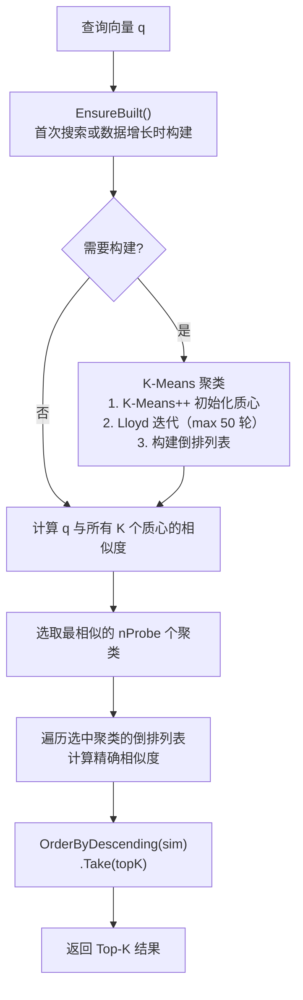

#### K-Means 聚类构建

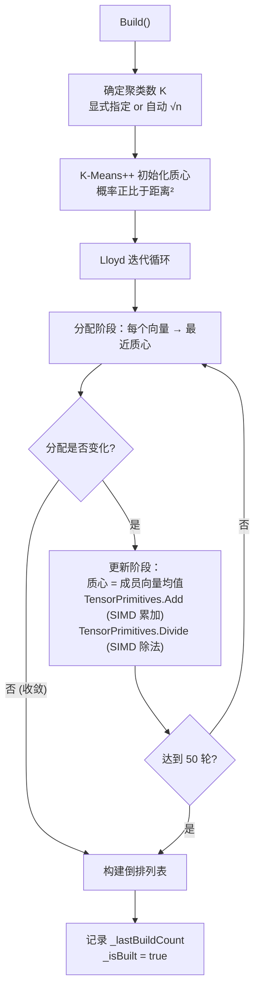

**参数调优**：

| 参数 | 默认值 | 推荐范围 | 说明 |
|------|--------|---------|------|
| `NumClusters` | 0（自动 √n） | √n ~ 4√n | 聚类数。增大 → 每个聚类更小 → 搜索更快但质心比较增多 |
| `NumProbes` | 10 | 1 ~ 20 | 探测聚类数。= 聚类总数时退化为暴力搜索 |

> **阈值搜索**时探测范围自动扩大为 `nProbe × 2`，降低因聚类划分导致的漏检。

```csharp
[QuiverVector(128, DistanceMetric.Cosine)]
[QuiverIndex(VectorIndexType.IVF, NumClusters = 100, NumProbes = 15)]
public float[] Feature { get; set; } = [];
```

### 5.4 KDTree（KD 树）

空间二叉划分树，**精确搜索**。沿各维度交替切分空间，利用剪枝跳过不可能的子树。

| 属性 | 值 |
|------|-----|
| 实现类 | `KDTreeIndex` |
| 搜索复杂度 | O(log n)（低维），O(n)（高维） |
| 精确度 | 100% |
| 适合维度 | < 20 维 |
| 构建方式 | 惰性（首次搜索触发全量重建） |
| 重建触发 | 每次 Add/Remove 后标记重建 |

#### KD-Tree 结构示意

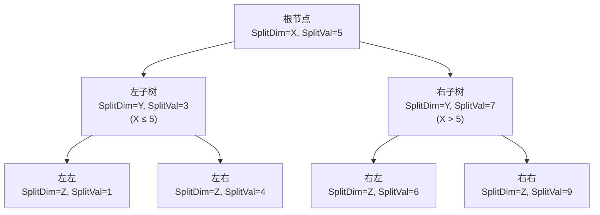

#### 搜索剪枝策略

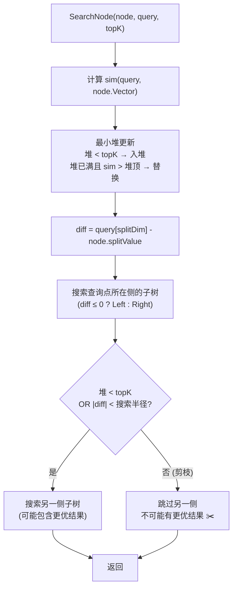

> ⚠️ **维度诅咒**：维度超过约 20 时，几乎每个子树都需要访问（剪枝失效），退化为 O(n)。高维场景应使用 HNSW。  
> ⚠️ **阈值搜索**退化为暴力遍历（KD-Tree 的剪枝难以直接应用于阈值搜索）。

```csharp
[QuiverVector(16, DistanceMetric.Euclidean)]
[QuiverIndex(VectorIndexType.KDTree)]
public float[] LowDimFeature { get; set; } = [];
```

### 5.5 索引选择决策指南

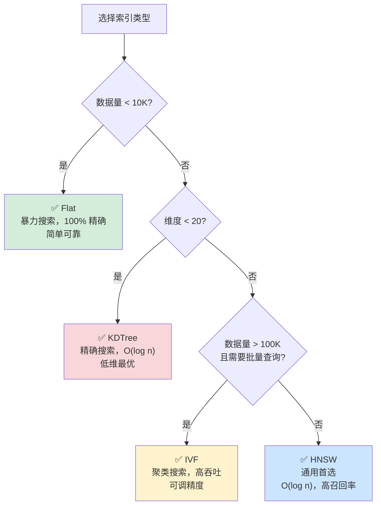

**综合对比表**：

| 维度 | Flat | HNSW | IVF | KDTree |
|------|------|------|-----|--------|
| 搜索速度 | O(n×d) | O(log n) | O(n/k×d) | O(log n) ~ O(n) |
| 精确度 | 100% | ~95-99%+ | ~90-99% | 100% |
| 插入速度 | O(1) | O(log n) | O(1)* | O(1)** |
| 内存 | n×d | n×(d+M) | n×d + k×d | n×d + 树结构 |
| 适合数据量 | <10K | 10K~10M | 100K+ | <10K (低维) |
| 适合维度 | 任意 | 任意 | 任意 | <20 |
| 构建方式 | 即时 | 即时 | 惰性 | 惰性 |
| 并行化 | ✅ >10K | ❌ | ❌ | ❌ |

> \* IVF 插入即时，但索引需重建  
> \*\* KDTree 插入即时，但树需重建

---

## 6. CRUD 操作

### 6.1 添加实体

```csharp
// 添加单个实体
db.Documents.Add(new Document
{
    Id = "doc-001",
    Title = "入门指南",
    Embedding = new float[384]
});

// 批量注册（原子语义：任一校验失败则全部回滚）
var batch = new List<Document>
{
    new() { Id = "doc-002", Title = "进阶教程", Embedding = new float[384] },
    new() { Id = "doc-003", Title = "最佳实践", Embedding = new float[384] },
};
db.Documents.AddRange(batch);

// 异步批量添加（CPU 密集计算卸载到线程池）
await db.Documents.AddRangeAsync(batch, cancellationToken);
```

#### `AddRange` 两阶段提交

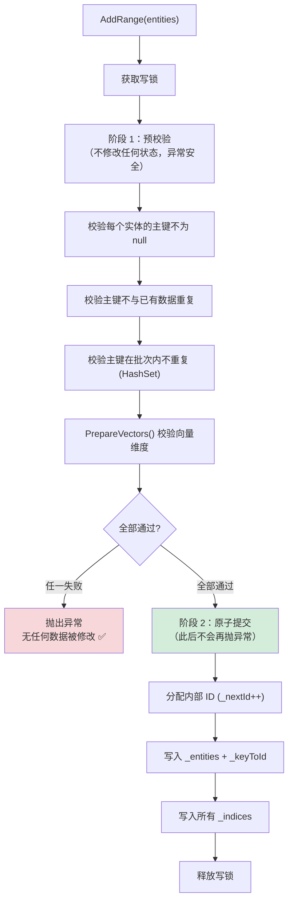

### 6.2 插入或更新（Upsert）

在**单次写锁**内完成，比外部 `Remove + Add` 更高效且原子。

```csharp
db.Documents.Upsert(new Document
{
    Id = "doc-001",
    Title = "更新后的入门指南",
    Embedding = new float[384]
});
// 主键存在 → RemoveCore() + AddCore()
// 主键不存在 → 直接 AddCore()
```

### 6.3 删除实体

```csharp
// 按实体删除（通过主键匹配，非引用比较）
bool removed = db.Documents.Remove(entity);

// 按主键直接删除（无需持有实体引用）
bool removed = db.Documents.RemoveByKey("doc-001");
```

**删除内部流程**（`RemoveCore`）：

1. 通过 `_keyToId` 反查内部 ID
2. 从 `_entities` 字典移除实体
3. 从 `_keyToId` 字典移除主键映射
4. 从**所有** `_indices` 中移除向量（索引实现自行处理残留引用）

### 6.4 查找实体

```csharp
// 按主键查找，O(1) 复杂度（双层字典：主键 → 内部ID → 实体）
Document? doc = db.Documents.Find("doc-001");
```

### 6.5 清空集合

```csharp
db.Documents.Clear();
// 清空 _entities + _keyToId + 所有索引
// 重置 _nextId = 0
```

### 6.6 获取信息

```csharp
int count = db.Documents.Count; // 线程安全（读锁）

// 查看向量字段元信息
foreach (var (name, dimensions) in db.Documents.VectorFields)
    Console.WriteLine($"字段: {name}, 维度: {dimensions}");
```

---

## 7. 向量搜索

### 7.1 Top-K 搜索

返回相似度最高的前 K 个实体，按相似度降序排列。

```csharp
float[] queryVector = GetEmbedding("搜索关键词");

var results = db.Documents.Search(
    vectorSelector: e => e.Embedding,  // 表达式树选择器
    queryVector: queryVector,
    topK: 10
);

foreach (var result in results)
{
    Console.WriteLine($"ID: {result.Entity.Id}");
    Console.WriteLine($"标题: {result.Entity.Title}");
    Console.WriteLine($"相似度: {result.Similarity:F4}");
}
```

**内部流程**：

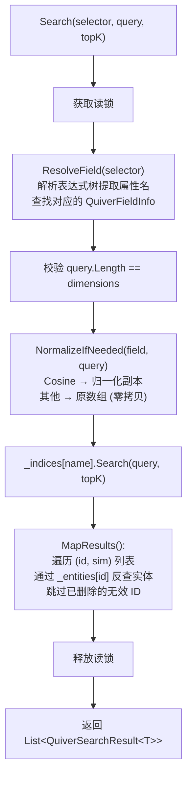

### 7.2 阈值搜索

返回所有相似度不低于指定阈值的实体，结果数量不固定。

```csharp
var results = db.Documents.SearchByThreshold(
    vectorSelector: e => e.Embedding,
    queryVector: queryVector,
    threshold: 0.85f
);

Console.WriteLine($"找到 {results.Count} 个相似度 ≥ 0.85 的结果");
```

### 7.3 带过滤的搜索

支持**表达式过滤**和**委托过滤**两种方式。

```csharp
// 方式 1：表达式过滤
// ⚠️ 每次调用编译表达式树，开销 ~50μs
var results = db.Documents.Search(
    e => e.Embedding,
    queryVector,
    topK: 10,
    filter: e => e.Title.Contains("教程")
);

// 方式 2：委托过滤（推荐高频调用场景）
// 外部缓存编译后的委托，避免重复编译
Func<Document, bool> myFilter = e => e.Title.Contains("教程");
var results = db.Documents.Search(
    e => e.Embedding,
    queryVector,
    topK: 10,
    filter: myFilter,
    overFetchMultiplier: 4
);
```

#### 过采样策略

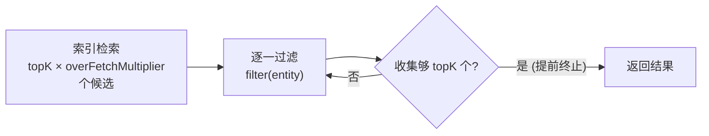

| `overFetchMultiplier` | 说明 |
|----------------------|------|
| 4（默认） | 适合过滤率 < 75% |
| 8~16 | 高过滤率场景（如按类别筛选） |
| 更大值 | 极端过滤率（如仅搜索特定标签） |

### 7.4 Top-1 搜索

搜索最相似的单个实体。内部优化路径：避免中间 `List` 分配，`MapTop1` 仅取第一个有效结果。

```csharp
var top1 = db.Documents.SearchTop1(
    e => e.Embedding,
    queryVector
);

if (top1 != null)
    Console.WriteLine($"最相似: {top1.Entity.Title} ({top1.Similarity:F4})");
else
    Console.WriteLine("未找到相似文档");
```

### 7.5 异步搜索

所有搜索方法均提供 `Async` 后缀重载，通过 `Task.Run` 将 CPU 密集计算卸载到线程池，避免阻塞 UI 线程或 ASP.NET 请求线程。

```csharp
// 异步 Top-K
var results = await db.Documents.SearchAsync(
    e => e.Embedding, queryVector, topK: 10, cancellationToken);

// 异步带过滤
var results = await db.Documents.SearchAsync(
    e => e.Embedding, queryVector, topK: 10,
    filter: e => e.Category == "教程",
    overFetchMultiplier: 4, cancellationToken);

// 异步阈值搜索
var results = await db.Documents.SearchByThresholdAsync(
    e => e.Embedding, queryVector, threshold: 0.8f, cancellationToken);

// 异步 Top-1
var top1 = await db.Documents.SearchTop1Async(
    e => e.Embedding, queryVector, cancellationToken);
```

### 7.6 默认字段便捷方法

当实体仅有一个 `[QuiverVector]` 字段时，可省略 `vectorSelector` 参数。框架缓存 `_defaultField` 避免每次调用 `_vectorFields.First()`。

```csharp
// 单向量字段实体 — 省略 vectorSelector
var results = db.Documents.Search(queryVector, topK: 5);
var top1 = db.Documents.SearchTop1(queryVector);

// 异步版本
var results = await db.Documents.SearchAsync(queryVector, topK: 5);
var top1 = await db.Documents.SearchTop1Async(queryVector);
```

> ⚠️ 多向量字段实体调用默认方法时抛出 `InvalidOperationException("Entity has N vector fields. Use the overload with a vectorSelector expression.")`

---

## 8. 持久化存储

### 8.1 保存与加载

```csharp
// 保存到配置的 DatabasePath（全量快照）
await db.SaveAsync();

// 保存到指定路径（覆盖 DatabasePath）
await db.SaveAsync(@"C:\backup\mydata.json");

// WAL 增量保存 — 仅追加变更到 WAL 文件，O(Δ) 复杂度
await db.SaveChangesAsync();

// 手动压缩：创建全量快照 + 清空 WAL
await db.CompactAsync();

// 加载（文件不存在时静默返回，不抛异常，适合首次启动）
// WAL 启用时自动回放增量变更
await db.LoadAsync();

// 从指定路径加载
await db.LoadAsync(@"C:\backup\mydata.json");
```

#### 持久化内部流程

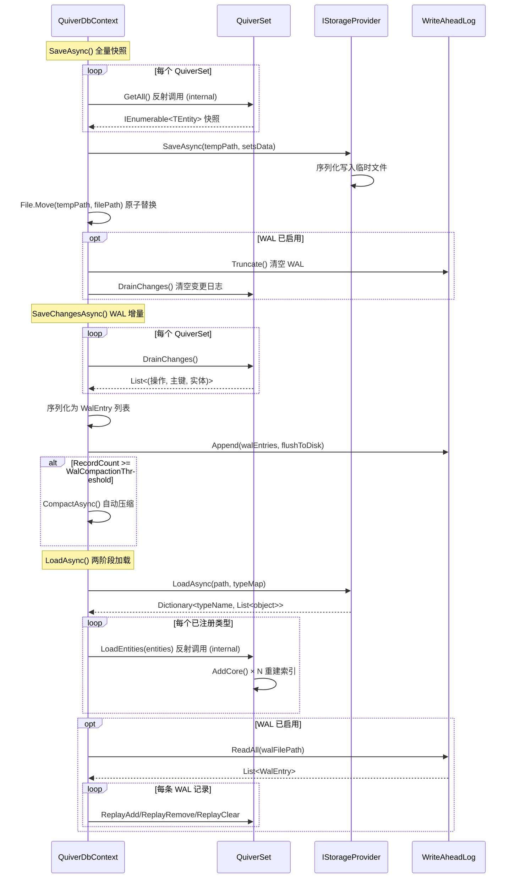

### 8.2 存储格式对比

| 格式 | 实现类 | 可读性 | 文件体积 | 读写速度 | 适用场景 |
|------|--------|--------|---------|---------|---------|
| `Json` | `JsonStorageProvider` | ✅ 优秀 | 最大 | 一般 | 开发调试 |
| `Xml` | `XmlStorageProvider` | ✅ 良好 | 较大 | 一般 | 兼容性需求 |
| `Binary` | `BinaryStorageProvider` | ❌ 不可读 | **最小** | **最快** | 生产环境 |

### 8.3 JSON 格式详解

使用 `System.Text.Json` 序列化。输出结构：

```json
{
  "MyNamespace.FaceFeature": [
    { "personId": "P001", "name": "张三", "embedding": [0.1, 0.2, ...] },
    { "personId": "P002", "name": "李四", "embedding": [0.3, 0.4, ...] }
  ]
}
```

- 支持通过 `QuiverDbOptions.JsonOptions` 自定义缩进、命名策略
- 默认启用 `WriteIndented = true` + `CamelCase`
- 加载时使用 `JsonDocument` DOM 解析，逐元素反序列化
- 未识别的类型名自动跳过（前向兼容）

### 8.4 XML 格式详解

使用 `System.Xml.Linq` (`XDocument`)。输出结构：

```xml
<?xml version="1.0" encoding="utf-8"?>
<QuiverDb version="1">
  <Set type="FaceFeature" count="2">
    <Entity>
      <PersonId>P001</PersonId>
      <Name>张三</Name>
      <Embedding>Base64EncodedBytes...</Embedding>
    </Entity>
  </Set>
</QuiverDb>
```

- 向量数据使用 **Base64 编码**（`MemoryMarshal.AsBytes` → `Convert.ToBase64String`），紧凑且无精度损失
- 日期时间使用 **ISO 8601 往返格式** (`"O"`)
- 数值使用 `CultureInfo.InvariantCulture`，保证跨区域一致性

### 8.5 Binary 格式详解

自定义紧凑二进制协议，性能最优：

```
┌─ 文件头 ──────────────────────────────────────────────────
│  Magic: "QDB\x01" (4B)              ← 文件标识 + 版本号
│  SetCount (int32)                    ← 向量集合数量
├─ Set × SetCount ─────────────────────────────────────────
│  TypeName (string)                   ← BinaryWriter 长度前缀
│  PropCount (int32)                   ← 属性描述符数量
│  ┌─ PropDescriptor × PropCount ──────────────────────────
│  │  PropName (string)
│  │  TypeCode (byte)                  ← 0=string 1=int32 ... 9=float[]
│  ├─ Entity × EntityCount ────────────────────────────────
│  │  [null 标志 1B] + [字段值]        ← 按描述符顺序逐字段写入
│  │  float[] → [len int32][原始字节]  ← MemoryMarshal.AsBytes 零拷贝
└──────────────────────────────────────────────────────────
```

**支持的属性类型码**：

| TypeCode | CLR 类型 | 存储方式 |
|----------|---------|---------|
| 0 | `string` | BinaryWriter.Write (长度前缀) |
| 1 | `int` | 4 字节 |
| 2 | `long` | 8 字节 |
| 3 | `float` | 4 字节 |
| 4 | `double` | 8 字节 |
| 5 | `bool` | 1 字节 |
| 6 | `DateTime` | ToBinary() → 8 字节 |
| 7 | `Guid` | 16 字节 |
| 8 | `decimal` | 16 字节 |
| 9 | `float[]` | [长度 int32] + [原始字节 零拷贝] |
| 10 | `string[]` | [长度 int32] + [逐元素字符串] |
| 11 | `byte` | 1 字节 |
| 12 | `short` | 2 字节 |
| 13 | `Half` | 2 字节（半精度浮点，ML/AI 场景常用） |
| 14 | `DateTimeOffset` | [Ticks int64] + [OffsetMinutes int16] = 10 字节 |
| 15 | `TimeSpan` | Ticks → 8 字节 |
| 16 | `byte[]` | [长度 int32] + [原始字节] |
| 17 | `double[]` | [长度 int32] + [原始字节 零拷贝] |

### 8.6 WAL 增量持久化

WAL（Write-Ahead Log）是一种增量持久化机制，通过将写操作以追加方式记录到日志文件中，避免每次保存都执行全量序列化，显著降低持久化开销。

#### 两种持久化模式对比

| 维度 | 全量模式（SaveAsync） | WAL 增量模式（SaveChangesAsync） |
|------|---------------------|-------------------------------|
| 持久化内容 | 所有实体的完整快照 | 仅自上次保存以来的变更（Δ） |
| 时间复杂度 | O(N)（N = 总实体数） | O(Δ)（Δ = 变更数） |
| 文件写入 | 全量覆盖 | 追加写入 |
| 适用场景 | 数据量小，保存频率低 | 数据量大，高频写入 |
| 启用方式 | 默认 | `EnableWal = true` |

#### 启用 WAL

```csharp
var options = new QuiverDbOptions
{
    DatabasePath = "mydata.vdb",
    StorageFormat = StorageFormat.Binary,
    EnableWal = true,                // 启用 WAL
    WalCompactionThreshold = 10_000, // 自动压缩阈值
    WalFlushToDisk = true            // fsync 持久性保证
};
```

#### 核心 API

```csharp
// 增量保存：仅将未持久化的变更追加到 WAL 文件
await db.SaveChangesAsync();

// 全量快照 + 清空 WAL（等价于 CompactAsync）
await db.SaveAsync();

// 手动压缩：创建全量快照 + 清空 WAL
await db.CompactAsync();

// 加载：读取全量快照 + 按顺序回放 WAL 增量变更
await db.LoadAsync();
```

#### WAL 工作流程

```mermaid
flowchart TD
    subgraph 写入阶段
        W1["用户调用 Add/Upsert/Remove/Clear"] --> W2["QuiverSet 更新内存数据 + 索引"]
        W2 --> W3["_changeLog 记录变更<br/>(Op, Key, Entity)"]
    end

    subgraph SaveChangesAsync
        S1["DrainChanges() 获取并清空变更日志"] --> S2["序列化为 WalEntry 列表<br/>(JSON 载荷)"]
        S2 --> S3["WriteAheadLog.Append()<br/>批量追加 + CRC32 校验"]
        S3 --> S4{"RecordCount >= 阈值?"}
        S4 -- "是" --> S5["CompactAsync()<br/>创建全量快照 + 清空 WAL"]
        S4 -- "否" --> S6["完成"]
    end

    subgraph LoadAsync
        L1["阶段 1：加载全量快照<br/>IStorageProvider.LoadAsync()"] --> L2["阶段 2：读取 WAL 文件<br/>WriteAheadLog.ReadAll()"]
        L2 --> L3["按顺序回放每条记录<br/>ReplayAdd / ReplayRemove / ReplayClear"]
        L3 --> L4["内存状态 = 快照 + Δ"]
    end

    W3 --> S1
    S6 --> L1
```

#### 变更追踪机制

`QuiverSet<T>` 内部维护 `_changeLog` 列表，在写锁内记录每次写操作：

| 操作 | Op 码 | Key | Entity |
|------|-------|-----|--------|
| Add | 1 | 主键值 | 实体实例 |
| Remove | 2 | 主键值 | `null` |
| Clear | 3 | `null` | `null` |

**特殊行为**：
- `Upsert` 记录为 Remove + Add 两条变更
- `LoadEntities`（快照加载）和 `ReplayAdd/Remove/Clear`（WAL 回放）**不记录变更**，避免循环写入
- `DrainChanges()` 使用快照 + 清除语义：获取变更列表后立即清空，保证每条变更只持久化一次

#### WAL 文件格式

自定义紧凑二进制格式，每条记录附带 CRC32 校验：

```
┌─ 文件头 (5 字节) ────────────────────────────────────────
│  [4B] Magic = "WLOG"                 ← 文件标识
│  [1B] Version = 0x01                 ← 协议版本
├─ Record × N ─────────────────────────────────────────────
│  [4B uint32] DataLength              ← 数据区长度（不含此字段和 CRC）
│  ┌─ 数据区 (DataLength 字节) ────────────────────────────
│  │  [8B int64]  SeqNo                ← 单调递增序列号
│  │  [1B]        OpCode               ← 1=Add, 2=Remove, 3=Clear
│  │  [string]    TypeName             ← BinaryWriter 长度前缀 UTF-8
│  │  [string]    PayloadJson          ← BinaryWriter 长度前缀 UTF-8
│  ├───────────────────────────────────────────────────────
│  [4B uint32] CRC32                   ← 覆盖 SeqNo 到 PayloadJson
└──────────────────────────────────────────────────────────
```

**崩溃恢复安全性**：
- 读取时逐条校验 CRC32，遇到校验失败或截断的记录即停止读取
- 不完整的尾部记录会被安全丢弃（仅丢失最近一批未 flush 的变更）
- 打开已有 WAL 文件时自动扫描并截断尾部损坏数据

#### WAL 线程安全

| 操作 | 线程安全机制 |
|------|------------|
| `Append` | `Lock` 对象串行化所有写操作 |
| `ReadAll` | 静态方法，使用独立的只读文件流 |
| `Truncate` | 在 `_writeLock` 内执行 |
| `RecordCount` | `Volatile.Read` 保证跨线程可见性 |

#### 自动压缩策略

```mermaid
flowchart LR
    SC["SaveChangesAsync()"] --> CHK{"WAL 记录数 >= 阈值?"}
    CHK -- "否" --> DONE["完成"]
    CHK -- "是" --> COMPACT["CompactAsync()"]
    COMPACT --> SNAP["创建全量快照<br/>(原子写入: 临时文件 → 替换)"]
    SNAP --> TRUNC["WAL.Truncate()<br/>仅保留文件头"]
    TRUNC --> DRAIN["DrainChanges()<br/>清空内存变更日志"]
    DRAIN --> DONE
```

> **推荐阈值范围**：1,000 ~ 100,000，取决于单条记录大小（向量维度）和对加载速度的要求。默认 10,000。

---

## 9. 多向量字段支持

一个实体可标记多个 `[QuiverVector]` 属性，每个字段**独立维护索引**，支持不同的维度、度量和索引策略。

### 9.1 定义多向量实体

```csharp
public class MultiModalItem
{
    [QuiverKey]
    public string Id { get; set; } = string.Empty;

    public string Title { get; set; } = string.Empty;
    public string Category { get; set; } = string.Empty;
    public bool IsPublished { get; set; }

    [QuiverVector(384, DistanceMetric.Cosine)]
    [QuiverIndex(VectorIndexType.HNSW, M = 32, EfConstruction = 200, EfSearch = 100)]
    public float[] TextEmbedding { get; set; } = [];

    [QuiverVector(512, DistanceMetric.Cosine)]
    [QuiverIndex(VectorIndexType.HNSW, M = 24, EfConstruction = 200, EfSearch = 80)]
    public float[] ImageEmbedding { get; set; } = [];
}
```

### 9.2 内部结构

```mermaid
graph TD
    subgraph "QuiverSet&lt;MultiModalItem&gt;"
        E["_entities"]
        K["_keyToId"]

        subgraph "_indices (每个字段独立索引)"
            TI["TextEmbedding<br/>→ HnswIndex<br/>384d, Cosine"]
            II["ImageEmbedding<br/>→ FlatIndex<br/>512d, Euclidean"]
            AI["AudioEmbedding<br/>→ IvfIndex<br/>256d, DotProduct"]
        end
    end

    ADD["Add(entity)"] --> E
    ADD --> K
    ADD --> TI
    ADD --> II
    ADD --> AI
```

### 9.3 分字段搜索

```csharp
// 按文本向量搜索
var textResults = db.Items.Search(e => e.TextEmbedding, textQuery, topK: 5);

// 按图像向量搜索
var imageResults = db.Items.Search(e => e.ImageEmbedding, imageQuery, topK: 5);

// 按音频向量搜索
var audioResults = db.Items.Search(e => e.AudioEmbedding, audioQuery, topK: 5);

// 三个字段的搜索结果互相独立（不同向量空间）
```

### 9.4 查看向量字段信息

```csharp
foreach (var (name, dimensions) in db.Items.VectorFields)
    Console.WriteLine($"字段: {name}, 维度: {dimensions}");
// 输出：
// 字段: TextEmbedding, 维度: 384
// 字段: ImageEmbedding, 维度: 512
// 字段: AudioEmbedding, 维度: 256
```

---

## 10. 线程安全与并发

### 10.1 锁模型

`QuiverSet<TEntity>` 内部使用 `ReaderWriterLockSlim` 实现读写分离：

```mermaid
flowchart LR
    subgraph 读操作 共享锁
        S["Search"]
        F["Find"]
        C["Count"]
        GA["GetAll"]
    end

    subgraph 写操作 独占锁
        A["Add"]
        AR["AddRange"]
        U["Upsert"]
        R["Remove"]
        CL["Clear"]
        LE["LoadEntities"]
    end

    S & F & C & GA -->|"并行执行 ✅"| RLock["EnterReadLock"]
    A & AR & U & R & CL & LE -->|"互斥执行 🔒"| WLock["EnterWriteLock"]
```

### 10.2 并发安全示例

```csharp
var db = new MyDocumentDb();

// ✅ 安全：多线程并发搜索（读锁共享）
var tasks = Enumerable.Range(0, 24).Select(_ => Task.Run(() =>
{
    var query = GenerateRandomVector(384);
    return db.Documents.Search(e => e.Embedding, query, topK: 5);
}));
await Task.WhenAll(tasks);

// ✅ 安全：读写并发（写操作持有独占锁时，读操作等待）
var writerTask = Task.Run(() =>
{
    db.Documents.Upsert(new Document
    {
        Id = "new-doc",
        Title = "新文档",
        Embedding = new float[384]
    });
});

var readerTask = Task.Run(() =>
    db.Documents.Search(e => e.Embedding, queryVector, topK: 5));

await Task.WhenAll(writerTask, readerTask);
```

### 10.3 Dispose 线程安全

`QuiverSet` 使用 `Interlocked.Exchange(ref _disposed, 1)` 保证并发 Dispose 安全。所有操作入口调用 `ThrowIfDisposed()`，使用 `Volatile.Read` 保证跨线程可见性。

### 10.4 并发性能参考

| 测试场景 | 数据量 | 配置 | 结果 |
|---------|--------|------|------|
| 纯读并发 | 3,000 条 × 3 向量 | 24 线程 × 100 次搜索 | 2,400 次零异常 |
| 读写混合 | 1,000 条 × 3 向量 | 4 写 + 8 读 + 2 删除，3 秒 | 零异常 |
| 批量写 + 搜索 | 动态增长 | 3 写线程 (每批 50 条) + 6 搜索线程，3 秒 | 零异常 |

---

## 11. 生命周期管理

### 11.1 QuiverDbContext 生命周期

```mermaid
stateDiagram-v2
    [*] --> Created: new MyDb(options)
    Created --> Active: InitializeSets() + 初始化 WAL
    Active --> Active: Add / Search / ...
    Active --> Saving: SaveAsync() 全量快照
    Active --> WalAppend: SaveChangesAsync() 增量追加
    Saving --> Active: 保存完成
    WalAppend --> Active: 追加完成
    WalAppend --> Saving: 自动压缩（超过阈值）
    Active --> Disposing_Async: DisposeAsync()
    Disposing_Async --> WalAppend_Final: WAL 模式→ SaveChangesAsync()
    Disposing_Async --> Saving_Final: 全量模式→ SaveAsync()
    WalAppend_Final --> Disposed: 释放 WAL + 所有 QuiverSet
    Saving_Final --> Disposed: 释放所有 QuiverSet
    Active --> Disposed: Dispose() (不保存)
    Disposed --> [*]
```

| 释放方式 | 自动保存 | WAL 模式行为 | 推荐场景 |
|---------|---------|------------|--------|
| `Dispose()` | ❌ 不保存 | 不保存，仅释放资源 | 需要手动控制保存时机 |
| `DisposeAsync()` | ✅ 先保存再释放 | 调用 `SaveChangesAsync()` 增量保存 | **推荐**，用于 `await using` |

### 11.2 推荐用法

```csharp
// ✅ 推荐：await using 自动保存（全量模式）
await using var db = new MyDocumentDb();
await db.LoadAsync();
db.Documents.Add(new Document { ... });
// 作用域结束 → DisposeAsync → SaveAsync → Dispose 所有资源

// ✅ 推荐：await using 自动保存（WAL 模式）
await using var walDb = new MyWalDb();
await walDb.LoadAsync(); // 加载快照 + 回放 WAL
walDb.Documents.Add(new Document { ... });
// 每次批量写入后可显式调用增量保存
await walDb.SaveChangesAsync();
// 作用域结束 → DisposeAsync → SaveChangesAsync → Dispose 所有资源

// 手动控制方式
var db2 = new MyDocumentDb();
try
{
    db2.Documents.Add(new Document { ... });
    await db2.SaveAsync(); // 手动保存
}
finally
{
    db2.Dispose(); // 仅释放资源，不保存
}
```

### 11.3 QuiverSet 释放

`QuiverSet` 实现 `IDisposable`，释放内部的 `ReaderWriterLockSlim`。释放后所有操作抛出 `ObjectDisposedException`。

---

## 12. 配置选项

`QuiverDbOptions` 提供以下配置：

```csharp
var options = new QuiverDbOptions
{
    // 数据库文件路径。null 时使用内存模式（不持久化）
    // 目录不存在时由存储提供者自动创建
    DatabasePath = @"C:\Data\MyQuiverDb.json",

    // 默认距离度量（实体级 [QuiverVector] 特性可覆盖）
    DefaultMetric = DistanceMetric.Cosine,

    // 持久化存储格式
    StorageFormat = StorageFormat.Json,

    // JSON 序列化选项（仅 StorageFormat.Json 时使用）
    JsonOptions = new JsonSerializerOptions
    {
        WriteIndented = true,                           // 缩进输出
        PropertyNamingPolicy = JsonNamingPolicy.CamelCase  // 驼峰命名
    },

    // ── WAL 增量持久化配置 ──

    // 是否启用 WAL 增量持久化
    EnableWal = true,

    // WAL 记录数达到此阈值时自动触发压缩（全量快照 + 清空 WAL）
    WalCompactionThreshold = 10_000,

    // WAL 写入后是否立即 fsync 到物理磁盘
    // true = 最强持久性（断电不丢数据），false = 依赖 OS 缓冲（性能更好）
    WalFlushToDisk = true
};
```

| 属性 | 类型 | 默认值 | 说明 |
|------|------|--------|------|
| `DatabasePath` | `string?` | `null` | 存储路径，`null` 为内存模式（`SaveAsync` 需显式传 `path`） |
| `DefaultMetric` | `DistanceMetric` | `Cosine` | 默认距离度量 |
| `StorageFormat` | `StorageFormat` | `Json` | 持久化格式：`Json` / `Xml` / `Binary` |
| `JsonOptions` | `JsonSerializerOptions` | 缩进 + 驼峰 | JSON 序列化选项 |
| `EnableWal` | `bool` | `false` | 是否启用 WAL 增量持久化 |
| `WalCompactionThreshold` | `int` | `10,000` | WAL 记录数达到此值时自动压缩 |
| `WalFlushToDisk` | `bool` | `true` | WAL 写入后是否 fsync 到磁盘 |

---

## 13. 内部实现细节

### 13.1 表达式树编译属性访问器

框架使用表达式树为每个主键和向量属性编译高性能访问器，替代运行时反射调用：

```csharp
// 编译前（反射）：~200ns / 次
var value = propertyInfo.GetValue(entity);

// 编译后（表达式树）：~2ns / 次，约 100 倍提升
private static Func<TEntity, TResult> CompileGetter<TResult>(PropertyInfo prop)
{
    var param = Expression.Parameter(typeof(TEntity), "e");
    Expression body = Expression.Property(param, prop);
    // 值类型自动插入装箱节点（如 int → object）
    if (prop.PropertyType != typeof(TResult))
        body = Expression.Convert(body, typeof(TResult));
    return Expression.Lambda<Func<TEntity, TResult>>(body, param).Compile();
}
```

### 13.2 SimilarityFunc 委托设计

使用 `ReadOnlySpan<float>` 参数类型的委托，可直接绑定 `TensorPrimitives` 方法组，无需额外 lambda 包装：

```csharp
// 委托签名
internal delegate float SimilarityFunc(ReadOnlySpan<float> a, ReadOnlySpan<float> b);

// 直接绑定 TensorPrimitives 方法组（零开销）
SimilarityFunc simFunc = TensorPrimitives.Dot;
SimilarityFunc simFunc = TensorPrimitives.CosineSimilarity;

// Euclidean 需要变换为相似度
SimilarityFunc simFunc = (a, b) => 1f / (1f + TensorPrimitives.Distance(a, b));
```

### 13.3 HNSW 层级随机生成

层级服从指数衰减分布，保证高层稀疏、低层稠密：

```
level = floor(-ln(uniform(0, 1)) × ml)
其中 ml = 1 / ln(M)
```

大多数节点（~93.75% 当 M=16）只在第 0 层，少数节点存在于高层充当"高速公路"入口。

### 13.4 IVF K-Means++ 初始化

比随机初始化收敛更快、聚类质量更高：

1. 随机选择第一个质心
2. 对每个未选为质心的向量，计算其与最近质心的距离 D(x)
3. 以概率正比于 D(x)² 选择下一个质心
4. 重复直到选出 K 个质心

### 13.5 KDTree 剪枝优化

搜索时利用切分超平面距离进行剪枝：

- `diff = query[splitDim] - node.splitValue`
- 优先搜索查询点所在侧
- 对另一侧：仅当堆未满 **或** `|diff| < 当前搜索半径` 时才探索
- 低维下可跳过大量子树；高维下剪枝失效

### 13.6 StorageProviderFactory

简单工厂模式，在 `QuiverDbContext` 构造时调用：

```csharp
internal static IStorageProvider Create(QuiverDbOptions options) => options.StorageFormat switch
{
    StorageFormat.Json   => new JsonStorageProvider(options.JsonOptions),
    StorageFormat.Xml    => new XmlStorageProvider(),
    StorageFormat.Binary => new BinaryStorageProvider(),
    _ => throw new ArgumentOutOfRangeException(nameof(options.StorageFormat))
};
```

### 13.7 变更追踪与 WAL 回放

`QuiverSet<T>` 内部的 `_changeLog` 在写锁内记录每次写操作，实现增量持久化：

```csharp
// 变更日志缓冲区
private readonly List<(byte Op, object? Key, object? Entity)> _changeLog = [];

// AddCore 中记录变更
if (logChanges)
    _changeLog.Add((1, key, entity)); // Op=1: Add

// RemoveCore 中记录变更
if (logChanges)
    _changeLog.Add((2, key, null)); // Op=2: Remove
```

**`logChanges` 参数控制**：

| 调用场景 | `logChanges` | 原因 |
|---------|-------------|------|
| 用户调用 Add/Remove/Upsert/Clear | `true` | 需要记录到 WAL |
| `LoadEntities`（快照加载） | `false` | 快照数据无需重复记录 |
| `ReplayAdd/Remove/Clear`（WAL 回放） | `false` | 回放数据来自 WAL，避免循环写入 |

**`DrainChanges()` 快照 + 清除语义**：

```csharp
internal List<(byte Op, object? Key, object? Entity)> DrainChanges()
{
    _lock.EnterWriteLock();
    try
    {
        if (_changeLog.Count == 0) return [];
        var snapshot = new List<(byte, object?, object?)>(_changeLog);
        _changeLog.Clear();
        return snapshot;
    }
    finally { _lock.ExitWriteLock(); }
}
```

**WAL 回放方法特殊处理**：

- `ReplayAdd`：主键已存在时**静默跳过**（快照可能已包含此实体）
- `ReplayRemove`：主键不存在时返回 `false`（实体可能在后续 WAL 记录中被重新添加）
- `ReplayClear`：直接清空所有数据和索引

### 13.8 原子写入（SaveAsync）

`SaveAsync` 使用先写临时文件、再原子替换的策略，防止写入中途崩溃导致数据损坏：

```csharp
var tempPath = filePath + ".tmp";
await _storageProvider.SaveAsync(tempPath, setsData);
File.Move(tempPath, filePath, overwrite: true); // 原子替换
```

### 13.9 WAL CRC32 校验

每条 WAL 记录的数据区（SeqNo 到 PayloadJson）通过 `System.IO.Hashing.Crc32` 计算校验和，附加在记录末尾：

```csharp
var data = ms.ToArray(); // SeqNo + OpCode + TypeName + PayloadJson
var crc = Crc32.HashToUInt32(data);
_writer.Write(data.Length);
_writer.Write(data);
_writer.Write(crc);
```

读取时逆向校验，CRC 不匹配即视为损坏，停止读取后续记录。

---

## 14. 完整示例

### 14.1 人脸识别系统

```csharp
using Vorcyc.Quiver;

// ═══ 定义实体 ═══
public class FaceFeature
{
    [QuiverKey]
    public string PersonId { get; set; } = string.Empty;
    public string Name { get; set; } = string.Empty;
    public DateTime RegisterTime { get; set; }

    [QuiverVector(128, DistanceMetric.Cosine)]
    public float[] Embedding { get; set; } = [];
}

// ═══ 定义数据库上下文 ═══
public class FaceDb : QuiverDbContext
{
    public QuiverSet<FaceFeature> Faces { get; set; } = null!;

    public FaceDb(string path) : base(new QuiverDbOptions
    {
        DatabasePath = path,
        StorageFormat = StorageFormat.Binary,
        DefaultMetric = DistanceMetric.Cosine
    })
    { }
}

// ═══ 使用 ═══
await using var db = new FaceDb("faces.vdb");
await db.LoadAsync();

// 批量注册人脸
var faces = employees.Select(e => new FaceFeature
{
    PersonId = e.Id,
    Name = e.Name,
    RegisterTime = DateTime.UtcNow,
    Embedding = GetFaceEmbedding(e.Photo)
}).ToList();
db.Faces.AddRange(faces);

// 实时人脸识别
float[] probeVector = GetFaceEmbedding(cameraFrame);
var match = db.Faces.SearchTop1(probeVector);

if (match is { Similarity: > 0.9f })
{
    Console.WriteLine($"识别成功: {match.Entity.Name} (置信度: {match.Similarity:P1})");
}
else
{
    Console.WriteLine("未识别到匹配人脸");
}
```

### 14.2 多模态搜索引擎（HNSW 索引）

```csharp
using Vorcyc.Quiver;

// ═══ 多模态实体 ═══
public class MediaItem
{
    [QuiverKey]
    public string Id { get; set; } = string.Empty;
    public string Title { get; set; } = string.Empty;
    public string Category { get; set; } = string.Empty;
    public bool IsPublished { get; set; }

    [QuiverVector(384, DistanceMetric.Cosine)]
    [QuiverIndex(VectorIndexType.HNSW, M = 32, EfConstruction = 200, EfSearch = 100)]
    public float[] TextEmbedding { get; set; } = [];

    [QuiverVector(512, DistanceMetric.Cosine)]
    [QuiverIndex(VectorIndexType.HNSW, M = 24, EfConstruction = 200, EfSearch = 80)]
    public float[] ImageEmbedding { get; set; } = [];
}

// ═══ 数据库上下文 ═══
public class MediaDb : QuiverDbContext
{
    public QuiverSet<MediaItem> Items { get; set; } = null!;

    public MediaDb() : base(new QuiverDbOptions
    {
        DatabasePath = "media.vdb",
        StorageFormat = StorageFormat.Binary
    })
    { }
}

// ═══ 使用 ═══
await using var db = new MediaDb();
await db.LoadAsync();

// 批量导入
await db.Items.AddRangeAsync(LoadMediaItems());

// 文本搜索 + 发布状态过滤
float[] textQuery = GetTextEmbedding("机器学习教程");
var textResults = db.Items.Search(
    e => e.TextEmbedding,
    textQuery,
    topK: 10,
    filter: e => e.IsPublished
);

// 图像搜索
float[] imageQuery = GetImageEmbedding(uploadedImage);
var imageResults = db.Items.Search(
    e => e.ImageEmbedding, imageQuery, topK: 10);

// 按类别过滤 + 高过采样率
Func<MediaItem, bool> categoryFilter = e => e.Category == "技术";
var filtered = db.Items.Search(
    e => e.TextEmbedding, textQuery, topK: 20,
    filter: categoryFilter,
    overFetchMultiplier: 8);
```

### 14.3 使用主构造函数简化上下文

```csharp
public class MyFaceDb(string path, StorageFormat format)
    : QuiverDbContext(new QuiverDbOptions
    {
        DatabasePath = path,
        StorageFormat = format,
        DefaultMetric = DistanceMetric.Cosine
    })
{
    public QuiverSet<FaceFeature> Faces { get; set; } = null!;
}

// 使用
var jsonDb = new MyFaceDb("data.json", StorageFormat.Json);
var binaryDb = new MyFaceDb("data.vdb", StorageFormat.Binary);
```

### 14.4 WAL 增量持久化服务

```csharp
using Vorcyc.Quiver;

// ═══ WAL 模式数据库上下文 ═══
public class MyWalDocDb(string path) : QuiverDbContext(new QuiverDbOptions
{
    DatabasePath = path,
    StorageFormat = StorageFormat.Binary,
    EnableWal = true,
    WalCompactionThreshold = 10_000,
    WalFlushToDisk = true
})
{
    public QuiverSet<Document> Documents { get; set; } = null!;
}

// ═══ 使用：高频写入场景 ═══
await using var db = new MyWalDocDb("documents.vdb");
await db.LoadAsync(); // 加载快照 + 回放 WAL

// 批量写入
for (int i = 0; i < 1000; i++)
{
    db.Documents.Add(new Document
    {
        Id = $"doc-{i:D5}",
        Title = $"文档 {i}",
        Category = "技术",
        Embedding = GetEmbedding($"文档内容 {i}")
    });
}

// 增量保存：仅将 1000 条变更追加到 WAL，O(Δ) 复杂度
await db.SaveChangesAsync();

// 继续增量操作
db.Documents.Upsert(new Document
{
    Id = "doc-00000",
    Title = "更新后的文档 0",
    Category = "教程",
    Embedding = GetEmbedding("更新后的内容")
});
db.Documents.RemoveByKey("doc-00999");

// 再次增量保存（仅 2 条变更：1 Upsert + 1 Remove）
await db.SaveChangesAsync();

// 需要时手动触发压缩
await db.CompactAsync(); // 全量快照 + 清空 WAL

// 作用域结束 → DisposeAsync → SaveChangesAsync（自动保存未持久化的变更）
```

### 14.5 异步并发搜索服务

```csharp
public class SearchService
{
    private readonly MyDocumentDb _db;

    public SearchService(string dbPath)
    {
        _db = new MyDocumentDb(dbPath, StorageFormat.Binary);
        _db.LoadAsync().GetAwaiter().GetResult();
    }

    /// <summary>
    /// 并发安全的搜索方法，可被多个 ASP.NET 请求同时调用。
    /// QuiverSet 内部的读写锁保证线程安全。
    /// </summary>
    public async Task<List<QuiverSearchResult<Document>>> SearchAsync(
        float[] queryVector, int topK, CancellationToken ct)
    {
        return await _db.Documents.SearchAsync(
            e => e.Embedding, queryVector, topK, ct);
    }

    /// <summary>带类别过滤的搜索。</summary>
    public async Task<List<QuiverSearchResult<Document>>> SearchByCategoryAsync(
        float[] queryVector, string category, int topK, CancellationToken ct)
    {
        Func<Document, bool> filter = e => e.Category == category;
        return await _db.Documents.SearchAsync(
            e => e.Embedding, queryVector, topK,
            filter, overFetchMultiplier: 8, ct);
    }
}
```

---

## 15. API 参考速查表

### QuiverDbContext

| 方法 / 属性 | 返回类型 | 说明 |
|------------|---------|------|
| `Set<TEntity>()` | `QuiverSet<TEntity>` | 按类型获取向量集合（未注册抛异常） |
| `SaveAsync(path?)` | `Task` | 异步全量保存所有集合到磁盘（WAL 启用时同时清空 WAL） |
| `SaveChangesAsync()` | `Task` | 仅将未持久化的变更追加到 WAL 文件，O(Δ)（WAL 未启用时等同于 `SaveAsync`） |
| `CompactAsync()` | `Task` | 创建全量快照 + 清空 WAL（等价于 `SaveAsync`） |
| `LoadAsync(path?)` | `Task` | 异步加载快照 + 回放 WAL（文件不存在静默返回） |
| `Dispose()` | `void` | 同步释放（不保存） |
| `DisposeAsync()` | `ValueTask` | 异步释放（WAL 模式调用 `SaveChangesAsync`，否则调用 `SaveAsync`） |

### QuiverSet\<TEntity\>

#### 属性

| 属性 | 类型 | 说明 |
|------|------|------|
| `Count` | `int` | 实体数量（读锁保护，线程安全） |
| `VectorFields` | `IReadOnlyDictionary<string, int>` | 向量字段名 → 维度的只读映射（惰性缓存） |

#### CRUD 方法

| 方法 | 返回类型 | 锁 | 说明 |
|------|---------|-----|------|
| `Add(entity)` | `void` | 写锁 | 添加单个实体（主键重复抛异常） |
| `AddRange(entities)` | `void` | 写锁 | 批量添加（原子，两阶段提交） |
| `AddRangeAsync(entities, ct)` | `Task` | 写锁 | 异步批量添加（`Task.Run`） |
| `Upsert(entity)` | `void` | 写锁 | 插入或更新（单次写锁内完成） |
| `Remove(entity)` | `bool` | 写锁 | 按实体主键删除 |
| `RemoveByKey(key)` | `bool` | 写锁 | 按主键值删除 |
| `Find(key)` | `TEntity?` | 读锁 | 按主键查找，O(1) |
| `Clear()` | `void` | 写锁 | 清空全部数据 + 索引 |

#### 搜索方法（同步）

| 方法 | 返回类型 | 说明 |
|------|---------|------|
| `Search(selector, query, topK)` | `List<QuiverSearchResult<T>>` | Top-K 搜索 |
| `Search(selector, query, topK, Expression filter)` | `List<QuiverSearchResult<T>>` | 带表达式过滤 |
| `Search(selector, query, topK, Func filter, overFetchMultiplier)` | `List<QuiverSearchResult<T>>` | 带委托过滤 + 过采样 |
| `SearchByThreshold(selector, query, threshold)` | `List<QuiverSearchResult<T>>` | 阈值搜索 |
| `SearchTop1(selector, query)` | `QuiverSearchResult<T>?` | 最相似单个实体 |
| `Search(query, topK)` | `List<QuiverSearchResult<T>>` | 默认字段 Top-K |
| `SearchTop1(query)` | `QuiverSearchResult<T>?` | 默认字段 Top-1 |

#### 搜索方法（异步）

所有同步搜索方法均有对应的 `Async` 后缀版本，附加 `CancellationToken` 参数，通过 `Task.Run` 卸载到线程池。

### 特性标记

| 特性 | 目标 | 必需 | 说明 |
|------|------|------|------|
| `[QuiverKey]` | 属性 | ✅ | 标记主键（有且仅有一个） |
| `[QuiverVector(dim, metric)]` | 属性 | ✅ | 标记向量字段（至少一个，类型须为 `float[]`） |
| `[QuiverIndex(type, ...)]` | 属性 | ❌ | 配置索引类型及参数（默认 Flat） |

### 枚举

#### DistanceMetric

| 值 | 说明 |
|----|------|
| `Cosine` | 余弦相似度（预归一化优化） |
| `Euclidean` | 欧几里得距离（转换为相似度） |
| `DotProduct` | 内积 |

#### VectorIndexType

| 值 | 说明 |
|----|------|
| `Flat` | 暴力搜索，100% 精确 |
| `HNSW` | 分层可导航小世界图 |
| `IVF` | 倒排文件索引 |
| `KDTree` | KD 树 |

#### StorageFormat

| 值 | 说明 |
|----|------|
| `Json` | JSON 格式 |
| `Xml` | XML 格式 |
| `Binary` | 二进制格式 |

### 搜索结果

```csharp
public record QuiverSearchResult<TEntity>(TEntity Entity, float Similarity);
```

| 属性 | 类型 | 说明 |
|------|------|------|
| `Entity` | `TEntity` | 匹配的实体实例 |
| `Similarity` | `float` | 相似度分数（值越大越相似） |
