# Vorcy Quiver 1.0 Technical Documentation

> **Product Positioning**: A pure .NET embedded vector database — zero native dependencies, runs in-process, no standalone database server deployment required  
> **Framework Version**: .NET 10  
> **Namespace**: `Vorcyc.Quiver`  
> **Design Philosophy**: Similar to EF Core's `DbContext` pattern, achieving automatic discovery, index construction, and persistence of the vector database through declarative attribute annotations  
> **Core Features**: Code-First declarative entity definition · Multiple ANN indexes (Flat / HNSW / IVF / KDTree) · Multiple persistence formats (JSON / XML / Binary) · WAL incremental persistence · Reader-writer lock concurrency safety · SIMD-accelerated similarity computation  
> **Keywords**: `Embedded Vector Database` `Pure .NET` `ANN` `Approximate Nearest Neighbor Search` `Similarity Retrieval` `HNSW` `IVF` `KDTree` `Code-First` `EF Core Style` `Embedding` `Semantic Search` `Face Recognition` `Image-to-Image Search` `RAG` `SIMD` `WAL` `Write-Ahead Log` `Incremental Persistence` `Crash Recovery`  
> **Name Origin**: Quiver — a container for arrows (Arrow), and the mathematical essence of a vector is an arrow

### Creation Overview

The inspiration for creating Quiver can be traced back to my development of the `Vorcyc.AwesomeAI.Ash` class, which provided simple vector storage and retrieval functionality to meet some lightweight semantic search needs. Although Ash pursued minimalism and ease of use in its design, as application scenarios evolved, its design bottlenecks became increasingly apparent:

- **Non-customizable table structure** — `Ash`'s storage architecture was internally fixed by the framework. Users could only access data according to a preset field layout and could not freely define entity properties and structures based on business requirements. This limitation was particularly prominent when designing differentiated data models for different scenarios (such as face recognition, document retrieval, multimodal search).
- **Only brute-force search supported** — `Ash`'s retrieval method was brute-force search, traversing each record and computing similarity one by one, with time complexity O(n*d). While acceptable for small data volumes, search latency increased dramatically when vector scale grew to tens or even hundreds of thousands. The lack of Approximate Nearest Neighbor (ANN) index support made it unsuitable for production scenarios requiring fast response times.
- **No concurrent operations supported** — `Ash`'s internal data structures had no thread synchronization protection. Performing read and write operations simultaneously in a multi-threaded environment would cause data races and unpredictable exceptions. For server-side scenarios requiring concurrent queries (such as ASP.NET Web API handling multiple search requests simultaneously), users had to add their own external locks, which increased usage complexity and easily led to performance bottlenecks or deadlock risks due to improper lock granularity.

While reflecting on these pain points, EF Core's design philosophy provided key inspiration — especially its "Code-First" concept: developers simply annotate entity class properties with attributes, and the framework automatically completes model discovery, relationship mapping, and data persistence, all in a declarative and non-intrusive manner.
Meanwhile, the Python library Annoy (Approximate Nearest Neighbors Oh Yeah) also provided inspiration, but its .NET wrapper HNSWSharp did not support a structured database-like design and only offered a single HNSW index type, lacking flexibility and diversity.

Therefore, I decided to design a brand-new vector database framework that would maintain EF Core-style ease of use and declarative modeling, support multiple ANN index algorithms to accommodate scenarios with different scales and performance requirements, and also include built-in concurrency safety mechanisms and efficient persistence solutions.

---

### Product Introduction

**Quiver** is a pure .NET embedded vector database with zero native dependencies, running as an in-process library without requiring standalone database server deployment. It draws on EF Core's `DbContext` design pattern, allowing developers to define entities and indexing strategies through declarative attributes such as `[QuiverKey]`, `[QuiverVector]`, and `[QuiverIndex]`, with the framework automatically completing model discovery, index construction, and persistence management at runtime.

**Core Capabilities at a Glance**:

- **Code-First Declarative Modeling** — Like EF Core, annotate entity classes with attributes, and the framework automatically discovers and registers `QuiverSet<T>` collections via reflection — zero configuration required.
- **Multiple ANN Index Algorithms** — Built-in Flat (brute-force search), HNSW (Hierarchical Navigable Small World graph), IVF (Inverted File Index), and KDTree indexes, covering the full range from small-scale exact search to million-scale approximate search.
- **Flexible Persistence Options** — Supports JSON (human-readable for debugging), XML (compatibility), and Binary (high-performance production) storage formats, plus a WAL (Write-Ahead Log) incremental persistence mechanism that reduces persistence complexity from O(N) to O(delta) in high-frequency write scenarios.
- **Out-of-the-box Concurrency Safety** — `QuiverSet<T>` internally implements reader-writer separation locks via `ReaderWriterLockSlim`, making concurrent multi-threaded searching and writing inherently safe without external locking.
- **SIMD Hardware Acceleration** — Leverages `TensorPrimitives`-based SIMD instructions to accelerate vector similarity computation and L2 normalization, fully utilizing modern CPU vectorization capabilities.

**Typical Use Cases**: Semantic search, RAG (Retrieval-Augmented Generation), face recognition, image-to-image search, recommendation systems, multimodal retrieval, etc.

---

## Table of Contents

1. [Architecture Overview](#1-architecture-overview)
2. [Quick Start](#2-quick-start)
3. [Core Concepts](#3-core-concepts)
   - [Entity Definition and Attribute Annotations](#31-entity-definition-and-attribute-annotations)
   - [Database Context QuiverDbContext](#32-database-context-quiverdbcontext)
   - [Vector Collection QuiverSet\<T\>](#33-vector-collection-quiversett)
4. [Distance Metrics](#4-distance-metrics)
5. [Index Types](#5-index-types)
   - [Flat (Brute-Force Search)](#51-flat-brute-force-search)
   - [HNSW (Hierarchical Navigable Small World Graph)](#52-hnsw-hierarchical-navigable-small-world-graph)
   - [IVF (Inverted File Index)](#53-ivf-inverted-file-index)
   - [KDTree](#54-kdtree)
   - [Index Selection Decision Guide](#55-index-selection-decision-guide)
6. [CRUD Operations](#6-crud-operations)
7. [Vector Search](#7-vector-search)
   - [Top-K Search](#71-top-k-search)
   - [Threshold Search](#72-threshold-search)
   - [Filtered Search](#73-filtered-search)
   - [Top-1 Search](#74-top-1-search)
   - [Async Search](#75-async-search)
   - [Default Field Convenience Methods](#76-default-field-convenience-methods)
8. [Persistent Storage](#8-persistent-storage)
   - [WAL Incremental Persistence](#86-wal-incremental-persistence)
9. [Multi-Vector Field Support](#9-multi-vector-field-support)
10. [Thread Safety and Concurrency](#10-thread-safety-and-concurrency)
11. [Lifecycle Management](#11-lifecycle-management)
12. [Configuration Options](#12-configuration-options)
13. [Internal Implementation Details](#13-internal-implementation-details)
14. [Complete Examples](#14-complete-examples)
15. [API Reference Cheat Sheet](#15-api-reference-cheat-sheet)

---

## 1. Architecture Overview

### 1.1 Layered Architecture

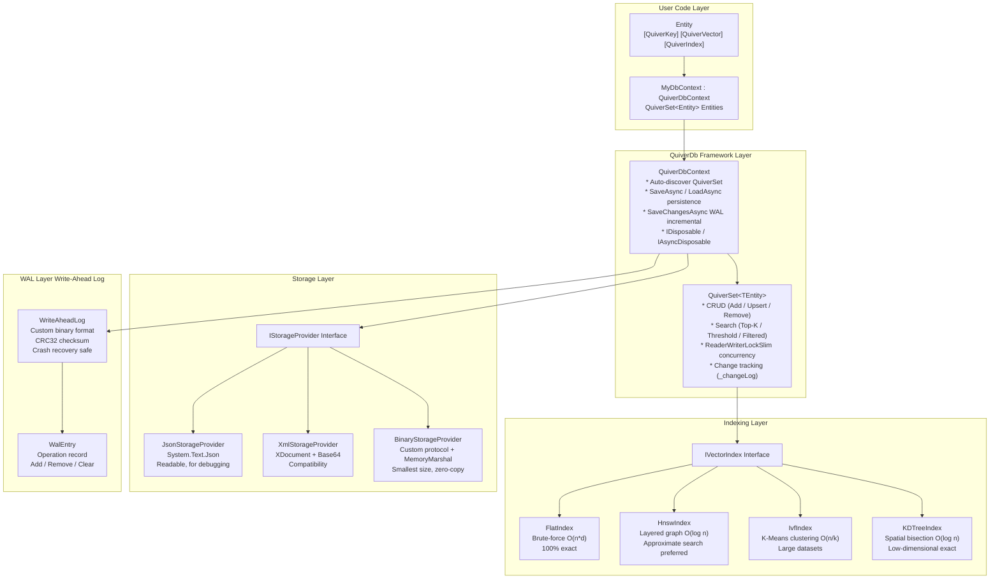

### 1.2 Core Components Overview

| Component | Type | Responsibility |
|-----------|------|----------------|
| `QuiverDbContext` | `abstract class` | Database context base class, manages automatic reflection discovery of QuiverSet collections, persistence read/write, lifecycle |
| `QuiverSet<TEntity>` | `class` | Vector collection, provides full CRUD + multiple search modes, internal `ReaderWriterLockSlim` reader-writer lock |
| `IVectorIndex` | `internal interface` | Unified vector index contract, defines `Add` / `Remove` / `Clear` / `Search` / `SearchByThreshold` |
| `IStorageProvider` | `internal interface` | Unified persistence contract, supports `SaveAsync` / `LoadAsync` |
| `StorageProviderFactory` | `internal static class` | Factory method, creates corresponding `IStorageProvider` instance based on `StorageFormat` enum |
| `QuiverVectorAttribute` | `Attribute` | Marks vector field, specifies dimensions and distance metric |
| `QuiverKeyAttribute` | `Attribute` | Marks entity primary key (exactly one per entity) |
| `QuiverIndexAttribute` | `Attribute` | Configures index type and tuning parameters (optional, defaults to Flat) |
| `QuiverDbOptions` | `class` | Global configuration: storage path, default metric, format, JSON options, WAL configuration |
| `QuiverSearchResult<T>` | `record` | Search result DTO, contains `Entity` and `Similarity` |
| `WriteAheadLog` | `internal sealed class` | WAL file read/write engine, custom binary format + CRC32 checksum, crash recovery safe |
| `WalEntry` | `internal sealed record` | WAL change record, contains operation type, target type name, JSON payload |
| `WalOperation` | `internal enum` | WAL operation types: Add / Remove / Clear |

### 1.3 Class Relationship Diagram

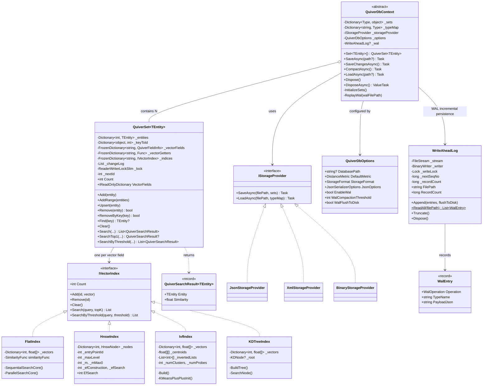

---

## 2. Quick Start

### 2.1 Define Entity Class

```csharp
using Vorcyc.Quiver;

public class Document
{
    [QuiverKey]
    public string Id { get; set; } = string.Empty;

    public string Title { get; set; } = string.Empty;

    public string Category { get; set; } = string.Empty;

    [QuiverVector(384, DistanceMetric.Cosine)]
    public float[] Embedding { get; set; } = [];
}
```

### 2.2 Define Database Context

```csharp
public class MyDocumentDb : QuiverDbContext
{
    public QuiverSet<Document> Documents { get; set; } = null!;

    public MyDocumentDb() : base(new QuiverDbOptions
    {
        DatabasePath = "documents.json",
        StorageFormat = StorageFormat.Json,
        DefaultMetric = DistanceMetric.Cosine
    })
    { }
}
```

### 2.3 Basic Usage

```csharp
// Create database, use await using to ensure automatic saving
await using var db = new MyDocumentDb();
await db.LoadAsync(); // Load existing data (silently returns if file doesn't exist)

// Add entity
db.Documents.Add(new Document
{
    Id = "doc-001",
    Title = "Introduction to Vector Databases",
    Category = "Tutorial",
    Embedding = new float[384] // Should be embedding vector output by a model
});

// Search Top-5 most similar documents
float[] queryVector = new float[384]; // Query vector
var results = db.Documents.Search(
    e => e.Embedding,
    queryVector,
    topK: 5
);

foreach (var result in results)
{
    Console.WriteLine($"Document: {result.Entity.Title}, Similarity: {result.Similarity:F4}");
}

// DisposeAsync automatically saves data to disk when scope ends
```

### 2.4 WAL Incremental Mode Quick Start

With WAL enabled, daily writes only append changes to the WAL file with O(delta) complexity, orders of magnitude faster than full snapshots:

```csharp
// WAL mode database context
public class MyWalDb : QuiverDbContext
{
    public QuiverSet<Document> Documents { get; set; } = null!;

    public MyWalDb() : base(new QuiverDbOptions
    {
        DatabasePath = "documents.vdb",
        StorageFormat = StorageFormat.Binary,
        EnableWal = true,              // Enable WAL
        WalCompactionThreshold = 10_000, // Auto-compact when WAL exceeds 10K records
        WalFlushToDisk = true            // fsync to guarantee durability
    })
    { }
}

// Usage
await using var db = new MyWalDb();
await db.LoadAsync(); // Load snapshot + replay WAL incremental changes

db.Documents.Add(new Document
{
    Id = "doc-001",
    Title = "Introduction to Vector Databases",
    Category = "Tutorial",
    Embedding = new float[384]
});

// Only append changes to WAL, O(delta) complexity
await db.SaveChangesAsync();

// Manually compact when needed: create full snapshot + clear WAL
await db.CompactAsync();

// DisposeAsync automatically calls SaveChangesAsync when scope ends
```

### 2.5 End-to-End Flow

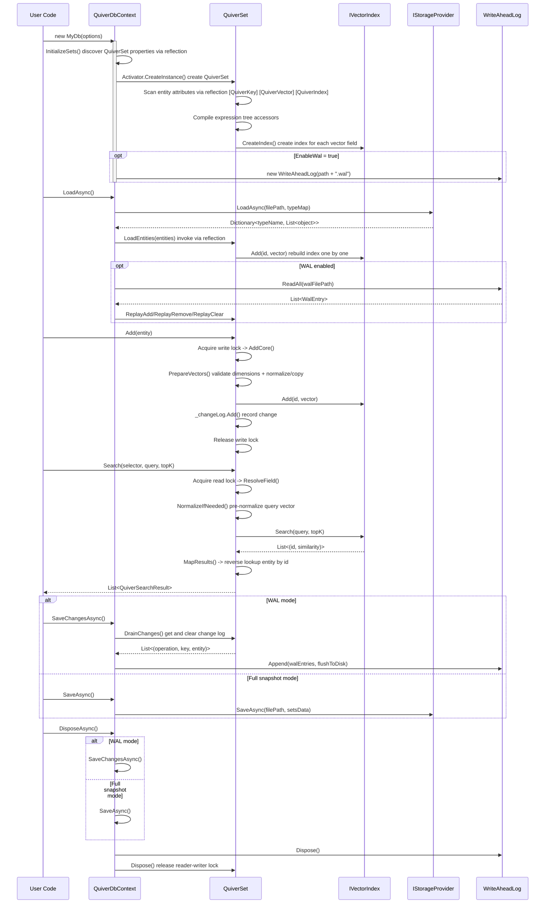

---

## 3. Core Concepts

### 3.1 Entity Definition and Attribute Annotations

Entity classes declare vector database metadata through Attributes. `QuiverSet<TEntity>` scans these attributes via reflection during construction to automatically discover and register fields.

#### `[QuiverKey]` — Primary Key Annotation

Each entity **must have exactly one** `[QuiverKey]` property. Supports any type (`string`, `int`, `Guid`, etc.). At runtime, the primary key value is read through a compiled expression tree accessor, internally stored as boxed `object` in `Dictionary<object, int>` for O(1) lookup and deduplication.

```csharp
[QuiverKey]
public string PersonId { get; set; } = string.Empty;
```

**Constraints**:
- Primary key value cannot be `null` (validated on write)
- Primary key must be unique within the collection (`Add` validates, `Upsert` handles automatically)
- Missing `[QuiverKey]` attribute causes `QuiverSet` construction to throw `InvalidOperationException`

#### `[QuiverVector(dimensions, metric)]` — Vector Field Annotation

Marks a property as a vector feature field. **Property type must be `float[]`**. An entity can have multiple vector fields annotated (multimodal scenarios).

```csharp
// 128-dimensional vector, using cosine similarity (default)
[QuiverVector(128)]
public float[] Embedding { get; set; } = [];

// 384-dimensional vector, explicitly specifying Euclidean distance
[QuiverVector(384, DistanceMetric.Euclidean)]
public float[] TextFeature { get; set; } = [];
```

**Parameter Description**:

| Parameter | Type | Default | Description |
|-----------|------|---------|-------------|
| `dimensions` | `int` | — (required) | Vector dimensions, validated at runtime `vector.Length == dimensions` |
| `metric` | `DistanceMetric` | `Cosine` | Distance metric type |

> **Common Dimensions**: 128 (lightweight models), 384 (MiniLM), 768 (BERT-base), 1024 (BERT-large), 1536 (OpenAI Ada-002), 3072 (OpenAI text-embedding-3-large).

**Runtime Behavior**:
- On write (`AddCore` / `PrepareVectors`): validates dimension match, throws `ArgumentException` on mismatch
- `Cosine` metric: performs L2 normalization before storing in index (`NormalizeToArray`)
- Non-`Cosine` metrics: performs defensive copy (`vector.Clone()`) to prevent external array modifications from corrupting the index

#### `[QuiverIndex(indexType)]` — Index Configuration (Optional)

Used on the same property as `[QuiverVector]` to specify the indexing strategy for that vector field. **Defaults to Flat brute-force search when not annotated**.

```csharp
// HNSW index: preferred for approximate search of high-dimensional vectors
[QuiverVector(768)]
[QuiverIndex(VectorIndexType.HNSW, M = 32, EfConstruction = 300, EfSearch = 100)]
public float[] Embedding { get; set; } = [];

// IVF index: large dataset scenarios
[QuiverVector(128)]
[QuiverIndex(VectorIndexType.IVF, NumClusters = 100, NumProbes = 15)]
public float[] Feature { get; set; } = [];

// KDTree index: only suitable for low dimensions < 20
[QuiverVector(16)]
[QuiverIndex(VectorIndexType.KDTree)]
public float[] LowDimFeature { get; set; } = [];
```

**`QuiverIndexAttribute` Complete Parameters**:

| Parameter | Applicable Index | Default | Description |
|-----------|-----------------|---------|-------------|
| `IndexType` | All | `Flat` | Index type enum |
| `M` | HNSW | 16 | Max neighbor connections per layer, layer 0 automatically uses `M * 2` |
| `EfConstruction` | HNSW | 200 | Candidate set size during construction |
| `EfSearch` | HNSW | 50 | Candidate set size during search, must be >= topK |
| `NumClusters` | IVF | 0 (auto sqrt(n)) | K-Means cluster count |
| `NumProbes` | IVF | 10 | Number of clusters to probe during search |

### 3.2 Database Context QuiverDbContext

`QuiverDbContext` is the core entry point for the vector database, designed to mimic EF Core's `DbContext`.

#### Auto-Discovery Mechanism

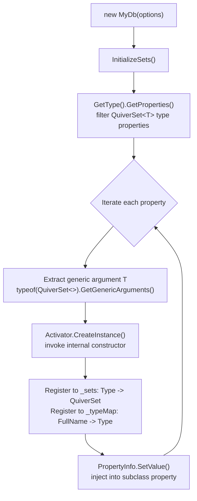

**Key Behaviors**:

- **Auto-discovery**: During construction, scans **all** `QuiverSet<T>` public properties of the subclass via reflection, automatically creates instances and injects them (no manual `new` required).
- **Persistence**: Delegates all collection data serialization/deserialization to `IStorageProvider` via `SaveAsync()` / `LoadAsync()`.
- **Lifecycle**: Implements `IDisposable` and `IAsyncDisposable`. Synchronous `Dispose` only releases resources; asynchronous `DisposeAsync` **automatically saves before releasing**.

```csharp
public class MyDb : QuiverDbContext
{
    // Declare to register, no manual initialization needed.
    // Property values are automatically injected by the framework after construction.
    public QuiverSet<FaceFeature> Faces { get; set; } = null!;
    public QuiverSet<Document> Documents { get; set; } = null!;

    public MyDb(string path, StorageFormat format)
        : base(new QuiverDbOptions
        {
            DatabasePath = path,
            StorageFormat = format
        })
    { }
}
```

**Generic Method Access**:

```csharp
// The following two approaches are equivalent:
var set1 = db.Faces;              // Direct property access
var set2 = db.Set<FaceFeature>(); // Generic method access (supports dynamic type lookup)
// Set<T>() internally looks up _sets dictionary, throws InvalidOperationException if not found
```

### 3.3 Vector Collection QuiverSet\<TEntity\>

`QuiverSet<TEntity>` is a vector collection for a single entity type, providing complete CRUD and search capabilities.

#### Internal Data Structures

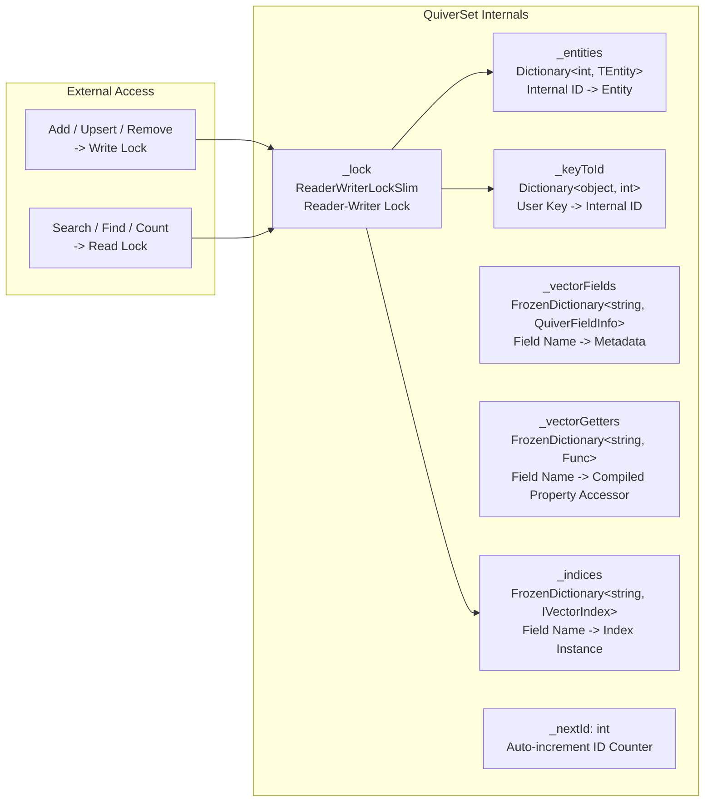

#### Initialization Flow During Construction

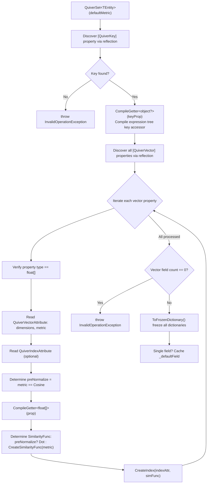

**Performance Optimization Highlights**:

| Optimization | Technique | Effect |
|-------------|-----------|--------|
| Property access | Expression tree compiled `Func<TEntity, T>` | Nanosecond-level, ~100x faster than reflection `PropertyInfo.GetValue` |
| Metadata lookup | `FrozenDictionary` | Zero heap allocation, optimized hash strategy for small key sets |
| Cosine computation | Pre-normalization + `TensorPrimitives.Dot` | Avoids recomputing norms on every search |
| L2 normalization | `TensorPrimitives.Norm` + `Divide` | SIMD accelerated |
| Similarity function | Direct binding to `TensorPrimitives` method groups | Zero lambda overhead |

---

## 4. Distance Metrics

The `DistanceMetric` enum defines three vector similarity computation methods:

| Metric Type | Mathematical Formula | Range | Use Case | Pre-normalization |
|------------|---------------------|-------|----------|-------------------|
| `Cosine` | $\cos(\theta) = \frac{a \cdot b}{\|a\| \times \|b\|}$ | [-1, 1] | Text embeddings, semantic search | ✅ Automatically enabled |
| `Euclidean` | $\frac{1}{1 + \|a - b\|_2}$ | (0, 1] | Spatial coordinates, physical distances | ❌ |
| `DotProduct` | $a \cdot b = \sum_i a_i b_i$ | $(-\infty, +\infty)$ | Pre-normalized vectors, MIPS | ❌ |

### 4.1 Cosine Pre-normalization Optimization Principle

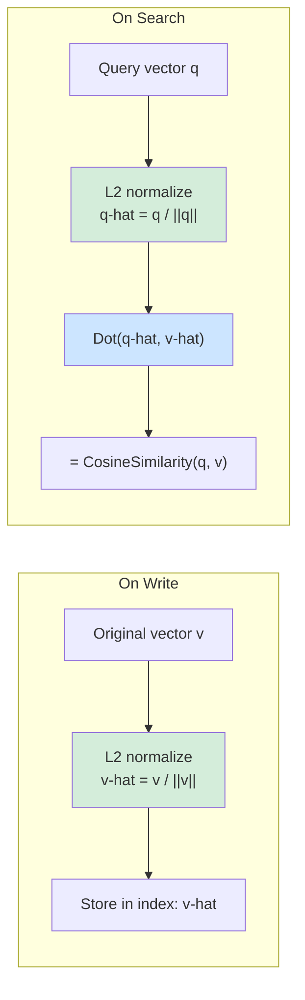

**Why is Dot faster than Cosine?**

- `CosineSimilarity(a, b)` = one dot product + two norm computations = **3 vector traversals**
- After pre-normalization, `Dot(a-hat, b-hat)` = one dot product = **1 vector traversal**
- Normalization overhead is incurred only once during write/query, while search only performs dot products against N candidates

**SIMD-Accelerated Implementation**:

```csharp
// SIMD-optimized implementation using TensorPrimitives
private static void NormalizeVector(ReadOnlySpan<float> source, Span<float> destination)
{
    var norm = TensorPrimitives.Norm(source);    // SIMD-accelerated L2 norm
    if (norm > 0f)
        TensorPrimitives.Divide(source, norm, destination); // SIMD-accelerated vector division
    else
        destination.Clear(); // Zero vector safety, avoid NaN
}
```

### 4.2 Metric Selection Recommendations

```csharp
// Cosine — most common, text/semantic search
[QuiverVector(384, DistanceMetric.Cosine)]
public float[] TextEmbedding { get; set; } = [];

// Euclidean — scenarios caring about absolute distance (geographic coordinates, physical space)
[QuiverVector(3, DistanceMetric.Euclidean)]
public float[] Position { get; set; } = [];

// DotProduct — vectors already pre-normalized or needing Maximum Inner Product Search (MIPS)
[QuiverVector(128, DistanceMetric.DotProduct)]
public float[] Feature { get; set; } = [];
```

### 4.3 Similarity Function Mapping

The framework internally creates different `SimilarityFunc` delegates (`ReadOnlySpan<float>, ReadOnlySpan<float> -> float`) based on metric type, which can directly bind to `TensorPrimitives` static method groups:

| Metric | PreNormalize | Bound Function |
|--------|-------------|----------------|
| `Cosine` | `true` | `TensorPrimitives.Dot` |
| `DotProduct` | `false` | `TensorPrimitives.Dot` |
| `Euclidean` | `false` | `(a, b) => 1f / (1f + TensorPrimitives.Distance(a, b))` |
| `Cosine` (fallback) | `false` | `TensorPrimitives.CosineSimilarity` |

---

## 5. Index Types

### 5.1 Flat (Brute-Force Search)

Traverses all vectors computing similarity, results are **100% exact**, and is the default index type.

| Property | Value |
|----------|-------|
| Implementation | `FlatIndex` |
| Time Complexity | O(n * d) |
| Space Complexity | O(n * d) |
| Accuracy | 100% |
| Suitable Data Size | < 10,000 |
| Parallel Threshold | Automatically enables `Parallel.ForEach` when > 10,000 entries |

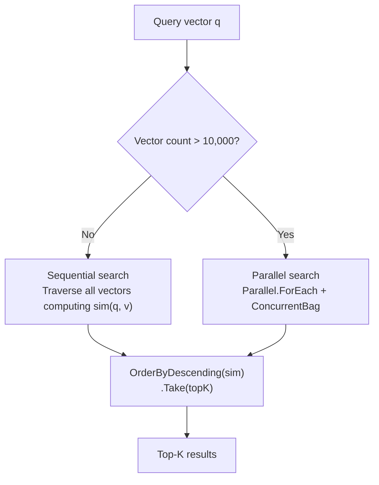

**Search Strategy Switching**:

```csharp
// Small data (<=10K): sequential traversal is faster, avoids thread scheduling overhead
private List<(int, float)> SequentialSearchCore(float[] query, int topK)
{
    var results = new List<(int Id, float Sim)>(_vectors.Count);
    foreach (var (id, vector) in _vectors)
        results.Add((id, similarityFunc(query, vector)));
    return results.OrderByDescending(r => r.Sim).Take(topK).ToList();
}

// Large data (>10K): Parallel.ForEach for multi-threaded parallel computation
private List<(int, float)> ParallelSearchCore(float[] query, int topK)
{
    var results = new ConcurrentBag<(int Id, float Similarity)>();
    Parallel.ForEach(_vectors, kvp =>
        results.Add((kvp.Key, similarityFunc(query, kvp.Value))));
    return results.OrderByDescending(r => r.Similarity).Take(topK).ToList();
}
```

```csharp
// Usage: default index, no [QuiverIndex] annotation needed
[QuiverVector(128)]
public float[] Embedding { get; set; } = [];
```

### 5.2 HNSW (Hierarchical Navigable Small World Graph)

Multi-layer proximity graph structure, the **universal preferred choice for approximate search**. Similar to "highway -> regional road -> local road" layered navigation.

| Property | Value |
|----------|-------|
| Implementation | `HnswIndex` |
| Search Complexity | O(log n) |
| Insert Complexity | O(log n) * efConstruction |
| Space Complexity | O(n * M) |
| Suitable Data Size | 10K ~ 10M |
| Deletion Strategy | Lazy deletion (residual references auto-cleaned) |

#### HNSW Layered Structure

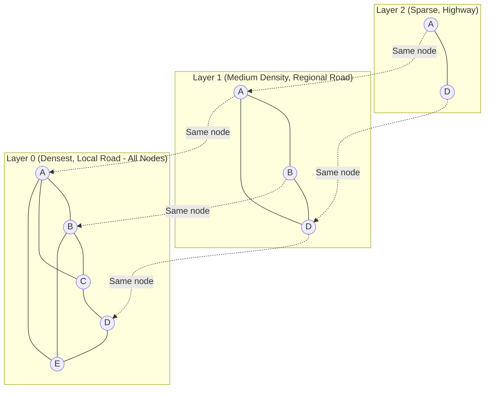

#### Insertion Algorithm Flow

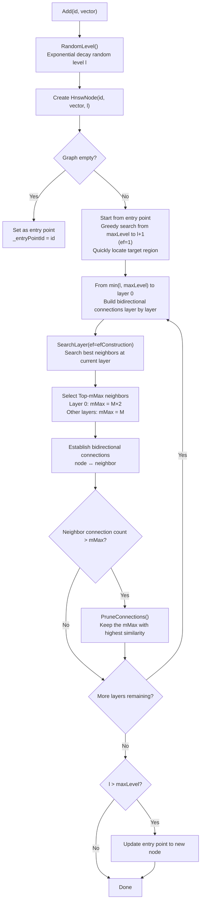

#### Search Algorithm Flow

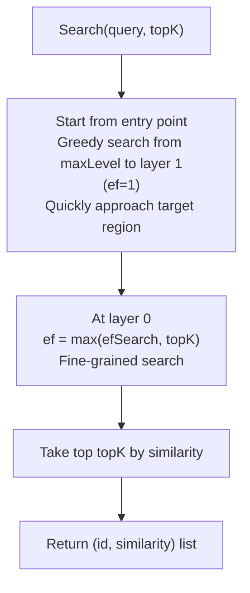

**Parameter Tuning Guide**:

| Parameter | Default | Recommended Range | Increase Effect | Decrease Effect |
|-----------|---------|-------------------|-----------------|-----------------|
| `M` | 16 | 12 ~ 48 | Higher recall, more memory, longer build time | Less memory, lower recall |
| `EfConstruction` | 200 | 100 ~ 500 | Better graph quality, slower insertion | Faster insertion, lower graph quality |
| `EfSearch` | 50 | 50 ~ 500 | Higher recall, slower search | Faster search, lower recall |

> **`EfSearch` can be dynamically adjusted at runtime** without rebuilding the index: `hnswIndex.EfSearch = 200;`

```csharp
[QuiverVector(768, DistanceMetric.Cosine)]
[QuiverIndex(VectorIndexType.HNSW, M = 32, EfConstruction = 300, EfSearch = 100)]
public float[] Embedding { get; set; } = [];
```

### 5.3 IVF (Inverted File Index)

Partitions vector space based on **K-Means clustering**, only probing the nearest clusters during search.

| Property | Value |
|----------|-------|
| Implementation | `IvfIndex` |
| Build Complexity | O(n * k * d * iter) |
| Search Complexity | O(k * d + nProbe * n/k * d) |
| Suitable Data Size | 100K+ |
| Build Method | Lazy (triggered on first search) |
| Auto-Rebuild | Flagged for rebuild after 50% data growth |
| Centroid Initialization | K-Means++ |
| Iteration Algorithm | Lloyd (max 50 rounds) |
| SIMD Acceleration | `TensorPrimitives.Add` / `TensorPrimitives.Divide` |

#### IVF Search Flow

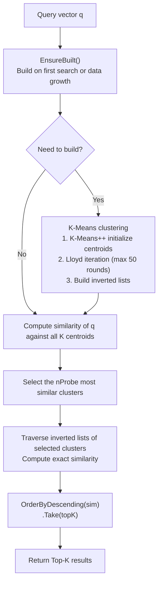

#### K-Means Clustering Build

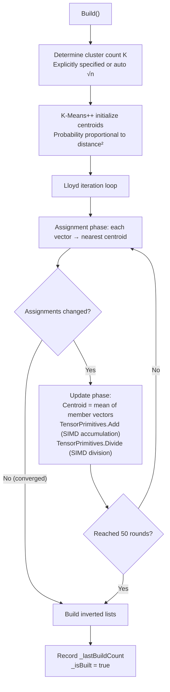

**Parameter Tuning**:

| Parameter | Default | Recommended Range | Description |
|-----------|---------|-------------------|-------------|
| `NumClusters` | 0 (auto sqrt(n)) | sqrt(n) ~ 4*sqrt(n) | Cluster count. Larger -> smaller clusters -> faster search but more centroid comparisons |
| `NumProbes` | 10 | 1 ~ 20 | Probe count. When = total clusters, degrades to brute-force search |

> **Threshold search** automatically expands probe range to `nProbe * 2`, reducing missed results from cluster partitioning.

```csharp
[QuiverVector(128, DistanceMetric.Cosine)]
[QuiverIndex(VectorIndexType.IVF, NumClusters = 100, NumProbes = 15)]
public float[] Feature { get; set; } = [];
```

### 5.4 KDTree

Spatial binary partition tree for **exact search**. Alternately splits space along dimensions, using pruning to skip impossible subtrees.

| Property | Value |
|----------|-------|
| Implementation | `KDTreeIndex` |
| Search Complexity | O(log n) (low dim), O(n) (high dim) |
| Accuracy | 100% |
| Suitable Dimensions | < 20 |
| Build Method | Lazy (triggered on first search, full rebuild) |
| Rebuild Trigger | Flagged for rebuild after every Add/Remove |

#### KD-Tree Structure Diagram

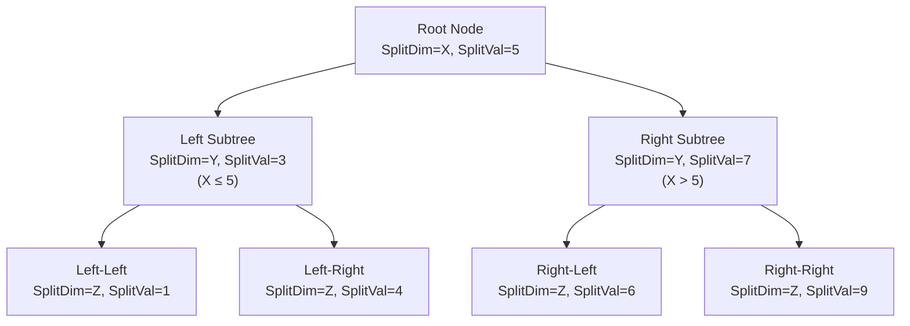

#### Search Pruning Strategy

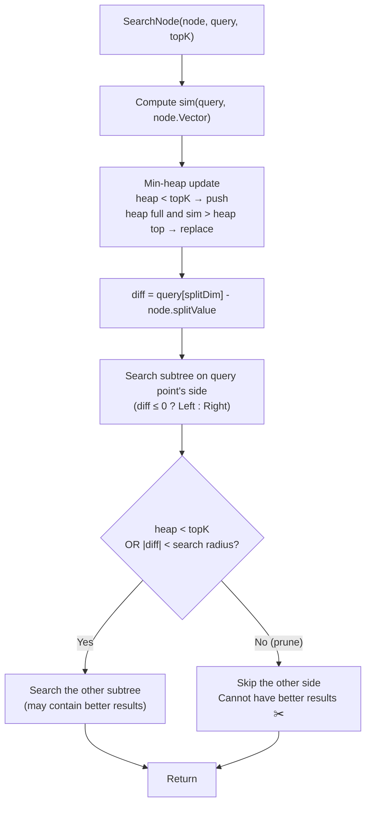

> ⚠️ **Curse of Dimensionality**: When dimensions exceed ~20, nearly every subtree must be visited (pruning fails), degrading to O(n). Use HNSW for high-dimensional scenarios.  
> ⚠️ **Threshold search** degrades to brute-force traversal (KD-Tree pruning cannot be directly applied to threshold search).

```csharp
[QuiverVector(16, DistanceMetric.Euclidean)]
[QuiverIndex(VectorIndexType.KDTree)]
public float[] LowDimFeature { get; set; } = [];
```

### 5.5 Index Selection Decision Guide

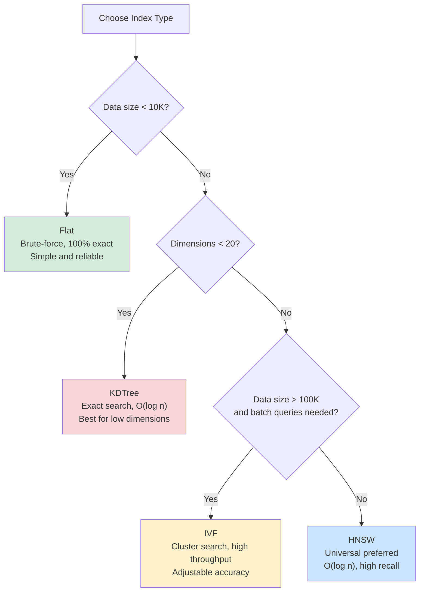

**Comprehensive Comparison Table**:

| Dimension | Flat | HNSW | IVF | KDTree |
|-----------|------|------|-----|--------|
| Search Speed | O(n*d) | O(log n) | O(n/k*d) | O(log n) ~ O(n) |
| Accuracy | 100% | ~95-99%+ | ~90-99% | 100% |
| Insert Speed | O(1) | O(log n) | O(1)* | O(1)** |
| Memory | n*d | n*(d+M) | n*d + k*d | n*d + tree structure |
| Suitable Data Size | <10K | 10K~10M | 100K+ | <10K (low dim) |
| Suitable Dimensions | Any | Any | Any | <20 |
| Build Method | Immediate | Immediate | Lazy | Lazy |
| Parallelization | Yes >10K | No | No | No |

> \* IVF insertion is immediate, but index needs rebuilding
> \*\* KDTree insertion is immediate, but tree needs rebuilding

---

## 6. CRUD Operations

### 6.1 Adding Entities

```csharp
// Add a single entity
db.Documents.Add(new Document
{
    Id = "doc-001",
    Title = "Getting Started Guide",
    Embedding = new float[384]
});

// Batch add (atomic semantics: if any validation fails, all are rolled back)
var batch = new List<Document>
{
    new() { Id = "doc-002", Title = "Advanced Tutorial", Embedding = new float[384] },
    new() { Id = "doc-003", Title = "Best Practices", Embedding = new float[384] },
};
db.Documents.AddRange(batch);

// Async batch add (offloads CPU-intensive computation to thread pool)
await db.Documents.AddRangeAsync(batch, cancellationToken);
```

#### `AddRange` Two-Phase Commit

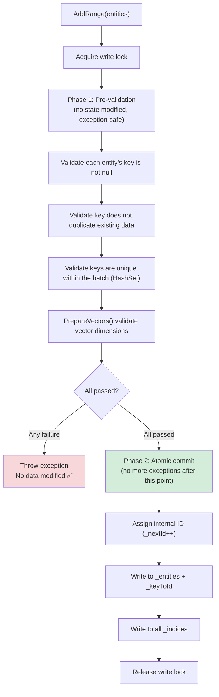

### 6.2 Insert or Update (Upsert)

Completed within a **single write lock**, more efficient and atomic than external `Remove + Add`.

```csharp
db.Documents.Upsert(new Document
{
    Id = "doc-001",
    Title = "Updated Getting Started Guide",
    Embedding = new float[384]
});
// Key exists -> RemoveCore() + AddCore()
// Key doesn't exist -> AddCore() directly
```

### 6.3 Removing Entities

```csharp
// Remove by entity (matched by primary key, not by reference comparison)
bool removed = db.Documents.Remove(entity);

// Remove by primary key directly (no entity reference needed)
bool removed = db.Documents.RemoveByKey("doc-001");
```

**Internal removal flow** (`RemoveCore`):

1. Reverse lookup internal ID via `_keyToId`
2. Remove entity from `_entities` dictionary
3. Remove key mapping from `_keyToId` dictionary
4. Remove vector from **all** `_indices` (index implementations handle residual references internally)

### 6.4 Finding Entities

```csharp
// Find by primary key, O(1) complexity (dual dictionary: key -> internal ID -> entity)
Document? doc = db.Documents.Find("doc-001");
```

### 6.5 Clearing the Collection

```csharp
db.Documents.Clear();
// Clears _entities + _keyToId + all indices
// Resets _nextId = 0
```

### 6.6 Getting Information

```csharp
int count = db.Documents.Count; // Thread-safe (read lock)

// View vector field metadata
foreach (var (name, dimensions) in db.Documents.VectorFields)
    Console.WriteLine($"Field: {name}, Dimensions: {dimensions}");
```

---

## 7. Vector Search

### 7.1 Top-K Search

Returns the top K entities with the highest similarity, sorted in descending order of similarity.

```csharp
float[] queryVector = GetEmbedding("search keywords");

var results = db.Documents.Search(
    vectorSelector: e => e.Embedding,  // Expression tree selector
    queryVector: queryVector,
    topK: 10
);

foreach (var result in results)
{
    Console.WriteLine($"ID: {result.Entity.Id}");
    Console.WriteLine($"Title: {result.Entity.Title}");
    Console.WriteLine($"Similarity: {result.Similarity:F4}");
}
```

**Internal flow**:

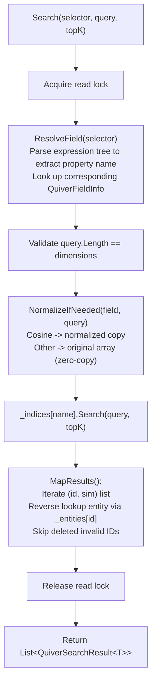

### 7.2 Threshold Search

Returns all entities with similarity not less than the specified threshold. The number of results is variable.

```csharp
var results = db.Documents.SearchByThreshold(
    vectorSelector: e => e.Embedding,
    queryVector: queryVector,
    threshold: 0.85f
);

Console.WriteLine($"Found {results.Count} results with similarity >= 0.85");
```

### 7.3 Filtered Search

Supports both **expression filtering** and **delegate filtering**.

```csharp
// Approach 1: Expression filtering
// ⚠️ Compiles expression tree on each call, overhead ~50μs
var results = db.Documents.Search(
    e => e.Embedding,
    queryVector,
    topK: 10,
    filter: e => e.Title.Contains("tutorial")
);

// Approach 2: Delegate filtering (recommended for high-frequency calls)
// Cache the compiled delegate externally to avoid repeated compilation
Func<Document, bool> myFilter = e => e.Title.Contains("tutorial");
var results = db.Documents.Search(
    e => e.Embedding,
    queryVector,
    topK: 10,
    filter: myFilter,
    overFetchMultiplier: 4
);
```

#### Over-Fetch Strategy

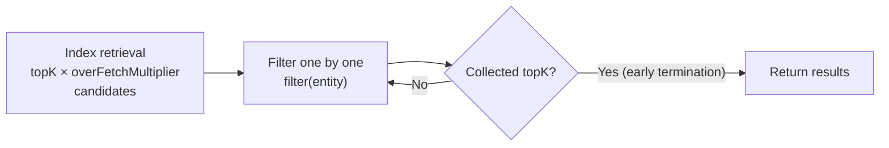

| `overFetchMultiplier` | Description |
|----------------------|-------------|
| 4 (default) | Suitable for filter rates < 75% |
| 8~16 | High filter rate scenarios (e.g., filtering by category) |
| Larger values | Extreme filter rates (e.g., searching for specific tags only) |

### 7.4 Top-1 Search

Searches for the single most similar entity. Internal optimization path: avoids intermediate `List` allocation, `MapTop1` takes only the first valid result.

```csharp
var top1 = db.Documents.SearchTop1(
    e => e.Embedding,
    queryVector
);

if (top1 != null)
    Console.WriteLine($"Most similar: {top1.Entity.Title} ({top1.Similarity:F4})");
else
    Console.WriteLine("No similar document found");
```

### 7.5 Async Search

All search methods provide `Async` suffix overloads that offload CPU-intensive computation to the thread pool via `Task.Run`, avoiding blocking UI threads or ASP.NET request threads.

```csharp
// Async Top-K
var results = await db.Documents.SearchAsync(
    e => e.Embedding, queryVector, topK: 10, cancellationToken);

// Async with filter
var results = await db.Documents.SearchAsync(
    e => e.Embedding, queryVector, topK: 10,
    filter: e => e.Category == "Tutorial",
    overFetchMultiplier: 4, cancellationToken);

// Async threshold search
var results = await db.Documents.SearchByThresholdAsync(
    e => e.Embedding, queryVector, threshold: 0.8f, cancellationToken);

// Async Top-1
var top1 = await db.Documents.SearchTop1Async(
    e => e.Embedding, queryVector, cancellationToken);
```

### 7.6 Default Field Convenience Methods

When an entity has only one `[QuiverVector]` field, the `vectorSelector` parameter can be omitted. The framework caches `_defaultField` to avoid calling `_vectorFields.First()` every time.

```csharp
// Single vector field entity — omit vectorSelector
var results = db.Documents.Search(queryVector, topK: 5);
var top1 = db.Documents.SearchTop1(queryVector);

// Async versions
var results = await db.Documents.SearchAsync(queryVector, topK: 5);
var top1 = await db.Documents.SearchTop1Async(queryVector);
```

> ⚠️ Calling default methods on multi-vector-field entities throws `InvalidOperationException("Entity has N vector fields. Use the overload with a vectorSelector expression.")`

---

## 8. Persistent Storage

### 8.1 Save and Load

```csharp
// Save to configured DatabasePath (full snapshot)
await db.SaveAsync();

// Save to a specified path (overrides DatabasePath)
await db.SaveAsync(@"C:\backup\mydata.json");

// WAL incremental save — only append changes to WAL file, O(Δ) complexity
await db.SaveChangesAsync();

// Manual compaction: create full snapshot + clear WAL
await db.CompactAsync();

// Load (silently returns if file doesn't exist, no exception — suitable for first startup)
// Automatically replays incremental changes when WAL is enabled
await db.LoadAsync();

// Load from a specified path
await db.LoadAsync(@"C:\backup\mydata.json");
```

#### Persistence Internal Flow

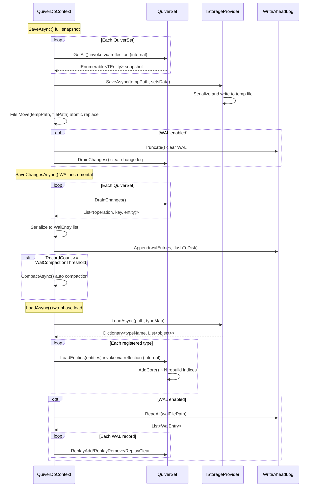

### 8.2 Storage Format Comparison

| Format | Implementation | Readability | File Size | Read/Write Speed | Use Case |
|--------|---------------|-------------|-----------|-----------------|----------|
| `Json` | `JsonStorageProvider` | ✅ Excellent | Largest | Average | Development & debugging |
| `Xml` | `XmlStorageProvider` | ✅ Good | Large | Average | Compatibility requirements |
| `Binary` | `BinaryStorageProvider` | ❌ Not readable | **Smallest** | **Fastest** | Production environments |

### 8.3 JSON Format Details

Uses `System.Text.Json` for serialization. Output structure:

```json
{
  "MyNamespace.FaceFeature": [
    { "personId": "P001", "name": "Alice", "embedding": [0.1, 0.2, ...] },
    { "personId": "P002", "name": "Bob", "embedding": [0.3, 0.4, ...] }
  ]
}
```

- Supports customizing indentation and naming policy via `QuiverDbOptions.JsonOptions`
- Defaults to `WriteIndented = true` + `CamelCase`
- Uses `JsonDocument` DOM parsing during loading, deserializing element by element
- Unrecognized type names are automatically skipped (forward compatible)

### 8.4 XML Format Details

Uses `System.Xml.Linq` (`XDocument`). Output structure:

```xml
<?xml version="1.0" encoding="utf-8"?>
<QuiverDb version="1">
  <Set type="FaceFeature" count="2">
    <Entity>
      <PersonId>P001</PersonId>
      <Name>Alice</Name>
      <Embedding>Base64EncodedBytes...</Embedding>
    </Entity>
  </Set>
</QuiverDb>
```

- Vector data uses **Base64 encoding** (`MemoryMarshal.AsBytes` → `Convert.ToBase64String`), compact with no precision loss
- DateTime uses **ISO 8601 round-trip format** (`"O"`)
- Numeric values use `CultureInfo.InvariantCulture`, ensuring cross-region consistency

### 8.5 Binary Format Details

Custom compact binary protocol with optimal performance:

```
┌─ File Header ─────────────────────────────────────────────
│  Magic: "QDB\x01" (4B)              ← File identifier + version
│  SetCount (int32)                    ← Number of vector collections
├─ Set × SetCount ──────────────────────────────────────────
│  TypeName (string)                   ← BinaryWriter length-prefixed
│  PropCount (int32)                   ← Number of property descriptors
│  ┌─ PropDescriptor × PropCount ───────────────────────────
│  │  PropName (string)
│  │  TypeCode (byte)                  ← 0=string 1=int32 ... 9=float[]
│  ├─ Entity × EntityCount ─────────────────────────────────
│  │  [null flag 1B] + [field value]   ← Written field by field in descriptor order
│  │  float[] → [len int32][raw bytes] ← MemoryMarshal.AsBytes zero-copy
└───────────────────────────────────────────────────────────
```

**Supported Property Type Codes**:

| TypeCode | CLR Type | Storage Method |
|----------|---------|---------------|
| 0 | `string` | BinaryWriter.Write (length-prefixed) |
| 1 | `int` | 4 bytes |
| 2 | `long` | 8 bytes |
| 3 | `float` | 4 bytes |
| 4 | `double` | 8 bytes |
| 5 | `bool` | 1 byte |
| 6 | `DateTime` | ToBinary() → 8 bytes |
| 7 | `Guid` | 16 bytes |
| 8 | `decimal` | 16 bytes |
| 9 | `float[]` | [length int32] + [raw bytes zero-copy] |
| 10 | `string[]` | [length int32] + [element-by-element strings] |
| 11 | `byte` | 1 byte |
| 12 | `short` | 2 bytes |
| 13 | `Half` | 2 bytes (half-precision float, common in ML/AI scenarios) |
| 14 | `DateTimeOffset` | [Ticks int64] + [OffsetMinutes int16] = 10 bytes |
| 15 | `TimeSpan` | Ticks → 8 bytes |
| 16 | `byte[]` | [length int32] + [raw bytes] |
| 17 | `double[]` | [length int32] + [raw bytes zero-copy] |

### 8.6 WAL Incremental Persistence

WAL (Write-Ahead Log) is an incremental persistence mechanism that records write operations by appending them to a log file, avoiding full serialization on every save and significantly reducing persistence overhead.

#### Two Persistence Modes Compared

| Dimension | Full Snapshot Mode (SaveAsync) | WAL Incremental Mode (SaveChangesAsync) |
|-----------|-------------------------------|----------------------------------------|
| Persisted Content | Complete snapshot of all entities | Only changes since last save (Δ) |
| Time Complexity | O(N) (N = total entity count) | O(Δ) (Δ = number of changes) |
| File Writing | Full overwrite | Append-only |
| Applicable Scenario | Small data, low save frequency | Large data, high-frequency writes |
| Enable Method | Default | `EnableWal = true` |

#### Enabling WAL

```csharp
var options = new QuiverDbOptions
{
    DatabasePath = "mydata.vdb",
    StorageFormat = StorageFormat.Binary,
    EnableWal = true,                // Enable WAL
    WalCompactionThreshold = 10_000, // Auto-compaction threshold
    WalFlushToDisk = true            // fsync durability guarantee
};
```

#### Core API

```csharp
// Incremental save: only append unpersisted changes to the WAL file
await db.SaveChangesAsync();

// Full snapshot + clear WAL (equivalent to CompactAsync)
await db.SaveAsync();

// Manual compaction: create full snapshot + clear WAL
await db.CompactAsync();

// Load: read full snapshot + replay WAL incremental changes in order
await db.LoadAsync();
```

#### WAL Workflow

```mermaid
flowchart TD
    subgraph Write Phase
        W1["User calls Add/Upsert/Remove/Clear"] --> W2["QuiverSet updates in-memory data + indices"]
        W2 --> W3["_changeLog records change<br/>(Op, Key, Entity)"]
    end

    subgraph SaveChangesAsync
        S1["DrainChanges() get and clear change log"] --> S2["Serialize to WalEntry list<br/>(JSON payload)"]
        S2 --> S3["WriteAheadLog.Append()<br/>Batch append + CRC32 checksum"]
        S3 --> S4{"RecordCount >= threshold?"}
        S4 -- "Yes" --> S5["CompactAsync()<br/>Create full snapshot + clear WAL"]
        S4 -- "No" --> S6["Done"]
    end

    subgraph LoadAsync
        L1["Phase 1: Load full snapshot<br/>IStorageProvider.LoadAsync()"] --> L2["Phase 2: Read WAL file<br/>WriteAheadLog.ReadAll()"]
        L2 --> L3["Replay each record in order<br/>ReplayAdd / ReplayRemove / ReplayClear"]
        L3 --> L4["Memory state = snapshot + Δ"]
    end

    W3 --> S1
    S6 --> L1
```

#### Change Tracking Mechanism

`QuiverSet<T>` internally maintains a `_changeLog` list, recording each write operation within the write lock:

| Operation | Op Code | Key | Entity |
|-----------|---------|-----|--------|
| Add | 1 | Key value | Entity instance |
| Remove | 2 | Key value | `null` |
| Clear | 3 | `null` | `null` |

**Special Behaviors**:
- `Upsert` is recorded as two changes: Remove + Add
- `LoadEntities` (snapshot loading) and `ReplayAdd/Remove/Clear` (WAL replay) **do not record changes**, avoiding circular writes
- `DrainChanges()` uses snapshot + clear semantics: retrieves the change list and immediately clears it, ensuring each change is persisted only once

#### WAL File Format

Custom compact binary format with CRC32 checksum per record:

```
┌─ File Header (5 bytes) ──────────────────────────────────
│  [4B] Magic = "WLOG"                 ← File identifier
│  [1B] Version = 0x01                 ← Protocol version
├─ Record × N ─────────────────────────────────────────────
│  [4B uint32] DataLength              ← Data area length (excludes this field and CRC)
│  ┌─ Data Area (DataLength bytes) ────────────────────────
│  │  [8B int64]  SeqNo                ← Monotonically increasing sequence number
│  │  [1B]        OpCode               ← 1=Add, 2=Remove, 3=Clear
│  │  [string]    TypeName             ← BinaryWriter length-prefixed UTF-8
│  │  [string]    PayloadJson          ← BinaryWriter length-prefixed UTF-8
│  ├───────────────────────────────────────────────────────
│  [4B uint32] CRC32                   ← Covers SeqNo through PayloadJson
└──────────────────────────────────────────────────────────
```

**Crash Recovery Safety**:
- Validates CRC32 record by record during reading; stops reading upon checksum failure or truncated records
- Incomplete trailing records are safely discarded (only losing the most recent batch of unflushed changes)
- Automatically scans and truncates corrupted trailing data when opening an existing WAL file

#### WAL Thread Safety

| Operation | Thread Safety Mechanism |
|-----------|----------------------|
| `Append` | `Lock` object serializes all write operations |
| `ReadAll` | Static method, uses an independent read-only file stream |
| `Truncate` | Executed within `_writeLock` |
| `RecordCount` | `Volatile.Read` ensures cross-thread visibility |

#### Auto-Compaction Strategy

```mermaid
flowchart LR
    SC["SaveChangesAsync()"] --> CHK{"WAL record count >= threshold?"}
    CHK -- "No" --> DONE["Done"]
    CHK -- "Yes" --> COMPACT["CompactAsync()"]
    COMPACT --> SNAP["Create full snapshot<br/>(atomic write: temp file -> replace)"]
    SNAP --> TRUNC["WAL.Truncate()<br/>Keep only file header"]
    TRUNC --> DRAIN["DrainChanges()<br/>Clear in-memory change log"]
    DRAIN --> DONE
```

> **Recommended threshold range**: 1,000 ~ 100,000, depending on individual record size (vector dimensions) and loading speed requirements. Default is 10,000.

---

## 9. Multi-Vector Field Support

An entity can have multiple `[QuiverVector]` properties annotated, each field **maintaining its own independent index**, supporting different dimensions, metrics, and indexing strategies.

### 9.1 Defining Multi-Vector Entities

```csharp
public class MultiModalItem
{
    [QuiverKey]
    public string Id { get; set; } = string.Empty;

    public string Title { get; set; } = string.Empty;
    public string Category { get; set; } = string.Empty;
    public bool IsPublished { get; set; }

    [QuiverVector(384, DistanceMetric.Cosine)]
    [QuiverIndex(VectorIndexType.HNSW, M = 32, EfConstruction = 200, EfSearch = 100)]
    public float[] TextEmbedding { get; set; } = [];

    [QuiverVector(512, DistanceMetric.Cosine)]
    [QuiverIndex(VectorIndexType.HNSW, M = 24, EfConstruction = 200, EfSearch = 80)]
    public float[] ImageEmbedding { get; set; } = [];
}
```

### 9.2 Internal Structure

```mermaid
graph TD
    subgraph "QuiverSet&lt;MultiModalItem&gt;"
        E["_entities"]
        K["_keyToId"]

        subgraph "_indices (independent index per field)"
            TI["TextEmbedding<br/>-> HnswIndex<br/>384d, Cosine"]
            II["ImageEmbedding<br/>-> FlatIndex<br/>512d, Euclidean"]
            AI["AudioEmbedding<br/>-> IvfIndex<br/>256d, DotProduct"]
        end
    end

    ADD["Add(entity)"] --> E
    ADD --> K
    ADD --> TI
    ADD --> II
    ADD --> AI
```

### 9.3 Per-Field Search

```csharp
// Search by text vector
var textResults = db.Items.Search(e => e.TextEmbedding, textQuery, topK: 5);

// Search by image vector
var imageResults = db.Items.Search(e => e.ImageEmbedding, imageQuery, topK: 5);

// Search by audio vector
var audioResults = db.Items.Search(e => e.AudioEmbedding, audioQuery, topK: 5);

// Search results from the three fields are mutually independent (different vector spaces)
```

### 9.4 Viewing Vector Field Information

```csharp
foreach (var (name, dimensions) in db.Items.VectorFields)
    Console.WriteLine($"Field: {name}, Dimensions: {dimensions}");
// Output:
// Field: TextEmbedding, Dimensions: 384
// Field: ImageEmbedding, Dimensions: 512
// Field: AudioEmbedding, Dimensions: 256
```

---

## 10. Thread Safety and Concurrency

### 10.1 Lock Model

`QuiverSet<TEntity>` internally uses `ReaderWriterLockSlim` to implement reader-writer separation:

```mermaid
flowchart LR
    subgraph "Read Operations (Shared Lock)"
        S["Search"]
        F["Find"]
        C["Count"]
        GA["GetAll"]
    end

    subgraph "Write Operations (Exclusive Lock)"
        A["Add"]
        AR["AddRange"]
        U["Upsert"]
        R["Remove"]
        CL["Clear"]
        LE["LoadEntities"]
    end

    S & F & C & GA -->|"Parallel execution ✅"| RLock["EnterReadLock"]
    A & AR & U & R & CL & LE -->|"Mutually exclusive 🔒"| WLock["EnterWriteLock"]
```

### 10.2 Concurrency Safety Examples

```csharp
var db = new MyDocumentDb();

// ✅ Safe: multi-threaded concurrent search (shared read lock)
var tasks = Enumerable.Range(0, 24).Select(_ => Task.Run(() =>
{
    var query = GenerateRandomVector(384);
    return db.Documents.Search(e => e.Embedding, query, topK: 5);
}));
await Task.WhenAll(tasks);

// ✅ Safe: concurrent read-write (read operations wait while write holds exclusive lock)
var writerTask = Task.Run(() =>
{
    db.Documents.Upsert(new Document
    {
        Id = "new-doc",
        Title = "New Document",
        Embedding = new float[384]
    });
});

var readerTask = Task.Run(() =>
    db.Documents.Search(e => e.Embedding, queryVector, topK: 5));

await Task.WhenAll(writerTask, readerTask);
```

### 10.3 Dispose Thread Safety

`QuiverSet` uses `Interlocked.Exchange(ref _disposed, 1)` to guarantee concurrent Dispose safety. All operation entry points call `ThrowIfDisposed()`, using `Volatile.Read` to ensure cross-thread visibility.

### 10.4 Concurrency Performance Reference

| Test Scenario | Data Size | Configuration | Result |
|--------------|-----------|---------------|--------|
| Pure read concurrency | 3,000 entries × 3 vectors | 24 threads × 100 searches | 2,400 searches with zero exceptions |
| Mixed read-write | 1,000 entries × 3 vectors | 4 writers + 8 readers + 2 deleters, 3 seconds | Zero exceptions |
| Batch write + search | Dynamically growing | 3 writer threads (50 per batch) + 6 search threads, 3 seconds | Zero exceptions |

---

## 11. Lifecycle Management

### 11.1 QuiverDbContext Lifecycle

```mermaid
stateDiagram-v2
    [*] --> Created: new MyDb(options)
    Created --> Active: InitializeSets() + Initialize WAL
    Active --> Active: Add / Search / ...
    Active --> Saving: SaveAsync() full snapshot
    Active --> WalAppend: SaveChangesAsync() incremental append
    Saving --> Active: Save complete
    WalAppend --> Active: Append complete
    WalAppend --> Saving: Auto-compaction (threshold exceeded)
    Active --> Disposing_Async: DisposeAsync()
    Disposing_Async --> WalAppend_Final: WAL mode -> SaveChangesAsync()
    Disposing_Async --> Saving_Final: Full mode -> SaveAsync()
    WalAppend_Final --> Disposed: Release WAL + all QuiverSets
    Saving_Final --> Disposed: Release all QuiverSets
    Active --> Disposed: Dispose() (no save)
    Disposed --> [*]
```

| Disposal Method | Auto-Save | WAL Mode Behavior | Recommended Scenario |
|----------------|-----------|-------------------|---------------------|
| `Dispose()` | ❌ No save | No save, only releases resources | When manual save timing control is needed |
| `DisposeAsync()` | ✅ Save then release | Calls `SaveChangesAsync()` for incremental save | **Recommended**, use with `await using` |

### 11.2 Recommended Usage

```csharp
// ✅ Recommended: await using with auto-save (full snapshot mode)
await using var db = new MyDocumentDb();
await db.LoadAsync();
db.Documents.Add(new Document { ... });
// Scope ends -> DisposeAsync -> SaveAsync -> Dispose all resources

// ✅ Recommended: await using with auto-save (WAL mode)
await using var walDb = new MyWalDb();
await walDb.LoadAsync(); // Load snapshot + replay WAL
walDb.Documents.Add(new Document { ... });
// Can explicitly call incremental save after each batch write
await walDb.SaveChangesAsync();
// Scope ends -> DisposeAsync -> SaveChangesAsync -> Dispose all resources

// Manual control approach
var db2 = new MyDocumentDb();
try
{
    db2.Documents.Add(new Document { ... });
    await db2.SaveAsync(); // Manual save
}
finally
{
    db2.Dispose(); // Only releases resources, does not save
}
```

### 11.3 QuiverSet Disposal

`QuiverSet` implements `IDisposable`, releasing the internal `ReaderWriterLockSlim`. All operations throw `ObjectDisposedException` after disposal.

---

## 12. Configuration Options

`QuiverDbOptions` provides the following configurations:

```csharp
var options = new QuiverDbOptions
{
    // Database file path. null for in-memory mode (no persistence)
    // Directory is auto-created by storage provider if it doesn't exist
    DatabasePath = @"C:\Data\MyQuiverDb.json",

    // Default distance metric (entity-level [QuiverVector] attribute can override)
    DefaultMetric = DistanceMetric.Cosine,

    // Persistence storage format
    StorageFormat = StorageFormat.Json,

    // JSON serialization options (only used when StorageFormat.Json)
    JsonOptions = new JsonSerializerOptions
    {
        WriteIndented = true,                           // Indented output
        PropertyNamingPolicy = JsonNamingPolicy.CamelCase  // Camel case naming
    },

    // ── WAL Incremental Persistence Configuration ──

    // Whether to enable WAL incremental persistence
    EnableWal = true,

    // Auto-trigger compaction (full snapshot + clear WAL) when WAL record count reaches this threshold
    WalCompactionThreshold = 10_000,

    // Whether to fsync to physical disk immediately after WAL write
    // true = strongest durability (no data loss on power failure), false = relies on OS buffer (better performance)
    WalFlushToDisk = true
};
```

| Property | Type | Default | Description |
|----------|------|---------|-------------|
| `DatabasePath` | `string?` | `null` | Storage path, `null` for in-memory mode (`SaveAsync` requires explicit `path`) |
| `DefaultMetric` | `DistanceMetric` | `Cosine` | Default distance metric |
| `StorageFormat` | `StorageFormat` | `Json` | Persistence format: `Json` / `Xml` / `Binary` |
| `JsonOptions` | `JsonSerializerOptions` | Indented + CamelCase | JSON serialization options |
| `EnableWal` | `bool` | `false` | Whether to enable WAL incremental persistence |
| `WalCompactionThreshold` | `int` | `10,000` | Auto-compact when WAL record count reaches this value |
| `WalFlushToDisk` | `bool` | `true` | Whether to fsync to disk after WAL write |

---

## 13. Internal Implementation Details

### 13.1 Expression Tree Compiled Property Accessors

The framework uses expression trees to compile high-performance accessors for each primary key and vector property, replacing runtime reflection calls:

```csharp
// Before compilation (reflection): ~200ns / call
var value = propertyInfo.GetValue(entity);

// After compilation (expression tree): ~2ns / call, ~100x improvement
private static Func<TEntity, TResult> CompileGetter<TResult>(PropertyInfo prop)
{
    var param = Expression.Parameter(typeof(TEntity), "e");
    Expression body = Expression.Property(param, prop);
    // Value types automatically get boxing node inserted (e.g., int -> object)
    if (prop.PropertyType != typeof(TResult))
        body = Expression.Convert(body, typeof(TResult));
    return Expression.Lambda<Func<TEntity, TResult>>(body, param).Compile();
}
```

### 13.2 SimilarityFunc Delegate Design

Uses delegates with `ReadOnlySpan<float>` parameter types that can directly bind to `TensorPrimitives` method groups without additional lambda wrapping:

```csharp
// Delegate signature
internal delegate float SimilarityFunc(ReadOnlySpan<float> a, ReadOnlySpan<float> b);

// Direct binding to TensorPrimitives method groups (zero overhead)
SimilarityFunc simFunc = TensorPrimitives.Dot;
SimilarityFunc simFunc = TensorPrimitives.CosineSimilarity;

// Euclidean requires transformation to similarity
SimilarityFunc simFunc = (a, b) => 1f / (1f + TensorPrimitives.Distance(a, b));
```

### 13.3 HNSW Level Random Generation

Levels follow an exponential decay distribution, ensuring upper layers are sparse and lower layers are dense:

```
level = floor(-ln(uniform(0, 1)) × ml)
where ml = 1 / ln(M)
```

Most nodes (~93.75% when M=16) exist only on layer 0, while a few nodes exist on higher layers serving as "highway" entry points.

### 13.4 IVF K-Means++ Initialization

Converges faster and produces higher-quality clusters than random initialization:

1. Randomly select the first centroid
2. For each vector not yet selected as a centroid, compute its distance D(x) to the nearest centroid
3. Select the next centroid with probability proportional to D(x)²
4. Repeat until K centroids are selected

### 13.5 KDTree Pruning Optimization

Uses split hyperplane distance for pruning during search:

- `diff = query[splitDim] - node.splitValue`
- Prioritize searching the side containing the query point
- For the other side: explore only when the heap is not full **or** `|diff| < current search radius`
- Can skip large numbers of subtrees in low dimensions; pruning fails in high dimensions

### 13.6 StorageProviderFactory

Simple factory pattern, invoked during `QuiverDbContext` construction:

```csharp
internal static IStorageProvider Create(QuiverDbOptions options) => options.StorageFormat switch
{
    StorageFormat.Json   => new JsonStorageProvider(options.JsonOptions),
    StorageFormat.Xml    => new XmlStorageProvider(),
    StorageFormat.Binary => new BinaryStorageProvider(),
    _ => throw new ArgumentOutOfRangeException(nameof(options.StorageFormat))
};
```

### 13.7 Change Tracking and WAL Replay

The `_changeLog` inside `QuiverSet<T>` records each write operation within the write lock, enabling incremental persistence:

```csharp
// Change log buffer
private readonly List<(byte Op, object? Key, object? Entity)> _changeLog = [];

// Record change in AddCore
if (logChanges)
    _changeLog.Add((1, key, entity)); // Op=1: Add

// Record change in RemoveCore
if (logChanges)
    _changeLog.Add((2, key, null)); // Op=2: Remove
```

**`logChanges` Parameter Control**:

| Call Scenario | `logChanges` | Reason |
|--------------|-------------|--------|
| User calls Add/Remove/Upsert/Clear | `true` | Needs to be recorded to WAL |
| `LoadEntities` (snapshot loading) | `false` | Snapshot data doesn't need re-recording |
| `ReplayAdd/Remove/Clear` (WAL replay) | `false` | Replay data comes from WAL, avoiding circular writes |

**`DrainChanges()` Snapshot + Clear Semantics**:

```csharp
internal List<(byte Op, object? Key, object? Entity)> DrainChanges()
{
    _lock.EnterWriteLock();
    try
    {
        if (_changeLog.Count == 0) return [];
        var snapshot = new List<(byte, object?, object?)>(_changeLog);
        _changeLog.Clear();
        return snapshot;
    }
    finally { _lock.ExitWriteLock(); }
}
```

**WAL Replay Method Special Handling**:

- `ReplayAdd`: **Silently skips** when primary key already exists (snapshot may already contain this entity)
- `ReplayRemove`: Returns `false` when primary key doesn't exist (entity may be re-added in subsequent WAL records)
- `ReplayClear`: Directly clears all data and indices

### 13.8 Atomic Write (SaveAsync)

`SaveAsync` uses a strategy of writing to a temporary file first, then atomically replacing, preventing data corruption from mid-write crashes:

```csharp
var tempPath = filePath + ".tmp";
await _storageProvider.SaveAsync(tempPath, setsData);
File.Move(tempPath, filePath, overwrite: true); // Atomic replace
```

### 13.9 WAL CRC32 Checksum

Each WAL record's data area (SeqNo through PayloadJson) is checksummed using `System.IO.Hashing.Crc32`, appended at the end of the record:

```csharp
var data = ms.ToArray(); // SeqNo + OpCode + TypeName + PayloadJson
var crc = Crc32.HashToUInt32(data);
_writer.Write(data.Length);
_writer.Write(data);
_writer.Write(crc);
```

During reading, reverse verification is performed — a CRC mismatch is treated as corruption, and reading of subsequent records stops.

---

## 14. Complete Examples

### 14.1 Face Recognition System

```csharp
using Vorcyc.Quiver;

// ═══ Define Entity ═══
public class FaceFeature
{
    [QuiverKey]
    public string PersonId { get; set; } = string.Empty;
    public string Name { get; set; } = string.Empty;
    public DateTime RegisterTime { get; set; }

    [QuiverVector(128, DistanceMetric.Cosine)]
    public float[] Embedding { get; set; } = [];
}

// ═══ Define Database Context ═══
public class FaceDb : QuiverDbContext
{
    public QuiverSet<FaceFeature> Faces { get; set; } = null!;

    public FaceDb(string path) : base(new QuiverDbOptions
    {
        DatabasePath = path,
        StorageFormat = StorageFormat.Binary,
        DefaultMetric = DistanceMetric.Cosine
    })
    { }
}

// ═══ Usage ═══
await using var db = new FaceDb("faces.vdb");
await db.LoadAsync();

// Batch register faces
var faces = employees.Select(e => new FaceFeature
{
    PersonId = e.Id,
    Name = e.Name,
    RegisterTime = DateTime.UtcNow,
    Embedding = GetFaceEmbedding(e.Photo)
}).ToList();
db.Faces.AddRange(faces);

// Real-time face recognition
float[] probeVector = GetFaceEmbedding(cameraFrame);
var match = db.Faces.SearchTop1(probeVector);

if (match is { Similarity: > 0.9f })
{
    Console.WriteLine($"Recognition successful: {match.Entity.Name} (confidence: {match.Similarity:P1})");
}
else
{
    Console.WriteLine("No matching face recognized");
}
```

### 14.2 Multimodal Search Engine (HNSW Index)

```csharp
using Vorcyc.Quiver;

// ═══ Multimodal Entity ═══
public class MediaItem
{
    [QuiverKey]
    public string Id { get; set; } = string.Empty;
    public string Title { get; set; } = string.Empty;
    public string Category { get; set; } = string.Empty;
    public bool IsPublished { get; set; }

    [QuiverVector(384, DistanceMetric.Cosine)]
    [QuiverIndex(VectorIndexType.HNSW, M = 32, EfConstruction = 200, EfSearch = 100)]
    public float[] TextEmbedding { get; set; } = [];

    [QuiverVector(512, DistanceMetric.Cosine)]
    [QuiverIndex(VectorIndexType.HNSW, M = 24, EfConstruction = 200, EfSearch = 80)]
    public float[] ImageEmbedding { get; set; } = [];
}

// ═══ Database Context ═══
public class MediaDb : QuiverDbContext
{
    public QuiverSet<MediaItem> Items { get; set; } = null!;

    public MediaDb() : base(new QuiverDbOptions
    {
        DatabasePath = "media.vdb",
        StorageFormat = StorageFormat.Binary
    })
    { }
}

// ═══ Usage ═══
await using var db = new MediaDb();
await db.LoadAsync();

// Batch import
await db.Items.AddRangeAsync(LoadMediaItems());

// Text search + published status filtering
float[] textQuery = GetTextEmbedding("machine learning tutorial");
var textResults = db.Items.Search(
    e => e.TextEmbedding,
    textQuery,
    topK: 10,
    filter: e => e.IsPublished
);

// Image search
float[] imageQuery = GetImageEmbedding(uploadedImage);
var imageResults = db.Items.Search(
    e => e.ImageEmbedding, imageQuery, topK: 10);

// Category filtering + high over-fetch rate
Func<MediaItem, bool> categoryFilter = e => e.Category == "Technology";
var filtered = db.Items.Search(
    e => e.TextEmbedding, textQuery, topK: 20,
    filter: categoryFilter,
    overFetchMultiplier: 8);
```

### 14.3 Simplifying Context with Primary Constructor

```csharp
public class MyFaceDb(string path, StorageFormat format)
    : QuiverDbContext(new QuiverDbOptions
    {
        DatabasePath = path,
        StorageFormat = format,
        DefaultMetric = DistanceMetric.Cosine
    })
{
    public QuiverSet<FaceFeature> Faces { get; set; } = null!;
}

// Usage
var jsonDb = new MyFaceDb("data.json", StorageFormat.Json);
var binaryDb = new MyFaceDb("data.vdb", StorageFormat.Binary);
```

### 14.4 WAL Incremental Persistence Service

```csharp
using Vorcyc.Quiver;

// ═══ WAL Mode Database Context ═══
public class MyWalDocDb(string path) : QuiverDbContext(new QuiverDbOptions
{
    DatabasePath = path,
    StorageFormat = StorageFormat.Binary,
    EnableWal = true,
    WalCompactionThreshold = 10_000,
    WalFlushToDisk = true
})
{
    public QuiverSet<Document> Documents { get; set; } = null!;
}

// ═══ Usage: High-Frequency Write Scenario ═══
await using var db = new MyWalDocDb("documents.vdb");
await db.LoadAsync(); // Load snapshot + replay WAL

// Batch write
for (int i = 0; i < 1000; i++)
{
    db.Documents.Add(new Document
    {
        Id = $"doc-{i:D5}",
        Title = $"Document {i}",
        Category = "Technology",
        Embedding = GetEmbedding($"Document content {i}")
    });
}

// Incremental save: only append 1000 changes to WAL, O(Δ) complexity
await db.SaveChangesAsync();

// Continue incremental operations
db.Documents.Upsert(new Document
{
    Id = "doc-00000",
    Title = "Updated Document 0",
    Category = "Tutorial",
    Embedding = GetEmbedding("Updated content")
});
db.Documents.RemoveByKey("doc-00999");

// Incremental save again (only 2 changes: 1 Upsert + 1 Remove)
await db.SaveChangesAsync();

// Manually trigger compaction when needed
await db.CompactAsync(); // Full snapshot + clear WAL

// Scope ends -> DisposeAsync -> SaveChangesAsync (auto-save unpersisted changes)
```

### 14.5 Async Concurrent Search Service

```csharp
public class SearchService
{
    private readonly MyDocumentDb _db;

    public SearchService(string dbPath)
    {
        _db = new MyDocumentDb(dbPath, StorageFormat.Binary);
        _db.LoadAsync().GetAwaiter().GetResult();
    }

    /// <summary>
    /// Concurrency-safe search method that can be called by multiple ASP.NET requests simultaneously.
    /// The reader-writer lock inside QuiverSet guarantees thread safety.
    /// </summary>
    public async Task<List<QuiverSearchResult<Document>>> SearchAsync(
        float[] queryVector, int topK, CancellationToken ct)
    {
        return await _db.Documents.SearchAsync(
            e => e.Embedding, queryVector, topK, ct);
    }

    /// <summary>Search with category filtering.</summary>
    public async Task<List<QuiverSearchResult<Document>>> SearchByCategoryAsync(
        float[] queryVector, string category, int topK, CancellationToken ct)
    {
        Func<Document, bool> filter = e => e.Category == category;
        return await _db.Documents.SearchAsync(
            e => e.Embedding, queryVector, topK,
            filter, overFetchMultiplier: 8, ct);
    }
}
```

---

## 15. API Reference Cheat Sheet

### QuiverDbContext

| Method / Property | Return Type | Description |
|-------------------|-------------|-------------|
| `Set<TEntity>()` | `QuiverSet<TEntity>` | Get vector collection by type (throws if not registered) |
| `SaveAsync(path?)` | `Task` | Async full save of all collections to disk (also clears WAL when enabled) |
| `SaveChangesAsync()` | `Task` | Only append unpersisted changes to WAL file, O(Δ) (equivalent to `SaveAsync` when WAL is not enabled) |
| `CompactAsync()` | `Task` | Create full snapshot + clear WAL (equivalent to `SaveAsync`) |
| `LoadAsync(path?)` | `Task` | Async load snapshot + replay WAL (silently returns if file doesn't exist) |
| `Dispose()` | `void` | Synchronous disposal (no save) |
| `DisposeAsync()` | `ValueTask` | Async disposal (WAL mode calls `SaveChangesAsync`, otherwise calls `SaveAsync`) |

### QuiverSet\<TEntity\>

#### Properties

| Property | Type | Description |
|----------|------|-------------|
| `Count` | `int` | Entity count (read lock protected, thread-safe) |
| `VectorFields` | `IReadOnlyDictionary<string, int>` | Read-only mapping of vector field name → dimensions (lazily cached) |

#### CRUD Methods

| Method | Return Type | Lock | Description |
|--------|-------------|------|-------------|
| `Add(entity)` | `void` | Write | Add single entity (throws on duplicate key) |
| `AddRange(entities)` | `void` | Write | Batch add (atomic, two-phase commit) |
| `AddRangeAsync(entities, ct)` | `Task` | Write | Async batch add (`Task.Run`) |
| `Upsert(entity)` | `void` | Write | Insert or update (completed within single write lock) |
| `Remove(entity)` | `bool` | Write | Remove by entity primary key |
| `RemoveByKey(key)` | `bool` | Write | Remove by key value |
| `Find(key)` | `TEntity?` | Read | Find by primary key, O(1) |
| `Clear()` | `void` | Write | Clear all data + indices |

#### Search Methods (Synchronous)

| Method | Return Type | Description |
|--------|-------------|-------------|
| `Search(selector, query, topK)` | `List<QuiverSearchResult<T>>` | Top-K search |
| `Search(selector, query, topK, Expression filter)` | `List<QuiverSearchResult<T>>` | With expression filter |
| `Search(selector, query, topK, Func filter, overFetchMultiplier)` | `List<QuiverSearchResult<T>>` | With delegate filter + over-fetch |
| `SearchByThreshold(selector, query, threshold)` | `List<QuiverSearchResult<T>>` | Threshold search |
| `SearchTop1(selector, query)` | `QuiverSearchResult<T>?` | Most similar single entity |
| `Search(query, topK)` | `List<QuiverSearchResult<T>>` | Default field Top-K |
| `SearchTop1(query)` | `QuiverSearchResult<T>?` | Default field Top-1 |

#### Search Methods (Asynchronous)

All synchronous search methods have corresponding `Async` suffix versions with an additional `CancellationToken` parameter, offloaded to the thread pool via `Task.Run`.

### Attribute Annotations

| Attribute | Target | Required | Description |
|-----------|--------|----------|-------------|
| `[QuiverKey]` | Property | ✅ | Marks primary key (exactly one required) |
| `[QuiverVector(dim, metric)]` | Property | ✅ | Marks vector field (at least one, type must be `float[]`) |
| `[QuiverIndex(type, ...)]` | Property | ❌ | Configures index type and parameters (defaults to Flat) |

### Enums

#### DistanceMetric

| Value | Description |
|-------|-------------|
| `Cosine` | Cosine similarity (pre-normalization optimized) |
| `Euclidean` | Euclidean distance (converted to similarity) |
| `DotProduct` | Dot product |

#### VectorIndexType

| Value | Description |
|-------|-------------|
| `Flat` | Brute-force search, 100% exact |
| `HNSW` | Hierarchical Navigable Small World graph |
| `IVF` | Inverted File Index |
| `KDTree` | KD Tree |

#### StorageFormat

| Value | Description |
|-------|-------------|
| `Json` | JSON format |
| `Xml` | XML format |
| `Binary` | Binary format |

### Search Result

```csharp
public record QuiverSearchResult<TEntity>(TEntity Entity, float Similarity);
```

| Property | Type | Description |
|----------|------|-------------|
| `Entity` | `TEntity` | The matched entity instance |
| `Similarity` | `float` | Similarity score (higher is more similar) |
