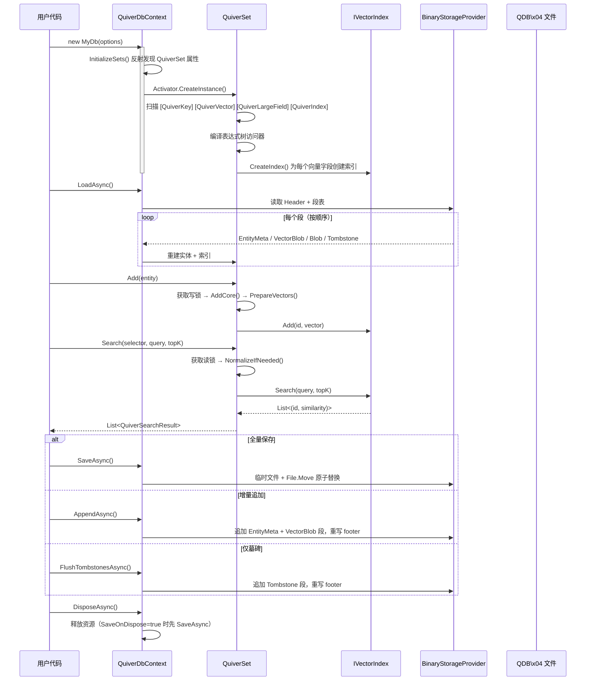

# Vorcyc Quiver 4.0.4

[English Document](README.md) | [中文文档](README_zh.md)


> **纯 .NET 嵌入式向量数据库** —— 零原生依赖，进程内部署，EF Core 风格代码优先建模。

| 项目 | 值 |
|---|---|
| 版本 | 4.0.4 |
| 目标框架 | .NET 10 |
| 许可证 | MIT |
| NuGet | [](https://www.nuget.org/packages/Vorcyc.Quiver) |
| 源码 | https://github.com/vorcyc/Vorcyc.Quiver |
| WIKI | https://github.com/vorcyc/Vorcyc.Quiver/wiki/Home_zh |
| 命名空间 | `Vorcyc.Quiver` |

> **名称由来**：Quiver（箭袋）—— 在数学上，向量就是一支箭。

---

## 设计动机

Quiver 诞生于对前身 `Vorcyc.AwesomeAI.Ash` 类的深度反思：Ash 表结构固定、只能暴力搜索、不支持并发，无法满足生产级向量检索的需求。借鉴 EF Core 的 Code-First 理念和 Python Annoy 的 ANN 启发，Quiver 以声明式建模、多种 ANN 索引算法和内置并发安全为核心目标重新设计。详见[产品简介 · 创作梗概](https://github.com/vorcyc/Vorcyc.Quiver/wiki/02-Product-Overview_zh)。

---

## Quiver 是什么？

**Quiver** 是一款纯 .NET 实现的嵌入式向量数据库，无任何原生依赖，以进程内库的形式运行，无需独立部署数据库服务器。它借鉴 EF Core 的 `DbContext` 设计模式——使用 `[QuiverKey]`、`[QuiverVector]`、`[QuiverLargeField]`、`[QuiverIndex]` 等声明式特性标注实体类，框架在运行时自动完成模型发现、索引构建和持久化管理。

### 核心能力

| 能力 | 说明 |
|---|---|
| **Code-First 声明式建模** | 像 EF Core 一样用特性标记实体类，框架自动反射发现并注册 `QuiverSet<T>` 集合，零配置即可使用。 |
| **多种 ANN 索引算法** | 内置 **Flat**（暴力搜索）、**HNSW**（分层可导航小世界图）、**IVF**（倒排文件索引）、**KDTree**，覆盖从小数据量精确搜索到百万级近似搜索的全场景需求。 |
| **二进制主存储（v4 段式格式）** | `SaveAsync` 原子全量快照；`AppendAsync` / `FlushTombstonesAsync` 追加新段并仅重写 footer，磁盘开销 O(Δ)，无 WAL 内存翻倍问题。 |
| **Mmap 向量存储** | 全局向量内存模式 `GlobalVectorMemoryMode.MemoryMapped` / `Auto` 将向量区域映射为只读内存映射视图，显著降低大规模向量集的常驻内存，同时保持 SIMD 友好访问。 |
| **开箱即用的并发安全** | `QuiverSet<T>` 内部通过 `ReaderWriterLockSlim` 实现读写分离锁，多线程并发搜索与写入天然安全，无需外部加锁。 |
| **9 种距离度量 + 自定义** | Cosine、Euclidean、DotProduct、Manhattan、Chebyshev、Pearson、Hamming、Jaccard、Canberra，以及自定义 `ISimilarity<float>`。 |
| **SIMD 硬件加速** | 全部相似度计算均使用 `Vector<float>` SIMD 指令，自动适配 SSE4 / AVX2 / AVX-512，无需 `System.Numerics.Tensors`。 |
| **Schema Migration** | 通过 `ConfigureMigration<T>()` 声明属性重命名和值转换规则，新增/删除字段自动处理。 |
| **文件工具** | `QuiverDbFile.MergeAsync`（多文件合并，支持 `FirstWriterWins` / `LastWriterWins`）和 `InspectAsync`（段级 CRC 校验与诊断）。 |

**典型应用场景**：语义搜索 · RAG（检索增强生成）· 人脸识别 · 以图搜图 · 推荐系统 · 多模态检索

> ⚠️ **Native AOT**：Quiver **不兼容 Native AOT 发布**（`PublishAot=true`）。框架通过运行时反射发现 `QuiverSet<T>` 属性，并在启动时编译表达式树访问器，均不被 Native AOT 支持。请仅在标准 JIT / .NET 10 运行时下使用。

---

## 快速开始

### 1. 安装

```
dotnet add package Vorcyc.Quiver
```

### 2. 定义实体

```csharp
using Vorcyc.Quiver;

public class Document
{
	[QuiverKey]
	public string Id { get; set; } = string.Empty;

	public string Title { get; set; } = string.Empty;

	public string Category { get; set; } = string.Empty;

	[QuiverVector(384, DistanceMetric.Cosine)]
	public float[] Embedding { get; set; } = [];
}
```

### 3. 定义数据库上下文

```csharp
public class MyDocumentDb : QuiverDbContext
{
	public QuiverSet<Document> Documents { get; set; } = null!;

	public MyDocumentDb() : base(new QuiverDbOptions
	{
		DatabasePath = "documents.vdb",
		DefaultMetric = DistanceMetric.Cosine
	})
	{ }
}
```

### 4. 添加、搜索、保存

```csharp
// DisposeAsync 默认不自动保存（SaveOnDispose 默认为 false）。
// 如需持久化，请显式调用 SaveAsync()，或在 QuiverDbOptions 中设置 SaveOnDispose = true。
await using var db = new MyDocumentDb();
await db.LoadAsync(); // 文件不存在时静默返回

// 添加实体
db.Documents.Add(new Document
{
	Id = "doc-001",
	Title = "向量数据库入门",
	Category = "教程",
	Embedding = new float[384] // 实际应为模型输出的嵌入向量
});

// 搜索 Top-5 最相似文档
float[] queryVector = new float[384];
var results = db.Documents.Search(
	e => e.Embedding,
	queryVector,
	topK: 5
);

foreach (var result in results)
	Console.WriteLine($"{result.Entity.Title}  相似度={result.Similarity:F4}");

await db.SaveAsync(); // 显式保存到磁盘
```

### 5. 增量追加（批量入库）

```csharp
// 分批入库时推荐使用同步 using，并显式调用 AppendAsync / SaveAsync。
// DisposeAsync 只有在 SaveOnDispose = true 时才会自动 SaveAsync。
using var db = new MyDocumentDb();
await db.LoadAsync();

foreach (var batch in EnumerateBatches())
{
	foreach (var doc in batch) db.Documents.Add(doc);
	await db.AppendAsync();   // O(Δ) 段追加，无全量重写
	db.Documents.Clear();     // 释放内存；磁盘上的段不受影响
}

// 可选手动碎片整理（启用后台 Merge 时框架也会自动触发）
await db.SaveAsync();
```

---

## 端到端流程



---

## 文档

完整章节文档请访问[中文 Wiki](https://github.com/vorcyc/Vorcyc.Quiver/wiki/Home_zh.md)：

| # | 章节 |
|---|---|
| 01 | [版本说明](https://github.com/vorcyc/Vorcyc.Quiver/wiki/01-Release-Notes_zh.md) |
| 02 | [产品概述](https://github.com/vorcyc/Vorcyc.Quiver/wiki/02-Product-Overview_zh.md) |
| 03 | [架构概述](https://github.com/vorcyc/Vorcyc.Quiver/wiki/03-Architecture_zh.md) |
| 04 | [快速开始](https://github.com/vorcyc/Vorcyc.Quiver/wiki/04-Quick-Start_zh.md) |
| 05 | [核心概念](https://github.com/vorcyc/Vorcyc.Quiver/wiki/05-Core-Concepts_zh.md) |
| 06 | [距离度量](https://github.com/vorcyc/Vorcyc.Quiver/wiki/06-Distance-Metrics_zh.md) |
| 07 | [索引类型](https://github.com/vorcyc/Vorcyc.Quiver/wiki/07-Index-Types_zh.md) |
| 08 | [CRUD 操作](https://github.com/vorcyc/Vorcyc.Quiver/wiki/08-CRUD_zh.md) |
| 09 | [向量搜索](https://github.com/vorcyc/Vorcyc.Quiver/wiki/09-Vector-Search_zh.md) |
| 10 | [持久化存储](https://github.com/vorcyc/Vorcyc.Quiver/wiki/10-Persistence_zh.md) |
| 11 | [迁移系统](https://github.com/vorcyc/Vorcyc.Quiver/wiki/11-Migration-System._zhmd) |
| 11a | [模式迁移](https://github.com/vorcyc/Vorcyc.Quiver/wiki/11-Schema-Migration_zh.md) |
| 12 | [多向量字段支持](https://github.com/vorcyc/Vorcyc.Quiver/wiki/12-Multi-Vector-Fields_zh.md) |
| 13 | [线程安全与并发](https://github.com/vorcyc/Vorcyc.Quiver/wiki/13-Thread-Safety_zh.md) |
| 14 | [生命周期管理](https://github.com/vorcyc/Vorcyc.Quiver/wiki/14-Lifecycle_zh.md) |
| 15 | [配置选项](https://github.com/vorcyc/Vorcyc.Quiver/wiki/15-Configuration_zh.md) |
| 16 | [内部实现细节](https://github.com/vorcyc/Vorcyc.Quiver/wiki/16-Internal-Implementation_zh.md) |
| 17 | [完整示例](https://github.com/vorcyc/Vorcyc.Quiver/wiki/17-Examples_zh.md) |
| 18 | [API 参考速查表](https://github.com/vorcyc/Vorcyc.Quiver/wiki/18-API-Reference_zh.md) |
| 19 | [使用建议](https://github.com/vorcyc/Vorcyc.Quiver/wiki/19-Usage-Recommendations_zh.md) |

---

## 关键词

`嵌入式向量数据库` · `纯 .NET` · `ANN` · `近似最近邻搜索` · `HNSW` · `IVF` · `KDTree` · `代码优先` · `Embedding` · `语义搜索` · `人脸识别` · `以图搜图` · `RAG` · `SIMD` · `模式迁移` · `ISimilarity` · `Mmap` · `SQ8 量化` · `Matryoshka 截断`
