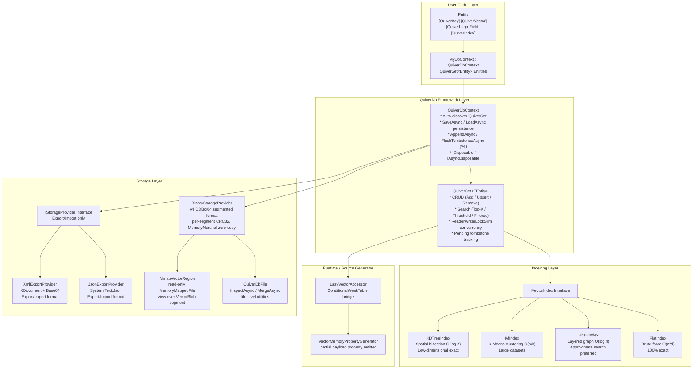
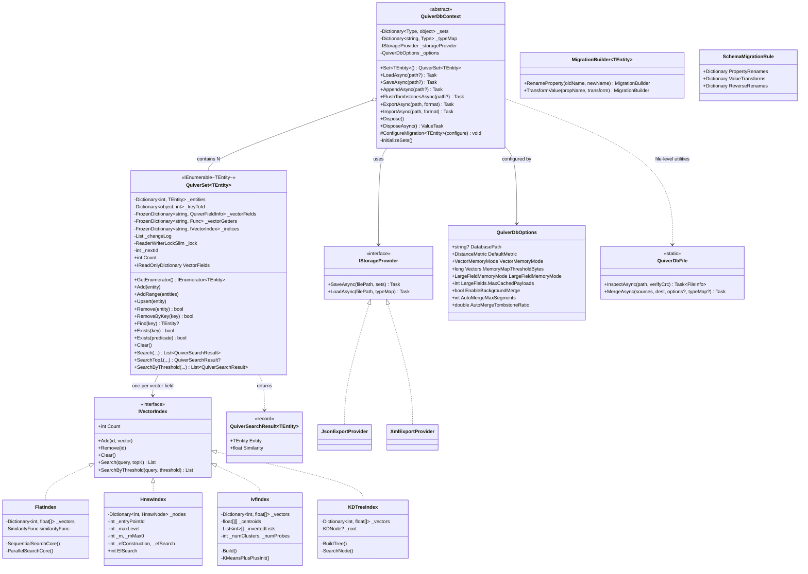

## 1. Architecture Overview

### 1.1 Layered Architecture

### 1.2 Core Components Overview

| Component | Type | Responsibility |
|-----------|------|----------------|
| `QuiverDbContext` | `abstract class` | Database context base class, manages automatic reflection discovery of QuiverSet collections, persistence read/write, lifecycle |
| `QuiverSet<TEntity>` | `partial class` | Vector collection, implements `IEnumerable<TEntity>`, provides full CRUD + multiple search modes + `foreach` / LINQ enumeration, internal `ReaderWriterLockSlim` reader-writer lock |
| `IVectorIndex` | `internal interface` | Unified vector index contract, defines `Add` / `Remove` / `Clear` / `Search` / `SearchByThreshold` |
| `IStorageProvider` | `internal interface` | Export/import serialization contract, supports `SaveAsync` / `LoadAsync`. Used only by `ExportAsync` / `ImportAsync` — primary storage always uses `BinaryStorageProvider` directly |
| `ExportStorageProviderFactory` | `internal static class` | Factory method, creates `JsonExportProvider` or `XmlExportProvider` based on `ExportFormat` enum |
| `QuiverVectorAttribute` | `Attribute` | Marks vector field, specifies dimensions (`dimensions`), distance metric (`metric`), nullable (`Nullable`), quantization/effective dimensions, and per-field memory mode |
| `QuiverKeyAttribute` | `Attribute` | Marks entity primary key (exactly one per entity) |
| `QuiverIndexAttribute` | `Attribute` | Configures index type and tuning parameters (optional, defaults to Flat) |
| `QuiverLargeFieldAttribute` | `Attribute` | Marks a `byte[]` field as a large field, written into a dedicated `Blob` segment instead of `EntityMeta` |
| `QuiverDbOptions` | `class` | Global configuration: storage path, default metric, vector/large-field memory modes, mmap thresholds, background-merge thresholds |
| `QuiverSearchResult<T>` | `record` | Search result DTO, contains `Entity` and `Similarity` |
| `QuiverDbFile` | `static class` | v4 file-level utilities: `InspectAsync` (version / segment table / per-segment CRC32) and `MergeAsync` (Append / FirstWriterWins / LastWriterWins) |
| `MigrationBuilder<T>` | `class` | Fluent API builder for Schema migration rules (property rename + value transform) |
| `SchemaMigrationRule` | `internal class` | Stores migration rules for a single entity type: property rename map + value transform functions |
| `ISimilarity<T>` | `public interface` | Static abstract similarity computation contract. JIT-inlined per concrete type, zero virtual dispatch |
| `IVectorStore` | `internal interface` | Vector data storage abstraction. Decouples vector ownership from index topology; includes `StoreByRef` zero-copy ingestion |
| `HeapVectorStore` | `internal sealed class` | Default GC-heap vector store (`Dictionary<int, float[]>`) |
| `MmapVectorStore` | `internal sealed class` | Read-only mmap vector store backed by `MmapVectorRegion` over the v4 `VectorBlob` segment; selected via `Vectors.MemoryMode = MemoryMapped / Auto` |
| `LazyVectorAccessor` | `static runtime class` | Runtime bridge for source-generated lazy vector properties; uses `ConditionalWeakTable` to weakly bind entity → owning `QuiverSet` |
| `LazyLargeFieldAccessor` | `static runtime class` | Runtime bridge for source-generated large-field properties; materializes `byte[]` payloads on demand |
| `InMemoryEntityStore<TEntity>` | `internal sealed class` | Entity object store used by `QuiverSet<TEntity>`; payload memory control is handled by vector and large-field stores |

### 1.3 Class Relationship Diagram

---

