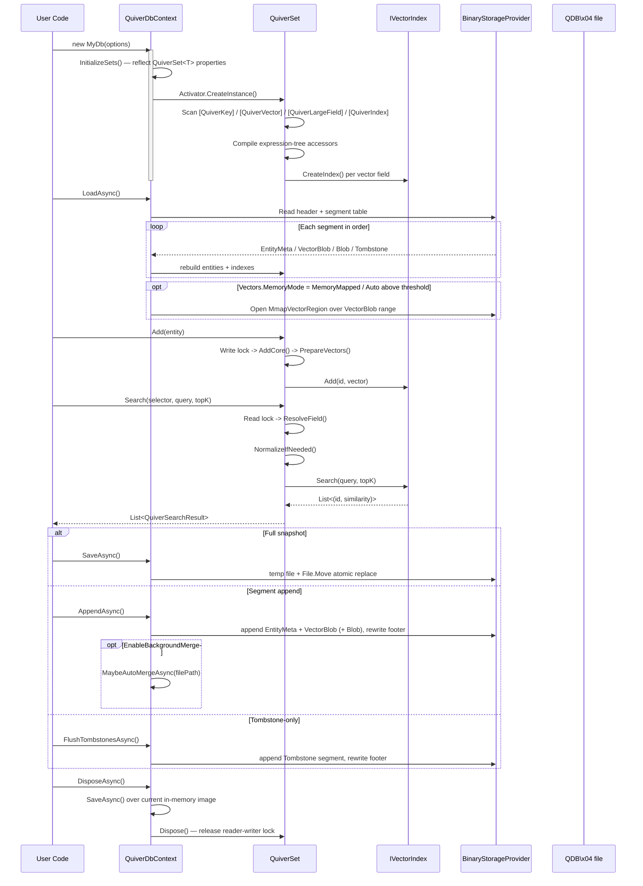

## 2. Quick Start

### 2.1 Define Entity Class

```csharp
using Vorcyc.Quiver;

public class Document
{
    [QuiverKey]
    public string Id { get; set; } = string.Empty;

    public string Title { get; set; } = string.Empty;

    public string Category { get; set; } = string.Empty;

    [QuiverVector(384, DistanceMetric.Cosine)]
    public float[] Embedding { get; set; } = [];
}
```

### 2.2 Define Database Context

```csharp
public class MyDocumentDb : QuiverDbContext
{
    public QuiverSet<Document> Documents { get; set; } = null!;

    public MyDocumentDb() : base(new QuiverDbOptions
    {
        DatabasePath = "documents.vdb",   // binary .vdb file
        DefaultMetric = DistanceMetric.Cosine
    })
    { }
}
```

### 2.3 Basic Usage

```csharp
// DisposeAsync does NOT auto-save by default (SaveOnDispose defaults to false).
// Call SaveAsync() explicitly, or set SaveOnDispose = true in QuiverDbOptions.
await using var db = new MyDocumentDb();
await db.LoadAsync(); // Load existing data (silently returns if file doesn't exist)

// Add entity
db.Documents.Add(new Document
{
    Id = "doc-001",
    Title = "Introduction to Vector Databases",
    Category = "Tutorial",
    Embedding = new float[384] // Should be embedding vector output by a model
});

// Search Top-5 most similar documents
float[] queryVector = new float[384]; // Query vector
var results = db.Documents.Search(
    e => e.Embedding,
    queryVector,
    topK: 5
);

foreach (var result in results)
{
    Console.WriteLine($"Document: {result.Entity.Title}, Similarity: {result.Similarity:F4}");
}

await db.SaveAsync(); // explicitly save data to disk
```

### 2.4 Incremental Append Quick Start (v4)

For streaming or batched ingest, `AppendAsync` writes a new segment and only rewrites the footer, giving O(Δ) disk cost without the pre-4.0 WAL memory doubling:

```csharp
public class MyAppendDb : QuiverDbContext
{
    public QuiverSet<Document> Documents { get; set; } = null!;

    public MyAppendDb() : base(new QuiverDbOptions
    {
        DatabasePath = "documents.vdb",
        Vectors.MemoryMode = GlobalVectorMemoryMode.Auto,
        LargeFields.MemoryMode = GlobalLargeFieldMemoryMode.PagedCache,
        EnableBackgroundMerge = true,
        AutoMergeMaxSegments = 32,
        AutoMergeTombstoneRatio = 0.25
    })
    { }
}

// IMPORTANT: synchronous `using` is recommended for staged ingest.
// DisposeAsync only auto-saves when SaveOnDispose = true.
using var db = new MyAppendDb();
await db.LoadAsync();

foreach (var batch in EnumerateBatches())
{
    foreach (var doc in batch) db.Documents.Add(doc);
    await db.AppendAsync();      // segment append, O(Δ)
    db.Documents.Clear();        // bound memory before next batch
}

foreach (var staleKey in staleKeys) db.Documents.RemoveByKey(staleKey);
await db.FlushTombstonesAsync(); // tombstone-only segment

await db.SaveAsync();            // optional manual compaction
```

### 2.5 End-to-End Flow



---

