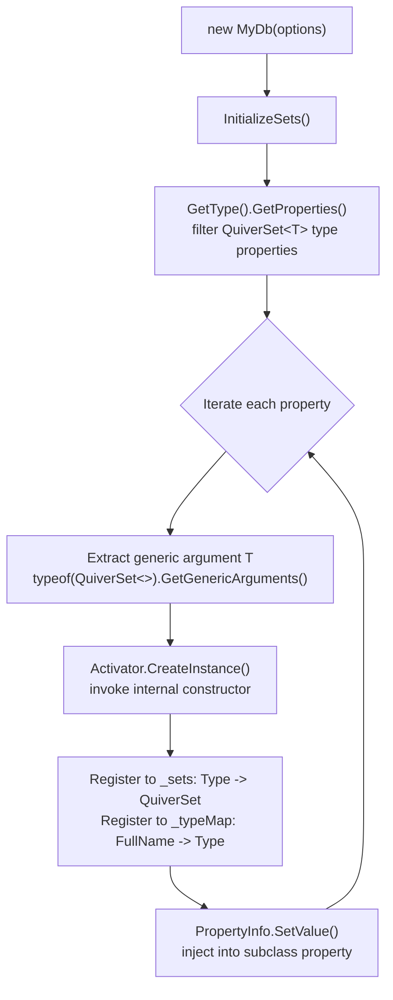
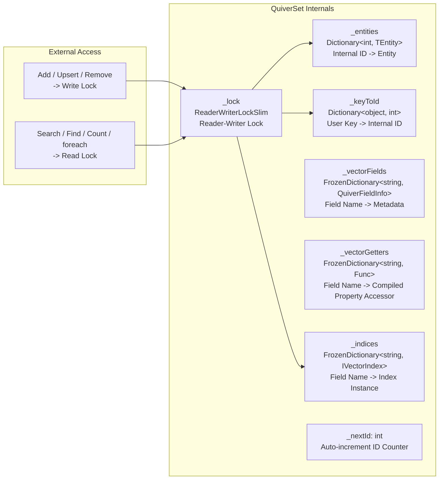
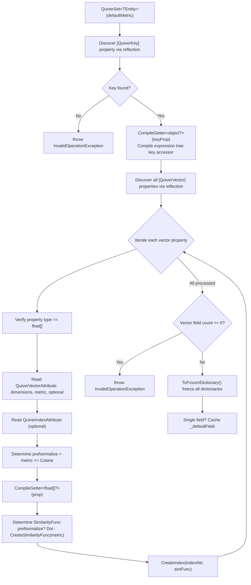

## 3. Core Concepts

### 3.1 Entity Definition and Attribute Annotations

Entity classes declare vector database metadata through Attributes. `QuiverSet<TEntity>` scans these attributes via reflection during construction to automatically discover and register fields.

#### `[QuiverKey]` — Primary Key Annotation

Each entity **must have exactly one** `[QuiverKey]` property. Supports any type (`string`, `int`, `Guid`, etc.). At runtime, the primary key value is read through a compiled expression tree accessor, internally stored as boxed `object` in `Dictionary<object, int>` for O(1) lookup and deduplication.

```csharp
[QuiverKey]
public string PersonId { get; set; } = string.Empty;
```

**Constraints**:
- Primary key value cannot be `null` (validated on write)
- Primary key must be unique within the collection (`Add` validates, `Upsert` handles automatically)
- Missing `[QuiverKey]` attribute causes `QuiverSet` construction to throw `InvalidOperationException`

#### `[QuiverVector(dimensions, metric)]` — Vector Field Annotation

Marks a property as a vector feature field. **Property type supports `float[]` (single-precision) and `Half[]` (half-precision fp16)**. An entity can have multiple vector fields annotated (multimodal scenarios).

```csharp
// 128-dimensional float vector, using cosine similarity (default)
[QuiverVector(128)]
public float[] Embedding { get; set; } = [];

// 384-dimensional float vector, explicitly specifying Euclidean distance
[QuiverVector(384, DistanceMetric.Euclidean)]
public float[] TextFeature { get; set; } = [];

// 128-dimensional nullable float vector
[QuiverVector(128, DistanceMetric.Cosine, Nullable = true)]
public float[]? FaceEmbedding { get; set; }

// 16-dimensional Half (fp16) vector — 50% memory/disk reduction, for large-scale low-precision scenarios
[QuiverVector(16, DistanceMetric.Cosine)]
public Half[] LightVec { get; set; } = [];
```

#### Half[] fp16 Vectors

`Half[]` fields use a **storage-native fp16 + compute-side widen to float** design:

- **Memory**: stored in `HalfHeapVectorStore`, 2 bytes/dimension (50% less than float)
- **Disk**: persisted as `VectorBlobEncoding.Float16`, `dim × 2` bytes per row
- **Compute**: automatically widened to `float` before similarity computation; precision loss limited to fp16 precision (~3 significant decimal digits)
- **Query**: both `float[]` and `Half[]` query overloads are supported

```csharp
public class LightDoc
{
    [QuiverKey] public string Id { get; set; } = string.Empty;
    [QuiverVector(16, DistanceMetric.Cosine)]
    public Half[] Vec { get; set; } = [];
}

// Half[] query overload
Half[] query = ...;
var results = db.Docs.Search(e => e.Vec, query, topK: 10);

// float[] query (convert first)
float[] queryF = ...;
var results = db.Docs.Search(e => e.Vec, Array.ConvertAll(queryF, v => (Half)v), topK: 10);
```

> ⚠️ **Limitation**: `Half[]` vector fields do not currently support Native AOT (source generator does not yet generate lazy properties for `Half[]`). Note that Quiver as a whole is not Native AOT-compatible — see [Product Overview](02-Product-Overview.md) for details.

**Parameter Description**:

| Parameter | Type | Default | Description |
|-----------|------|---------|-------------|
| `dimensions` | `int` | — (required) | Vector dimensions, validated at runtime `vector.Length == dimensions` |
| `metric` | `DistanceMetric` | `Cosine` | Distance metric type |
| `Nullable` | `bool` | `false` | Whether to allow the vector to be `null`. When `true`, entities with null vectors are still written but not added to that field's index |

> **Common Dimensions**: 128 (lightweight models), 384 (MiniLM), 768 (BERT-base), 1024 (BERT-large), 1536 (OpenAI Ada-002), 3072 (OpenAI text-embedding-3-large).

**Runtime Behavior**:
- On write (`AddCore` / `PrepareVectors`): validates dimension match, throws `ArgumentException` on mismatch
- `float[]` + `Cosine` metric: performs L2 normalization before storing in index (`NormalizeToArray`)
- `float[]` + non-`Cosine` metrics: performs defensive copy (`vector.Clone()`) to prevent external modifications from corrupting the index
- `Half[]` + `Cosine` metric: widens to float, normalizes, then narrows back to Half before storing in `HalfHeapVectorStore`
- `Half[]` + non-`Cosine` metrics: stored directly in `HalfHeapVectorStore` (no normalization)
- `Nullable = false` (default): throws `ArgumentNullException` if vector is `null`
- `Nullable = true`: skips that field's index when vector is `null`; entity is still written normally; search on that field will not return this entity

#### `[QuiverIndex(indexType)]` — Index Configuration (Optional)

Used on the same property as `[QuiverVector]` to specify the indexing strategy for that vector field. **Defaults to Flat brute-force search when not annotated**.

```csharp
// HNSW index: preferred for approximate search of high-dimensional vectors
[QuiverVector(768)]
[QuiverIndex(VectorIndexType.HNSW, M = 32, EfConstruction = 300, EfSearch = 100)]
public float[] Embedding { get; set; } = [];

// IVF index: large dataset scenarios
[QuiverVector(128)]
[QuiverIndex(VectorIndexType.IVF, NumClusters = 100, NumProbes = 15)]
public float[] Feature { get; set; } = [];

// KDTree index: only suitable for low dimensions < 20
[QuiverVector(16)]
[QuiverIndex(VectorIndexType.KDTree)]
public float[] LowDimFeature { get; set; } = [];
```

**`QuiverIndexAttribute` Complete Parameters**:

| Parameter | Applicable Index | Default | Description |
|-----------|-----------------|---------|-------------|
| `IndexType` | All | `Flat` | Index type enum |
| `M` | HNSW | 16 | Max neighbor connections per layer, layer 0 automatically uses `M * 2` |
| `EfConstruction` | HNSW | 200 | Candidate set size during construction |
| `EfSearch` | HNSW | 50 | Candidate set size during search, must be >= topK |
| `NumClusters` | IVF | 0 (auto sqrt(n)) | K-Means cluster count |
| `NumProbes` | IVF | 10 | Number of clusters to probe during search |

### 3.2 Database Context QuiverDbContext

`QuiverDbContext` is the core entry point for the vector database, designed to mimic EF Core's `DbContext`.

#### Auto-Discovery Mechanism



**Key Behaviors**:

- **Auto-discovery**: During construction, scans **all** `QuiverSet<T>` public properties of the subclass via reflection, automatically creates instances and injects them (no manual `new` required).
- **Persistence**: Delegates all collection data serialization/deserialization to `IStorageProvider` via `SaveAsync()` / `LoadAsync()`.
- **Lifecycle**: Implements `IDisposable` and `IAsyncDisposable`. By default both only release resources; `DisposeAsync` saves first only when `SaveOnDispose = true`.

```csharp
public class MyDb : QuiverDbContext
{
    // Declare to register, no manual initialization needed.
    // Property values are automatically injected by the framework after construction.
    public QuiverSet<FaceFeature> Faces { get; set; } = null!;
    public QuiverSet<Document> Documents { get; set; } = null!;

    public MyDb(string path, StorageFormat format)
        : base(new QuiverDbOptions
        {
            DatabasePath = path,
            StorageFormat = format
        })
    { }
}
```

**Generic Method Access**:

```csharp
// The following two approaches are equivalent:
var set1 = db.Faces;              // Direct property access
var set2 = db.Set<FaceFeature>(); // Generic method access (supports dynamic type lookup)
// Set<T>() internally looks up _sets dictionary, throws InvalidOperationException if not found
```

### 3.3 Vector Collection QuiverSet\<TEntity\>

`QuiverSet<TEntity>` is a vector collection for a single entity type, implementing `IEnumerable<TEntity>`, providing complete CRUD, search, and enumeration capabilities with support for `foreach` loops and LINQ queries.

> **Implementation Note**: `QuiverSet<TEntity>` uses `partial class` split across multiple files by responsibility:
> - `QuiverSet.cs` — Fields, constructor, properties, enumerator, Dispose, private utility methods
> - `QuiverSet.Crud.cs` — CRUD operations (Add / AddRange / Upsert / Remove / Find / Clear)
> - `QuiverSet.Search.cs` — Vector retrieval (sync + async + default field + core search helpers)
> - `QuiverSet.Persistence.cs` — Tombstone tracking and persistence helpers (snapshot / append / tombstone flush integration with `QuiverDbContext`)

#### Internal Data Structures



#### Initialization Flow During Construction



**Performance Optimization Highlights**:

| Optimization | Technique | Effect |
|-------------|-----------|--------|
| Property access | Expression tree compiled `Func<TEntity, T>` | Nanosecond-level, ~100x faster than reflection `PropertyInfo.GetValue` |
| Metadata lookup | `FrozenDictionary` | Zero heap allocation, optimized hash strategy for small key sets |
| Cosine computation | Pre-normalization + internal `VectorMath.Dot` | Avoids recomputing norms on every search |
| L2 normalization | internal `VectorMath.Norm` + `Divide` | SIMD accelerated |
| Similarity function | `ISimilarity<float>` static dispatch to internal implementations | Zero lambda overhead |

---

