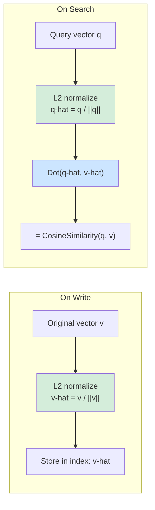

## 4. Distance Metrics

The `DistanceMetric` enum defines nine vector similarity computation methods:

| Metric Type | Mathematical Formula | Range | Use Case | Pre-normalization |
|------------|---------------------|-------|----------|-------------------|
| `Cosine` | $\cos(\theta) = \frac{a \cdot b}{\|a\| \times \|b\|}$ | [-1, 1] | Text embeddings, semantic search | ✅ Automatically enabled |
| `Euclidean` | $\frac{1}{1 + \|a - b\|_2}$ | (0, 1] | Spatial coordinates, physical distances | ❌ |
| `DotProduct` | $a \cdot b = \sum_i a_i b_i$ | $(-\infty, +\infty)$ | Pre-normalized vectors, MIPS | ❌ |
| `Manhattan` | $\frac{1}{1 + \sum|a_i - b_i|}$ | (0, 1] | Sparse features, recommendation systems | ❌ |
| `Chebyshev` | $\frac{1}{1 + \max|a_i - b_i|}$ | (0, 1] | Feature deviation detection, grid distances | ❌ |
| `Pearson` | $\frac{\sum(a_i-\bar{a})(b_i-\bar{b})}{\sqrt{\sum(a_i-\bar{a})^2 \sum(b_i-\bar{b})^2}}$ | [-1, 1] | Text embeddings (de-biased), TF-IDF, rating vectors | ❌ |
| `Hamming` | $1 - \frac{\text{mismatch}}{n}$ | [0, 1] | Binary hash codes, LSH, SimHash/MinHash fingerprints | ❌ |
| `Jaccard` | $\frac{\sum\min(a_i,b_i)}{\sum\max(a_i,b_i)}$ | [0, 1] | BoW/TF-IDF sparse features, histogram comparison | ❌ |
| `Canberra` | $1 - \frac{1}{n}\sum\frac{|a_i-b_i|}{|a_i|+|b_i|}$ | [0, 1] | Sparse data (weight-sensitive), chemical fingerprints | ❌ |

### 4.1 Cosine Pre-normalization Optimization Principle



**Why is Dot faster than Cosine?**

- `CosineSimilarity(a, b)` = one dot product + two norm computations = **3 vector traversals**
- After pre-normalization, `Dot(a-hat, b-hat)` = one dot product = **1 vector traversal**
- Normalization overhead is incurred only once during write/query, while search only performs dot products against N candidates

**SIMD-Accelerated Implementation**:

```csharp
// SIMD-optimized implementation using internal VectorMath
private static void NormalizeVector(ReadOnlySpan<float> source, Span<float> destination)
{
    var norm = VectorMath.Norm(source);    // SIMD-accelerated L2 norm
    if (norm > 0f)
        VectorMath.Divide(source, norm, destination); // SIMD-accelerated vector division
    else
        destination.Clear(); // Zero vector safety, avoid NaN
}
```

### 4.2 Metric Selection Recommendations

```csharp
// Cosine — most common, text/semantic search
[QuiverVector(384, DistanceMetric.Cosine)]
public float[] TextEmbedding { get; set; } = [];

// Euclidean — scenarios caring about absolute distance (geographic coordinates, physical space)
[QuiverVector(3, DistanceMetric.Euclidean)]
public float[] Position { get; set; } = [];

// DotProduct — vectors already pre-normalized or needing Maximum Inner Product Search (MIPS)
[QuiverVector(128, DistanceMetric.DotProduct)]
public float[] Feature { get; set; } = [];

// Manhattan — sparse features, recommendation systems
[QuiverVector(256, DistanceMetric.Manhattan)]
public float[] SparseFeature { get; set; } = [];

// Hamming — binary hash codes, LSH fingerprints
[QuiverVector(64, DistanceMetric.Hamming)]
public float[] BinaryHash { get; set; } = [];
```

### 4.3 Custom Similarity

Implement `ISimilarity<float>` to define a custom metric, then assign it via the `CustomSimilarity` property on `[QuiverVector]`. When `CustomSimilarity` is set, the `metric` parameter is ignored.

```csharp
// 1. Define custom similarity (readonly struct + ISimilarity<float>)
public readonly struct WeightedL1Similarity : ISimilarity<float>
{
    public static float Compute(ReadOnlySpan<float> x, ReadOnlySpan<float> y)
    {
        float sum = 0f;
        for (int i = 0; i < x.Length; i++)
            sum += MathF.Abs(x[i] - y[i]) * (i < 128 ? 2f : 1f); // first 128 dims weighted 2x
        return 1f / (1f + sum);
    }
}

// 2. Use it on entity
public class MyEntity
{
    [QuiverKey]
    public string Id { get; set; } = string.Empty;

    [QuiverVector(256, CustomSimilarity = typeof(WeightedL1Similarity))]
    public float[] Embedding { get; set; } = [];
}
```

**Requirements**:
- Must be a `readonly struct` implementing `ISimilarity<float>`
- Must have a public parameterless constructor (default for structs)
- JIT will inline `TSim.Compute()` at the call site — zero overhead vs built-in metrics

### 4.4 Similarity Function Mapping

The framework internally resolves each metric to an `ISimilarity<float>` implementation. All implementations use SIMD-accelerated computation:

| Metric | PreNormalize | ISimilarity Type | SIMD Backend |
|--------|-------------|------------------|--------------|
| `Cosine` | `true` | `DotProductSimilarity` | `VectorMath.Dot` |
| `Cosine` (fallback) | `false` | `CosineSimilarity` | `VectorMath.CosineSimilarity` |
| `DotProduct` | `false` | `DotProductSimilarity` | `VectorMath.Dot` |
| `Euclidean` | `false` | `EuclideanSimilarity` | `VectorMath.Distance` |
| `Manhattan` | `false` | `ManhattanSimilarity` | `Vector<float>` abs-diff accumulation |
| `Chebyshev` | `false` | `ChebyshevSimilarity` | `Vector<float>` abs-diff max tracking |
| `Pearson` | `false` | `PearsonCorrelationSimilarity` | `VectorMath.Sum` + `Vector<float>` centered-dot |
| `Hamming` | `false` | `HammingSimilarity` | `Vector<float>` equality mask + ConditionalSelect |
| `Jaccard` | `false` | `JaccardSimilarity` | `Vector<float>` Min/Max accumulation |
| `Canberra` | `false` | `CanberraSimilarity` | `Vector<float>` weighted division |
| (custom) | user-defined | User's `ISimilarity<float>` | User-defined |

---

