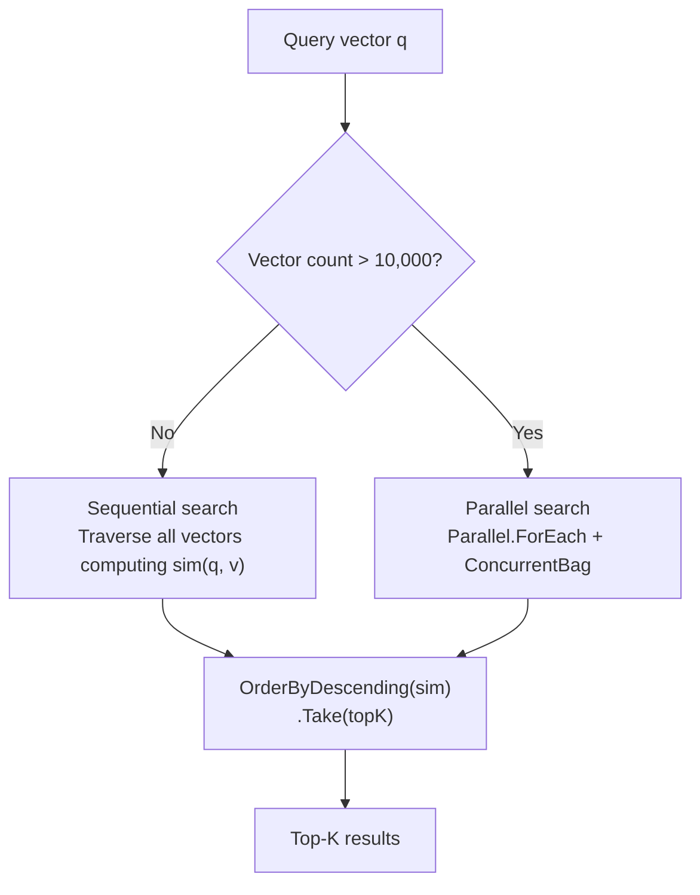
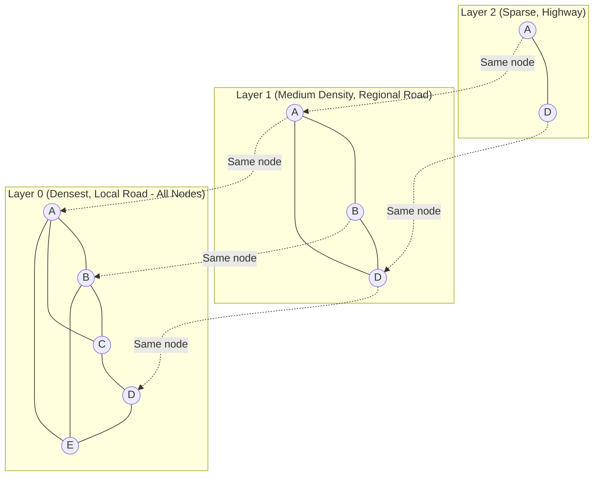
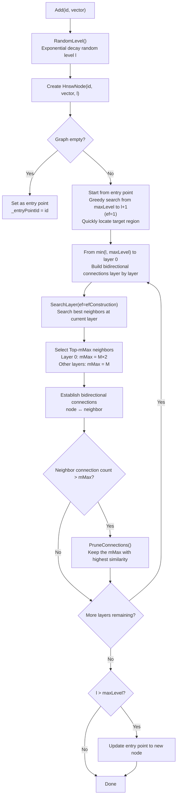
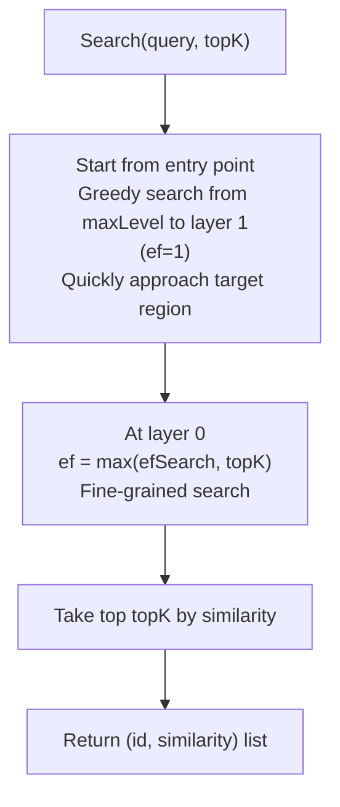
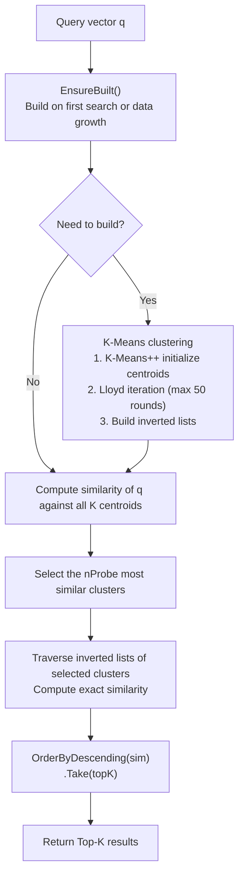
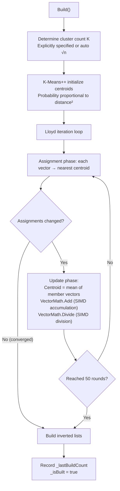
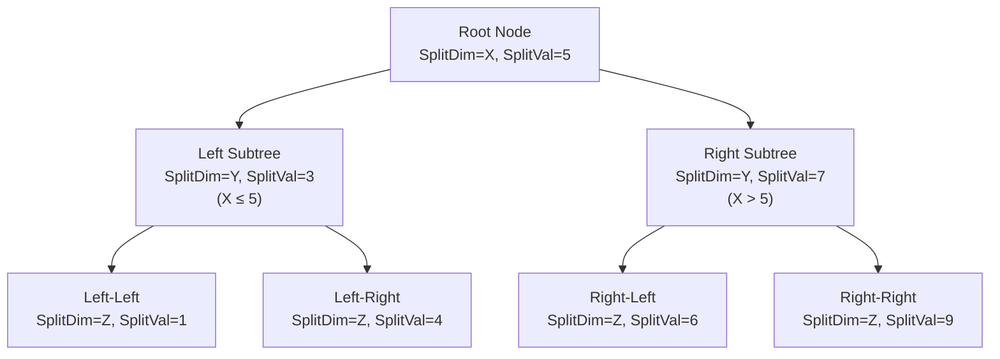
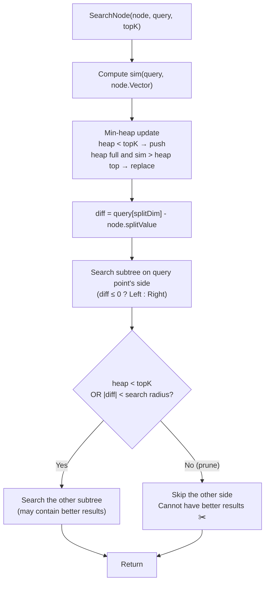
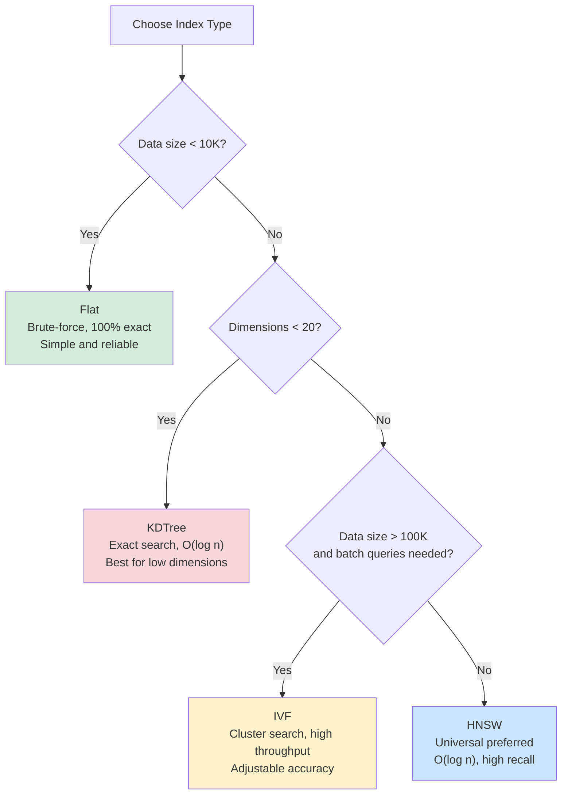

## 5. Index Types

### 5.1 Flat (Brute-Force Search)

Traverses all vectors computing similarity, results are **100% exact**, and is the default index type.

| Property | Value |
|----------|-------|
| Implementation | `FlatIndex` |
| Time Complexity | O(n * d) |
| Space Complexity | O(n * d) |
| Accuracy | 100% |
| Suitable Data Size | < 10,000 |
| Parallel Threshold | Automatically enables `Parallel.ForEach` when > 10,000 entries |



**Search Strategy Switching**:

```csharp
// Small data (<=10K): sequential traversal is faster, avoids thread scheduling overhead
private List<(int Id, float Similarity)> SequentialSearchCore(float[] query, int topK)
{
    var results = new List<(int Id, float Sim)>(_vectors.Count);
    foreach (var (id, vector) in _vectors)
        results.Add((id, similarityFunc(query, vector)));
    return results.OrderByDescending(r => r.Sim).Take(topK).ToList();
}

// Large data (>10K): Parallel.ForEach for multi-threaded parallel computation
private List<(int Id, float Similarity)> ParallelSearchCore(float[] query, int topK)
{
    var results = new ConcurrentBag<(int Id, float Similarity)>();
    Parallel.ForEach(_vectors, kvp =>
    {
        results.Add((kvp.Key, similarityFunc(query, kvp.Value)));
    });
    return results.OrderByDescending(r => r.Similarity).Take(topK).ToList();
}
```

```csharp
// Usage: default index, no [QuiverIndex] annotation needed
[QuiverVector(128)]
public float[] Embedding { get; set; } = [];
```

### 5.2 HNSW (Hierarchical Navigable Small World Graph)

Multi-layer proximity graph structure, the **universal preferred choice for approximate search**. Similar to "highway -> regional road -> local road" layered navigation.

| Property | Value |
|----------|-------|
| Implementation | `HnswIndex` |
| Search Complexity | O(log n) |
| Insert Complexity | O(log n) * efConstruction |
| Space Complexity | O(n * M) |
| Suitable Data Size | 10K ~ 10M |
| Deletion Strategy | Lazy deletion (residual references auto-cleaned) |
| Persistence Optimization | `SaveAsync` writes `IndexSnapshot`; load restores graph topology first |

#### HNSW Snapshot Persistence

Building the HNSW graph is often more expensive than reading entity and vector bytes. Quiver writes HNSW topology into a `SegmentKind.IndexSnapshot` segment during full saves. The snapshot contains the entry point, max level, per-node level, per-layer neighbor lists, and the covered `NextId`. On the next `LoadAsync()`, if the snapshot fingerprint matches the current similarity type, parameters, and effective dimension, Quiver restores the graph directly and skips `Add(id)` rebuild for covered ids.

This is automatic and requires no additional configuration. Old files, corrupted snapshots, or parameter mismatches safely fall back to a full rebuild. The snapshot stores topology only, not entities or vector copies, so mmap vector reads, non-InMemory vector properties, and `[QuiverLargeField]` large-object loading keep the same behavior.

#### HNSW Layered Structure



#### Insertion Algorithm Flow



#### Search Algorithm Flow



**Parameter Tuning Guide**:

| Parameter | Default | Recommended Range | Increase Effect | Decrease Effect |
|-----------|---------|-------------------|-----------------|-----------------|
| `M` | 16 | 12 ~ 48 | Higher recall, more memory, longer build time | Less memory, lower recall |
| `EfConstruction` | 200 | 100 ~ 500 | Better graph quality, slower insertion | Faster insertion, lower graph quality |
| `EfSearch` | 50 | 50 ~ 500 | Higher recall, slower search | Faster search, lower recall |

> **`EfSearch` can be dynamically adjusted at runtime** without rebuilding the index: `hnswIndex.EfSearch = 200;`

```csharp
[QuiverVector(768, DistanceMetric.Cosine)]
[QuiverIndex(VectorIndexType.HNSW, M = 32, EfConstruction = 300, EfSearch = 100)]
public float[] Embedding { get; set; } = [];
```

### 5.3 IVF (Inverted File Index)

Partitions vector space based on **K-Means clustering**, only probing the nearest clusters during search.

| Property | Value |
|----------|-------|
| Implementation | `IvfIndex` |
| Build Complexity | O(n * k * d * iter) |
| Search Complexity | O(k * d + nProbe * n/k * d) |
| Suitable Data Size | 100K+ |
| Build Method | Lazy (triggered on first search) |
| Auto-Rebuild | Flagged for rebuild after 50% data growth |
| Centroid Initialization | K-Means++ |
| Iteration Algorithm | Lloyd (max 50 rounds) |
| SIMD Acceleration | internal `VectorMath.Add` / `VectorMath.Divide` |

#### IVF Search Flow



#### K-Means Clustering Build



**Parameter Tuning**:

| Parameter | Default | Recommended Range | Description |
|-----------|---------|-------------------|-------------|
| `NumClusters` | 0 (auto sqrt(n)) | sqrt(n) ~ 4*sqrt(n) | Cluster count. Larger -> smaller clusters -> faster search but more centroid comparisons |
| `NumProbes` | 10 | 1 ~ 20 | Probe count. When = total clusters, degrades to brute-force search |

> **Threshold search** automatically expands probe range to `nProbe * 2`, reducing missed results from cluster partitioning.

```csharp
[QuiverVector(128, DistanceMetric.Cosine)]
[QuiverIndex(VectorIndexType.IVF, NumClusters = 100, NumProbes = 15)]
public float[] Feature { get; set; } = [];
```

### 5.4 KDTree

Spatial binary partition tree for **exact search**. Alternately splits space along dimensions, using pruning to skip impossible subtrees.

| Property | Value |
|----------|-------|
| Implementation | `KDTreeIndex` |
| Search Complexity | O(log n) (low dim), O(n) (high dim) |
| Accuracy | 100% |
| Suitable Dimensions | < 20 |
| Build Method | Lazy (triggered on first search, full rebuild) |
| Rebuild Trigger | Flagged for rebuild after every Add/Remove |

#### KD-Tree Structure Diagram



#### Search Pruning Strategy



> ⚠️ **Curse of Dimensionality**: When dimensions exceed ~20, nearly every subtree must be visited (pruning fails), degrading to O(n). Use HNSW for high-dimensional scenarios.  
> ⚠️ **Threshold search** degrades to brute-force traversal (KD-Tree pruning cannot be directly applied to threshold search).

```csharp
[QuiverVector(16, DistanceMetric.Euclidean)]
[QuiverIndex(VectorIndexType.KDTree)]
public float[] LowDimFeature { get; set; } = [];
```

### 5.5 Index Selection Decision Guide



**Comprehensive Comparison Table**:

| Dimension | Flat | HNSW | IVF | KDTree |
|-----------|------|------|-----|--------|
| Search Speed | O(n*d) | O(log n) | O(n/k*d) | O(log n) ~ O(n) |
| Accuracy | 100% | ~95-99%+ | ~90-99% | 100% |
| Insert Speed | O(1) | O(log n) | O(1)* | O(1)** |
| Memory | n*d | n*(d+M) | n*d + k*d | n*d + tree structure |
| Suitable Data Size | <10K | 10K~10M | 100K+ | <10K (low dim) |
| Suitable Dimensions | Any | Any | Any | <20 |
| Build Method | Immediate | Immediate | Lazy | Lazy |
| Parallelization | Yes >10K | No | No | No |

> \* IVF insertion is immediate, but index needs rebuilding
> \*\* KDTree insertion is immediate, but tree needs rebuilding

---

