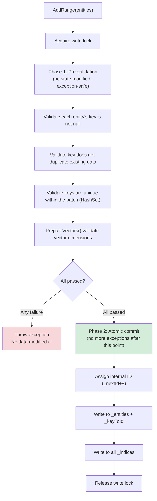

## 6. CRUD Operations

### 6.1 Adding Entities

```csharp
// Add a single entity
db.Documents.Add(new Document
{
    Id = "doc-001",
    Title = "Getting Started Guide",
    Embedding = new float[384]
});

// Batch add (atomic semantics: if any validation fails, all are rolled back)
var batch = new List<Document>
{
    new() { Id = "doc-002", Title = "Advanced Tutorial", Embedding = new float[384] },
    new() { Id = "doc-003", Title = "Best Practices", Embedding = new float[384] },
};
db.Documents.AddRange(batch);

// Async batch add (offloads CPU-intensive computation to thread pool)
await db.Documents.AddRangeAsync(batch, cancellationToken);
```

#### `AddRange` Two-Phase Commit



### 6.2 Insert or Update (Upsert)

Completed within a **single write lock**, more efficient and atomic than external `Remove + Add`.

```csharp
db.Documents.Upsert(new Document
{
    Id = "doc-001",
    Title = "Updated Getting Started Guide",
    Embedding = new float[384]
});
// Key exists -> RemoveCore() + AddCore()
// Key doesn't exist -> AddCore() directly
```

### 6.3 Removing Entities

```csharp
// Remove by entity (matched by primary key, not by reference comparison)
bool removed = db.Documents.Remove(entity);

// Remove by primary key directly (no entity reference needed)
bool removed = db.Documents.RemoveByKey("doc-001");
```

**Internal removal flow** (`RemoveCore`):

1. Reverse lookup internal ID via `_keyToId`
2. Remove entity from `_entities` dictionary
3. Remove key mapping from `_keyToId` dictionary
4. Remove vector from **all** `_indices` (index implementations handle residual references internally)

### 6.4 Finding Entities

```csharp
// Find by primary key, O(1) complexity (dual dictionary: key -> internal ID -> entity)
Document? doc = db.Documents.Find("doc-001");
```

### 6.5 Existence Check

```csharp
// By primary key, O(1) complexity (only checks _keyToId dictionary, one fewer lookup than Find)
bool exists = db.Documents.Exists("doc-001");

// By predicate, O(n) worst case (iterates within read lock, short-circuits on first match)
bool hasTutorial = db.Documents.Exists(e => e.Category == "Tutorial");
```

**Comparison with other approaches**:

| Approach | Complexity | Memory Allocation | Use Case |
|----------|-----------|-------------------|----------|
| `Exists(key)` | O(1) | None | Check by primary key |
| `Exists(predicate)` | O(n) short-circuit | None | Check by property condition |
| `Find(key) != null` | O(1) | None | When you also need the entity |
| LINQ `.Any(predicate)` | O(n) | O(n) snapshot | Not recommended — creates full snapshot |

> **Performance Tip**: `Exists(predicate)` iterates `_entities.Values` directly within the read lock, returning immediately on match, with **zero snapshot allocation**. Compared to LINQ's `Any()` which goes through `GetEnumerator()` creating an O(n) snapshot array first, this is both faster and allocation-free.

### 6.6 Clearing the Collection

```csharp
db.Documents.Clear();
// Clears _entities + _keyToId + all indices
// Resets _nextId = 0
```

### 6.7 Getting Information

```csharp
int count = db.Documents.Count; // Thread-safe (read lock)

// View vector field metadata
foreach (var (name, dimensions) in db.Documents.VectorFields)
    Console.WriteLine($"Field: {name}, Dimensions: {dimensions}");
```

### 6.8 Enumeration and LINQ Queries

`QuiverSet<TEntity>` implements `IEnumerable<TEntity>`, supporting `foreach` loops and LINQ queries.

```csharp
// foreach to iterate all entities
foreach (var doc in db.Documents)
    Console.WriteLine($"{doc.Id}: {doc.Title}");

// LINQ filter + sort
var tutorials = db.Documents
    .Where(e => e.Category == "Tutorial")
    .OrderBy(e => e.Title)
    .ToList();

// LINQ aggregation
var categoryCount = db.Documents
    .GroupBy(e => e.Category)
    .Select(g => new { Category = g.Key, Count = g.Count() })
    .ToList();

// LINQ conditional count
int tutorialCount = db.Documents.Count(e => e.Category == "Tutorial");
```

**Thread Safety Semantics**:

Enumeration **takes a snapshot of entities within a read lock** (shallow copy), then releases the lock before `yield return`ing one by one. This means:

- ✅ No lock is held during enumeration, so write operations are not blocked
- ✅ Concurrent writes during enumeration do not affect the already-captured snapshot
- ✅ Any code can safely run inside the `foreach` body with no deadlock risk
- ⚠️ Each enumeration creates an O(n) snapshot copy — be mindful of performance with large datasets

> **Performance Tip**: If you only need to find by primary key, use `Find(key)` (O(1)); if you need vector similarity ordering, use `Search(...)`. `foreach` / LINQ is best suited for full-collection traversal or filtering by non-vector properties.

---

