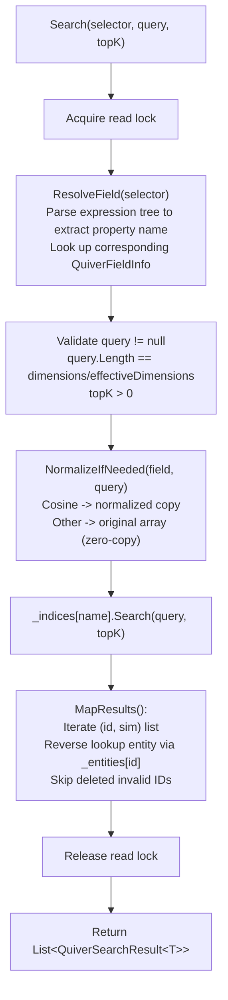
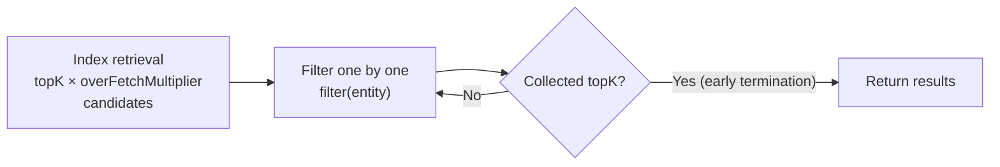

## 7. Vector Search

### 7.1 Top-K Search

Returns the top K entities with the highest similarity, sorted in descending order of similarity.

```csharp
float[] queryVector = GetEmbedding("search keywords");

var results = db.Documents.Search(
    vectorSelector: e => e.Embedding,  // Expression tree selector
    queryVector: queryVector,
    topK: 10
);

foreach (var result in results)
{
    Console.WriteLine($"ID: {result.Entity.Id}");
    Console.WriteLine($"Title: {result.Entity.Title}");
    Console.WriteLine($"Similarity: {result.Similarity:F4}");
}
```

**Internal flow**:



### 7.2 Threshold Search

Returns all entities with similarity not less than the specified threshold. The number of results is variable.

```csharp
var results = db.Documents.SearchByThreshold(
    vectorSelector: e => e.Embedding,
    queryVector: queryVector,
    threshold: 0.85f
);

Console.WriteLine($"Found {results.Count} results with similarity >= 0.85");
```

### 7.3 Filtered Search

Supports both **expression filtering** and **delegate filtering**.

```csharp
// Approach 1: Expression filtering
// ⚠️ Compiles expression tree on each call, overhead ~50μs
var results = db.Documents.Search(
    e => e.Embedding,
    queryVector,
    topK: 10,
    filter: e => e.Title.Contains("tutorial")
);

// Approach 2: Delegate filtering (recommended for high-frequency calls)
// Cache the compiled delegate externally to avoid repeated compilation
Func<Document, bool> myFilter = e => e.Title.Contains("tutorial");
var results = db.Documents.Search(
    e => e.Embedding,
    queryVector,
    topK: 10,
    filter: myFilter,
    overFetchMultiplier: 4
);
```

#### Over-Fetch Strategy



| `overFetchMultiplier` | Description |
|----------------------|-------------|
| 4 (default) | Suitable for filter rates < 75% |
| 8~16 | High filter rate scenarios (e.g., filtering by category) |
| Larger values | Extreme filter rates (e.g., searching for specific tags only) |

### 7.4 Top-1 Search

Searches for the single most similar entity. Internal optimization path: avoids intermediate `List` allocation, `MapTop1` takes only the first valid result.

```csharp
var top1 = db.Documents.SearchTop1(
    e => e.Embedding,
    queryVector
);

if (top1 != null)
    Console.WriteLine($"Most similar: {top1.Entity.Title} ({top1.Similarity:F4})");
else
    Console.WriteLine("No similar document found");
```

### 7.5 Async Search

All search methods provide `Async` suffix overloads that offload CPU-intensive computation to the thread pool via `Task.Run`. These are CPU-bound convenience wrappers, not true I/O async operations. They are useful for UI applications; in high-concurrency server code, prefer the synchronous overloads and control scheduling at the caller level. Cancellation is observed before the work item starts; once the synchronous search loop is running it is not interrupted.

```csharp
// Async Top-K
var results = await db.Documents.SearchAsync(
    e => e.Embedding, queryVector, topK: 10, cancellationToken);

// Async with filter
var results = await db.Documents.SearchAsync(
    e => e.Embedding, queryVector, topK: 10,
    filter: e => e.Category == "Tutorial",
    overFetchMultiplier: 4, cancellationToken);

// Async threshold search
var results = await db.Documents.SearchByThresholdAsync(
    e => e.Embedding, queryVector, threshold: 0.8f, cancellationToken);

// Async Top-1
var top1 = await db.Documents.SearchTop1Async(
    e => e.Embedding, queryVector, cancellationToken);
```

### 7.6 Half[] Query Overloads

When a vector field type is `Half[]` (fp16), all search methods (`Search`, `SearchByThreshold`, `SearchTop1`, `SearchAsync`) provide dedicated overloads that accept a `Half[]` query vector. The query vector is widened to `float[]` once at the entry point, then reuses the existing float search pipeline.

```csharp
// Half[] query overload
Half[] queryH = GetHalfEmbedding("search keywords");

var results = db.Docs.Search(
    e => e.Vec,        // Expression<Func<T, Half[]>>
    queryH,            // Half[] query vector
    topK: 10
);

// Top-1
var top1 = db.Docs.SearchTop1(e => e.Vec, queryH);

// Threshold search
var aboveThreshold = db.Docs.SearchByThreshold(e => e.Vec, queryH, threshold: 0.8f);

// Async
var results = await db.Docs.SearchAsync(e => e.Vec, queryH, topK: 10);
```

**Internal flow**: `Half[]` query → `WidenQuery(Half[])` converts to `float[]` → `NormalizeIfNeeded(...)` → same float index search pipeline.

> **Design note**: The `float[]` query overload does not accept `Expression<Func<T, Half[]>>` because the field property type differs. To query a `Half[]` field with float precision, convert first:
> ```csharp
> float[] qf = ...;
> var qh = Array.ConvertAll(qf, v => (Half)v);
> var r = db.Docs.Search(e => e.Vec, qh, topK: 5);
> ```

### 7.7 Default Field Convenience Methods

When an entity has only one `[QuiverVector]` field, the `vectorSelector` parameter can be omitted. The framework caches `_defaultField` to avoid calling `_vectorFields.First()` every time.

```csharp
// Single vector field entity — omit vectorSelector
var results = db.Documents.Search(queryVector, topK: 5);
var top1 = db.Documents.SearchTop1(queryVector);

// Async versions
var results = await db.Documents.SearchAsync(queryVector, topK: 5);
var top1 = await db.Documents.SearchTop1Async(queryVector);
```

> ⚠️ Calling default methods on multi-vector-field entities throws `InvalidOperationException("Entity has N vector fields. Use the overload with a vectorSelector expression.")`
>
> ⚠️ **Half fields do not support the selector-less convenience methods**: the default field mechanism only applies to `float[]` fields.

---

