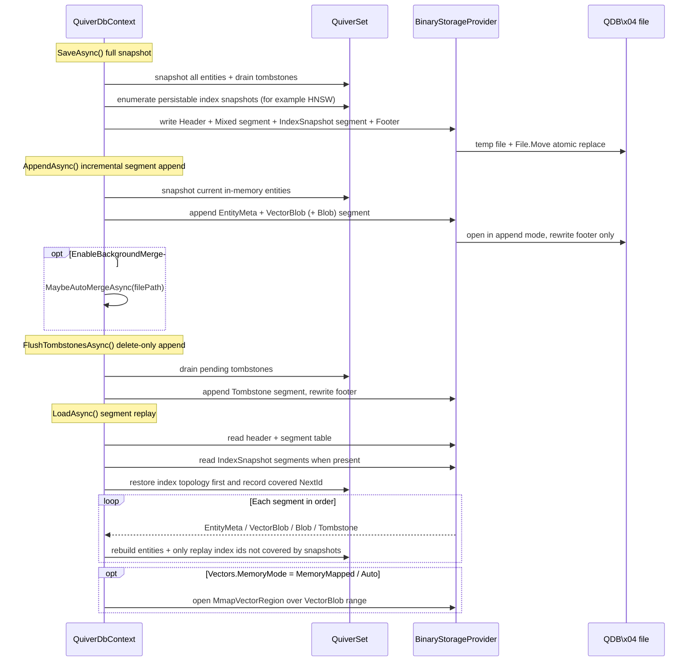
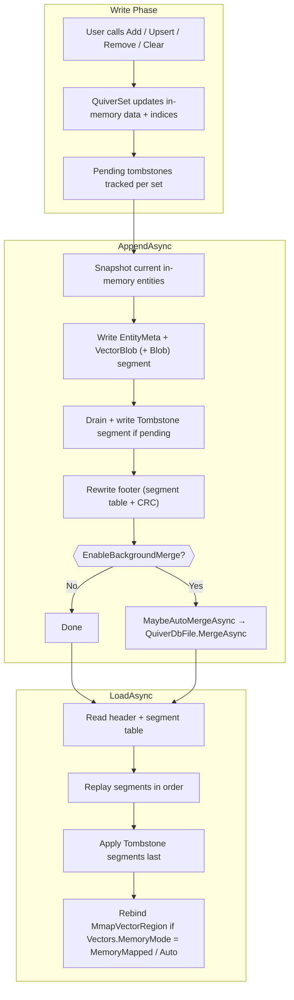

## 8. Persistent Storage

### 8.1 Save and Load

Quiver 4.0 uses a **segmented binary file** (`QDB\x04`) as its sole persistence format. WAL has been removed; instead, four explicit persistence methods cover the full snapshot ↔ incremental spectrum:

```csharp
// Full snapshot — rewrites the entire file atomically (temp file + File.Move)
await db.SaveAsync();
await db.SaveAsync(@"C:\backup\mydata.vdb");

// Incremental append — writes the current in-memory entities as a NEW segment,
// only rewrites the footer. O(Δ) on disk, no double-buffer memory peak.
await db.AppendAsync();

// Tombstone-only append — flushes pending deletions as a Tombstone segment.
// Useful when the workload is delete-heavy and live entities should not be rewritten.
await db.FlushTombstonesAsync();

// Full snapshot — coalesces all live entities into a single Mixed segment and
// drops every tombstone. This is also the manual compaction step.
await db.SaveAsync();

// Load — reads header, scans the segment table, replays segments in order,
// applies tombstones, and rebinds mmap regions when Vectors.MemoryMode = MemoryMapped / Auto.
await db.LoadAsync();
await db.LoadAsync(@"C:\backup\mydata.vdb");
```

> ⚠️ **`await using` does not auto-save by default** — `DisposeAsync()` performs a full `SaveAsync()` only when `QuiverDbOptions.SaveOnDispose = true`. For batch ingest pipelines that use `AppendAsync()` + `Clear()`, prefer synchronous `using` and explicit `AppendAsync` / `SaveAsync` calls to avoid overwriting appended segments if auto-save is enabled.

#### Persistence Internal Flow



### 8.2 Storage Architecture

Quiver 4.0 is **binary-only** for primary storage. JSON and XML are export/import side channels.

| Role | Implementation | Description |
|------|---------------|-------------|
| **Primary storage** | `BinaryStorageProvider` (v4 `QDB\x04`) | Always used for `SaveAsync` / `LoadAsync` / `AppendAsync` / `FlushTombstonesAsync`. Segmented format with per-segment CRC32 and `MemoryMarshal` zero-copy |
| **File utilities** | `QuiverDbFile` | Static helpers: `InspectAsync` (version + segment table + CRC verification) and `MergeAsync` (multi-file merge with `Append` / `FirstWriterWins` / `LastWriterWins` policies) |
| **Mmap region** | `MmapVectorRegion` | Read-only `MemoryMappedFile` view over a `VectorBlob` segment; used by `MmapVectorStore` when `Vectors.MemoryMode = MemoryMapped / Auto` |
| **Export / Import** | `JsonExportProvider` | Human-readable JSON, useful for debugging and interoperability. Accessed via `ExportAsync` / `ImportAsync` |
| **Export / Import** | `XmlExportProvider` | XML with Base64 vectors, useful for compatibility. Accessed via `ExportAsync` / `ImportAsync` |

```csharp
// Export to JSON for inspection
await db.ExportAsync("backup.json", ExportFormat.Json);

// Import back
await db.ImportAsync("backup.json", ExportFormat.Json);

// Inspect a v4 file without loading it
var info = await QuiverDbFile.InspectAsync("mydata.vdb", verifyCrc: true);
foreach (var seg in info.Segments)
    Console.WriteLine($"{seg.Kind} offset={seg.Offset} size={seg.Size} crc={(seg.CrcOk ? "OK" : "FAIL")}");

// Merge multiple files into one, deduplicating by primary key
await QuiverDbFile.MergeAsync(
    sources: ["shard-0.vdb", "shard-1.vdb", "shard-2.vdb"],
    destination: "merged.vdb",
    options: new MergeOptions { ConflictPolicy = MergeConflictPolicy.LastWriterWins },
    typeMap: db.GetTypeMap());
```

### 8.3 JSON Export Format Details

Used only for export/import via `ExportAsync` / `ImportAsync`. Output structure:

```json
{
  "MyNamespace.FaceFeature": [
    { "personId": "P001", "name": "Alice", "embedding": [0.1, 0.2, ...] },
    { "personId": "P002", "name": "Bob", "embedding": [0.3, 0.4, ...] }
  ]
}
```

- JSON options (`WriteIndented`, naming policy) are passed directly to `ExportAsync`
- Defaults to `WriteIndented = true` + `CamelCase`
- Uses `JsonDocument` DOM parsing during import, deserializing element by element
- Unrecognized type names are automatically skipped (forward compatible)

### 8.4 XML Export Format Details

Used only for export/import via `ExportAsync` / `ImportAsync`. Output structure:

```xml
<?xml version="1.0" encoding="utf-8"?>
<QuiverDb version="1">
  <Set type="FaceFeature" count="2">
    <Entity>
      <PersonId>P001</PersonId>
      <Name>Alice</Name>
      <Embedding>Base64EncodedBytes...</Embedding>
    </Entity>
  </Set>
</QuiverDb>
```

- Vector data uses **Base64 encoding** (`MemoryMarshal.AsBytes` → `Convert.ToBase64String`), compact with no precision loss
- DateTime uses **ISO 8601 round-trip format** (`"O"`)
- Numeric values use `CultureInfo.InvariantCulture`, ensuring cross-region consistency

### 8.5 Binary Format Details (v4 — Primary Storage)

Quiver 4.0 uses a **segmented** binary container. The file is a sequence of typed segments terminated by a top-level footer; the footer lists every segment's kind, byte range, and CRC32.

```
┌─ File Header ─────────────────────────────────────────────
│  Magic: "QDB\x04" (4B)              ← v4 identifier (v1–v3 files also accepted on read)
├─ Segment × N ─────────────────────────────────────────────
│  [Kind 1B]  Mixed / EntityMeta / VectorBlob / Blob / Tombstone / IndexSnapshot
│  [Length u64]                       ← Payload byte count
│  [Payload …]                        ← Kind-specific contents
│  [CRC32 u32]                        ← Covers payload
├─ Footer (top-level) ──────────────────────────────────────
│  [SegmentTable]   (offset, length, kind, crc) × N
│  [Trailer Magic + Footer offset/length + CRC]
└───────────────────────────────────────────────────────────
```

**Segment kinds**:

| Kind | Purpose | Written by |
|------|---------|-----------|
| `Mixed` | Self-contained EntityMeta + VectorBlob (+ Blob) bundle for one type | `SaveAsync` |
| `EntityMeta` | Property records only (key + scalar fields, vector reference) | `AppendAsync` (split path) |
| `VectorBlob` | Raw `float[]` arena, mmap-friendly contiguous layout | `AppendAsync` (split path) |
| `Blob` | `[QuiverLargeField] byte[]` payloads, kept outside `EntityMeta` | `AppendAsync` / `SaveAsync` |
| `Tombstone` | Deletion records (type + key) applied on load | `FlushTombstonesAsync` / `AppendAsync` |
| `IndexSnapshot` | Optional persisted index topology, currently used by HNSW | `SaveAsync` |

#### HNSW `IndexSnapshot` segments

`SaveAsync()` writes `IndexSnapshot` segments for indexes that support snapshots. HNSW snapshots store the graph entry point, max level, per-node level and neighbor lists, plus the covered `NextId`. During load, if the snapshot matches the current similarity type, HNSW parameters, and effective dimension, `LoadAsync()` restores the topology first, skips `index.Add(id)` for covered ids, and only replays new or uncovered segments.

Snapshots are an optimization only: old files without snapshots, CRC failures, parameter mismatches, or index types without snapshot support automatically fall back to the previous rebuild path. The snapshot does not store entity data or vector copies, so non-InMemory vector materialization, `[QuiverLargeField]` large-object loading, and mmap vector reads keep the same semantics.

**Supported property TypeCodes** (used inside `EntityMeta` / `Mixed`):

| TypeCode | CLR Type | Storage Method |
|----------|---------|---------------|
| 0 | `string` | BinaryWriter.Write (length-prefixed) |
| 1 | `int` | 4 bytes |
| 2 | `long` | 8 bytes |
| 3 | `float` | 4 bytes |
| 4 | `double` | 8 bytes |
| 5 | `bool` | 1 byte |
| 6 | `DateTime` | ToBinary() → 8 bytes |
| 7 | `Guid` | 16 bytes |
| 8 | `decimal` | 16 bytes |
| 9 | `float[]` | [length int32] + [raw bytes zero-copy] |
| 10 | `string[]` | [length int32] + [element-by-element strings] |
| 11 | `byte` | 1 byte |
| 12 | `short` | 2 bytes |
| 13 | `Half` | 2 bytes (half-precision float, common in ML/AI scenarios) |
| 14 | `DateTimeOffset` | [Ticks int64] + [OffsetMinutes int16] = 10 bytes |
| 15 | `TimeSpan` | Ticks → 8 bytes |
| 16 | `byte[]` | [length int32] + [raw bytes] |
| 17 | `double[]` | [length int32] + [raw bytes zero-copy] |
| 18 | `ushort` | 2 bytes |
| 19 | `uint` | 4 bytes |
| 20 | `ulong` | 8 bytes |
| 21 | `sbyte` | 1 byte |
| 22 | `char` | stored as UInt16, 2 bytes |
| 23 | `DateOnly` | DayNumber → 4 bytes |
| 24 | `TimeOnly` | Ticks → 8 bytes |
| 25 | `ushort[]` | [length int32] + [raw bytes zero-copy] |
| 26 | `uint[]` | [length int32] + [raw bytes zero-copy] |
| 27 | `ulong[]` | [length int32] + [raw bytes zero-copy] |
| 28 | `sbyte[]` | [length int32] + [raw bytes zero-copy] |
| 29 | _(reserved)_ | Formerly `char[]`; removed because `char[]` semantics overlap with `string` — use `string` instead |
| 30 | `DateOnly[]` | [length int32] + [element-by-element DayNumber int32] |
| 31 | `TimeOnly[]` | [length int32] + [element-by-element Ticks int64] |
| 32 | `short[]` | [length int32] + [raw bytes zero-copy] |
| 33 | `int[]` | [length int32] + [raw bytes zero-copy] |
| 34 | `long[]` | [length int32] + [raw bytes zero-copy] |
| 35 | `bool[]` | [length int32] + [1 byte per element] |
| 36 | `Half[]` | [length int32] + [raw bytes zero-copy, 2 bytes per element] |

> Properties whose type is **not** in the table above (for example `int?` and other nullable value types, `List<T>` and other generic collections, or custom/complex types) are **not supported**. Attempting to persist such a property throws a `NotSupportedException` on the first `SaveAsync()`, with a message that names the offending entity, property, and the full list of supported types.

### 8.6 Incremental Append Mode (v4 segmented persistence)

In 4.0 the WAL subsystem has been **removed**. Incremental persistence is now expressed directly at the file level: every save call writes one or more new segments and rewrites only the footer.

#### Three Persistence Granularities Compared

| Dimension | `SaveAsync()` | `AppendAsync()` | `FlushTombstonesAsync()` |
|-----------|---------------------------------|------------------|--------------------------|
| Persisted content | All live entities, single `Mixed` segment | New `EntityMeta` + `VectorBlob` (+ `Blob`) segment for current in-memory entities | `Tombstone` segment for pending deletions only |
| Disk complexity | O(N) (full rewrite) | O(Δ) (segment append) | O(Δ) (tombstone append) |
| File write strategy | Temp file + `File.Move` atomic replace | Open existing file, append + rewrite footer | Same as `AppendAsync` |
| Memory profile | Single in-memory image | No double-buffer; mmap-friendly | Minimal |
| Typical scenario | Initial save, periodic compaction | Streaming / batched ingest | Delete-heavy workloads |

#### Background Auto-Merge

When `EnableBackgroundMerge = true`, every `AppendAsync` and `FlushTombstonesAsync` call ends with a `MaybeAutoMergeAsync` check that may trigger an in-process merge via `QuiverDbFile.MergeAsync`:

| Option | Default | Meaning |
|--------|---------|---------|
| `EnableBackgroundMerge` | `false` | Master switch for auto-merge |
| `AutoMergeMaxSegments` | `32` | Merge when the live segment count exceeds this number |
| `AutoMergeTombstoneRatio` | `0.25` | Merge when the tombstone-to-live-entity ratio exceeds this value |

#### Workflow



#### Crash Recovery Safety

- Each segment carries its own CRC32; on load, any segment that fails verification stops the replay at that point. The remainder of the file is treated as truncated/uncommitted.
- The footer is written last and atomically; a partial append never corrupts previously committed segments.
- `QuiverDbFile.InspectAsync(path, verifyCrc: true)` produces a per-segment health report without modifying the file.

#### Multi-file Merge

```csharp
await QuiverDbFile.MergeAsync(
    sources: ["a.vdb", "b.vdb", "c.vdb"],
    destination: "merged.vdb",
    options: new MergeOptions
    {
        ConflictPolicy = MergeConflictPolicy.LastWriterWins,   // or FirstWriterWins / Append
    },
    typeMap: db.GetTypeMap());
```

`Append` preserves all entries verbatim; `FirstWriterWins` / `LastWriterWins` deduplicate by primary key.

---

