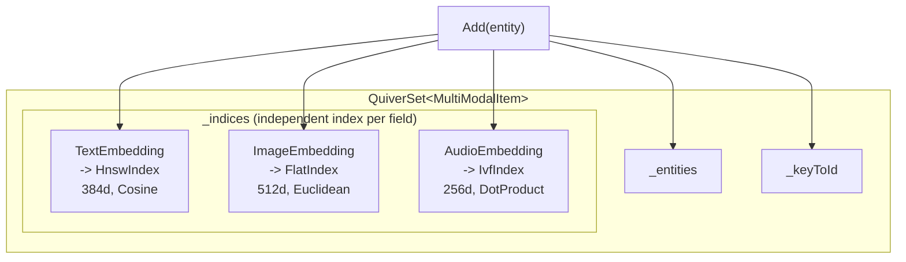

## 10. Multi-Vector Field Support

An entity can have multiple `[QuiverVector]` properties annotated, each field **maintaining its own independent index**, supporting different dimensions, metrics, and indexing strategies.

### 10.1 Defining Multi-Vector Entities

```csharp
public class MultiModalItem
{
    [QuiverKey]
    public string Id { get; set; } = string.Empty;

    public string Title { get; set; } = string.Empty;
    public string Category { get; set; } = string.Empty;
    public bool IsPublished { get; set; }

    [QuiverVector(384, DistanceMetric.Cosine)]
    [QuiverIndex(VectorIndexType.HNSW, M = 32, EfConstruction = 200, EfSearch = 100)]
    public float[] TextEmbedding { get; set; } = [];

    [QuiverVector(512, DistanceMetric.Cosine)]
    [QuiverIndex(VectorIndexType.HNSW, M = 24, EfConstruction = 200, EfSearch = 80)]
    public float[] ImageEmbedding { get; set; } = [];
}
```

### 10.2 Internal Structure



### 10.3 Per-Field Search

```csharp
// Search by text vector
var textResults = db.Items.Search(e => e.TextEmbedding, textQuery, topK: 5);

// Search by image vector
var imageResults = db.Items.Search(e => e.ImageEmbedding, imageQuery, topK: 5);

// Search by audio vector
var audioResults = db.Items.Search(e => e.AudioEmbedding, audioQuery, topK: 5);

// Search results from the three fields are mutually independent (different vector spaces)
```

### 10.4 Viewing Vector Field Information

```csharp
foreach (var (name, dimensions) in db.Items.VectorFields)
    Console.WriteLine($"Field: {name}, Dimensions: {dimensions}");
// Output:
// Field: TextEmbedding, Dimensions: 384
// Field: ImageEmbedding, Dimensions: 512
// Field: AudioEmbedding, Dimensions: 256
```

### 10.5 Nullable Vector Fields

Mark a vector field as nullable with `Nullable = true`. Useful when not all entities have a particular feature — e.g., an image collection where only some images contain faces.

#### Defining a Nullable Vector Entity

```csharp
public class ImageEntity
{
    [QuiverKey]
    public string Id { get; set; } = string.Empty;

    public string FileName { get; set; } = string.Empty;

    /// <summary>Overall image feature vector (required)</summary>
    [QuiverVector(512, DistanceMetric.Cosine)]
    public float[] ImageEmbedding { get; set; } = [];

    /// <summary>Face feature vector (nullable, null when no face detected)</summary>
    [QuiverVector(128, DistanceMetric.Cosine, Nullable = true)]
    public float[]? FaceEmbedding { get; set; }
}
```

#### Behavioral Semantics

| Operation | When `FaceEmbedding = null` | When `FaceEmbedding` has a value |
|-----------|---------------------------|----------------------------------|
| `Add` / `Upsert` | Entity is written normally, **not added** to FaceEmbedding index | Dimensions validated and added to index normally |
| `Search(e => e.FaceEmbedding, ...)` | This entity **will not appear** in results | Participates in similarity computation normally |
| `Search(e => e.ImageEmbedding, ...)` | Participates in search normally | Participates in search normally |
| `Remove` | All indices silently remove | Removed normally |

#### Usage Example

```csharp
await using var db = new ImageDb();
await db.LoadAsync();

// Write: image with face
db.Images.Add(new ImageEntity
{
    Id = "img-001",
    FileName = "portrait.jpg",
    ImageEmbedding = GetImageEmbedding("portrait.jpg"),
    FaceEmbedding = GetFaceEmbedding("portrait.jpg") // Face detected
});

// Write: landscape without face (FaceEmbedding is null)
db.Images.Add(new ImageEntity
{
    Id = "img-002",
    FileName = "landscape.jpg",
    ImageEmbedding = GetImageEmbedding("landscape.jpg"),
    FaceEmbedding = null // No face, Nullable field allows null
});

// Search by image — both images participate
var allResults = db.Images.Search(e => e.ImageEmbedding, imageQuery, topK: 10);
// allResults may contain img-001 and img-002

// Search by face — only images with faces participate
var faceResults = db.Images.Search(e => e.FaceEmbedding, faceQuery, topK: 10);
// faceResults can only contain img-001; img-002 is not in the FaceEmbedding index
```

> ⚠️ **Note**: Non-Nullable vector fields (default) throw `ArgumentNullException` if `null` is passed, with a clear message that suggests `[QuiverVector(Nullable = true)]` when nulls are allowed.

---

