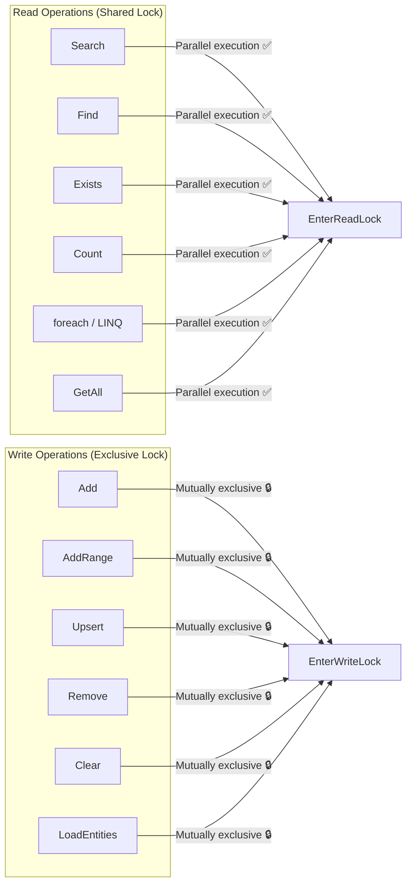

## 11. Thread Safety and Concurrency

### 11.1 Lock Model

`QuiverSet<TEntity>` internally uses `ReaderWriterLockSlim` to implement reader-writer separation:



### 11.2 Concurrency Safety Examples

```csharp
var db = new MyDocumentDb();

// ✅ Safe: multi-threaded concurrent search (shared read lock)
var tasks = Enumerable.Range(0, 24).Select(_ => Task.Run(() =>
{
    var query = GenerateRandomVector(384);
    return db.Documents.Search(e => e.Embedding, query, topK: 5);
}));
await Task.WhenAll(tasks);

// ✅ Safe: concurrent read-write (read operations wait while write holds exclusive lock)
var writerTask = Task.Run(() =>
{
    db.Documents.Upsert(new Document
    {
        Id = "new-doc",
        Title = "New Document",
        Embedding = new float[384]
    });
});

var readerTask = Task.Run(() =>
    db.Documents.Search(e => e.Embedding, queryVector, topK: 5));

await Task.WhenAll(writerTask, readerTask);
```

### 11.3 Dispose Thread Safety

`QuiverSet` uses `Interlocked.Exchange(ref _disposed, 1)` to guarantee concurrent Dispose safety. All operation entry points call `ThrowIfDisposed()`, using `Volatile.Read` to ensure cross-thread visibility.

### 11.4 Concurrency Performance Reference

| Test Scenario | Data Size | Configuration | Result |
|--------------|-----------|---------------|--------|
| Pure read concurrency | 3,000 entries × 3 vectors | 24 threads × 100 searches | 2,400 searches with zero exceptions |
| Mixed read-write | 1,000 entries × 3 vectors | 4 writers + 8 readers + 2 deleters, 3 seconds | Zero exceptions |
| Batch write + search | Dynamically growing | 3 writer threads (50 per batch) + 6 search threads, 3 seconds | Zero exceptions |

---

