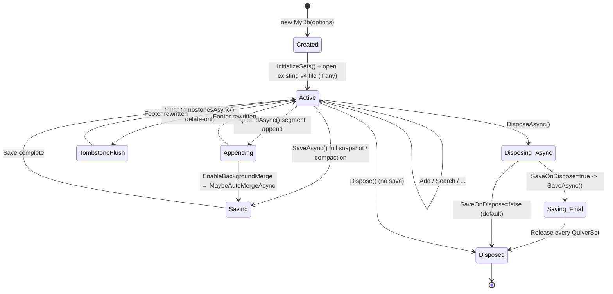

## 12. Lifecycle Management

### 12.1 QuiverDbContext Lifecycle



| Disposal Method | Auto-Save | Behavior | Recommended Scenario |
|----------------|-----------|----------|---------------------|
| `Dispose()` | ❌ No save | Releases resources only | Manual save timing control |
| `DisposeAsync()` | ❌ No save (default) | Releases resources only unless `SaveOnDispose = true` | Explicit `SaveAsync()` before disposal or `AppendAsync` batched ingest |

> ⚠️ **Default: no auto-save on disposal** — `DisposeAsync()` does **not** automatically call `SaveAsync()` unless `QuiverDbOptions.SaveOnDispose = true`. This avoids the trap where a batch-ingest loop that does `AppendAsync(); Clear();` followed by `await using` disposal would overwrite the file with an empty snapshot when auto-save is enabled. Always call `SaveAsync()` explicitly when you need the data persisted.

### 12.2 Recommended Usage

```csharp
// ✅ Read-mostly / mixed workloads: explicit save before disposal
await using var db = new MyDocumentDb();
await db.LoadAsync();
db.Documents.Add(new Document { ... });
await db.SaveAsync();
// Scope ends -> DisposeAsync -> release

// ✅ Streaming / batched ingest: synchronous using + explicit AppendAsync
using var ingest = new MyDocumentDb();
await ingest.LoadAsync();
foreach (var batch in batches)
{
    foreach (var doc in batch) ingest.Documents.Add(doc);
    await ingest.AppendAsync();   // segment append, O(Δ)
    ingest.Documents.Clear();     // free memory before next batch
}
// Dispose() releases resources WITHOUT a final SaveAsync

// ✅ Delete-heavy workload
await using var deleter = new MyDocumentDb();
await deleter.LoadAsync();
foreach (var key in stale) deleter.Documents.RemoveByKey(key);
await deleter.FlushTombstonesAsync();   // only tombstone segment appended
```

### 12.3 QuiverSet Disposal

`QuiverSet` implements `IDisposable`, releasing the internal `ReaderWriterLockSlim`. All operations throw `ObjectDisposedException` after disposal.

---

