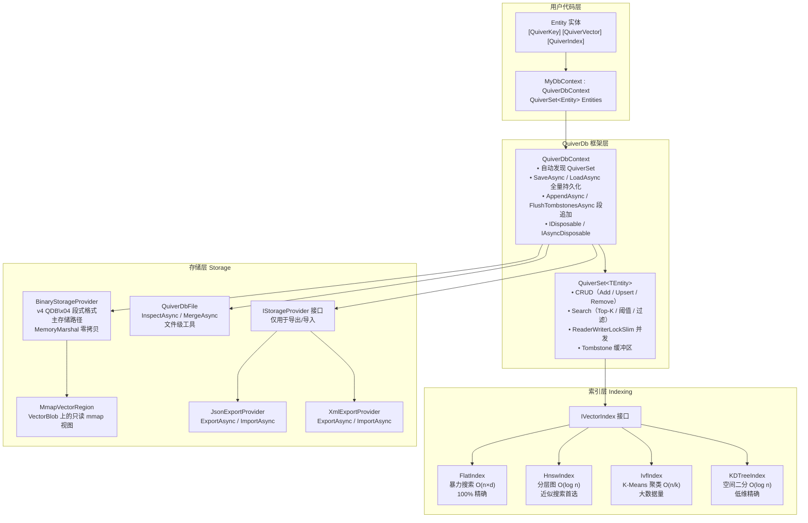
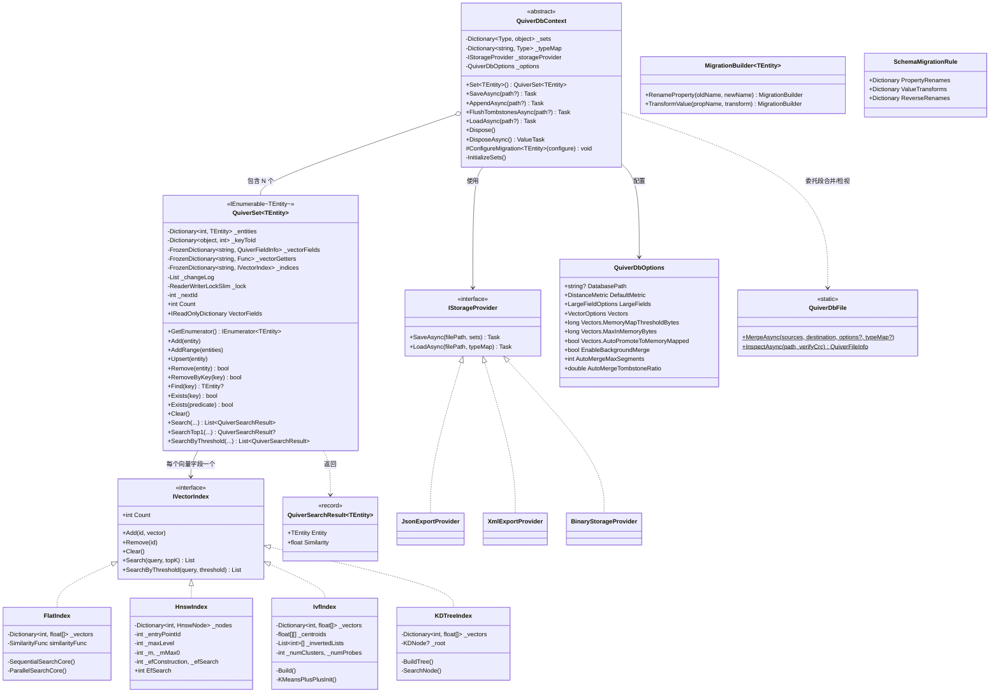

## 1. 架构概览

### 1.1 分层架构

### 1.2 核心组件总览

| 组件 | 类型 | 职责 |
|------|------|------|
| `QuiverDbContext` | `abstract class` | 数据库上下文基类，管理 QuiverSet 集合的反射自动发现、持久化读写、生命周期 |
| `QuiverSet<TEntity>` | `partial class` | 向量集合，实现 `IEnumerable<TEntity>`，提供完整 CRUD + 多种搜索模式 + `foreach` / LINQ 枚举，内部 `ReaderWriterLockSlim` 读写锁 |
| `IVectorIndex` | `internal interface` | 向量索引统一契约，定义 `Add` / `Remove` / `Clear` / `Search` / `SearchByThreshold` |
| `IStorageProvider` | `internal interface` | 导出/导入统一契约，支持 `SaveAsync` / `LoadAsync` |
| `ExportStorageProviderFactory` | `internal static class` | 工厂方法，根据 `ExportFormat` 枚举创建对应的 `IStorageProvider` 实例 |
| `QuiverVectorAttribute` | `Attribute` | 标记向量字段，指定维度 (`dimensions`)、距离度量 (`metric`)、是否可空 (`Nullable`) 和字段级内存模式 (`MemoryMode`) |
| `QuiverKeyAttribute` | `Attribute` | 标记实体主键（每个实体有且仅有一个） |
| `QuiverIndexAttribute` | `Attribute` | 配置索引类型及调优参数（可选，默认 Flat） |
| `QuiverDbOptions` | `class` | 全局配置：存储路径、默认度量、大字段内存模式、向量内存模式、后台合并阈值等 |
| `QuiverSearchResult<T>` | `record` | 搜索结果 DTO，包含 `Entity` 和 `Similarity` |
| `QuiverDbFile` | `public static class` | v4 文件级工具：`InspectAsync`（版本/段表/CRC 校验）、`MergeAsync`（多文件合并，支持 Append / FWW / LWW 三种冲突策略） |
| `MmapVectorRegion` | `internal sealed class` | 只读 `MemoryMappedFile` 视图，覆盖单个 `VectorBlob` 段；`MmapVectorStore` 的底层 |
| `MmapVectorStore` | `internal sealed class` | 通过 `MmapVectorRegion` 暴露向量数据的 `IVectorStore` 实现，`Vectors.MemoryMode = MemoryMapped / Auto` 时启用 |
| `LazyVectorAccessor` | `internal static class` | 源生成器生成的 `partial` 向量 getter 的运行时桥；通过 `ConditionalWeakTable` 把实体绑定到所属 `QuiverSet` 与内部 ID |
| `MigrationBuilder<T>` | `class` | Schema 迁移的流式 API 构建器（属性重命名 + 值转换） |
| `SchemaMigrationRule` | `internal class` | 存储单个实体类型的迁移规则：属性重命名映射 + 值转换函数 |
| `ISimilarity<T>` | `public interface` | 静态抽象相似度计算契约。JIT 为每个具体类型内联，零虚分派 |
| `IVectorStore` | `internal interface` | 向量数据存储抽象。将向量所有权从索引拓扑中剥离 |
| `HeapVectorStore` | `internal sealed class` | GC 堆向量存储（`Dictionary<int, float[]>`），唯一的向量存储后端 |
| `EntityPageCache<TEntity>` | `internal sealed class` | 懒加载 LRU 分页缓存。实体按需加载，冷页驱逐后序列化为 `.qvpg` 二进制页文件 |

### 1.3 类关系图

---

