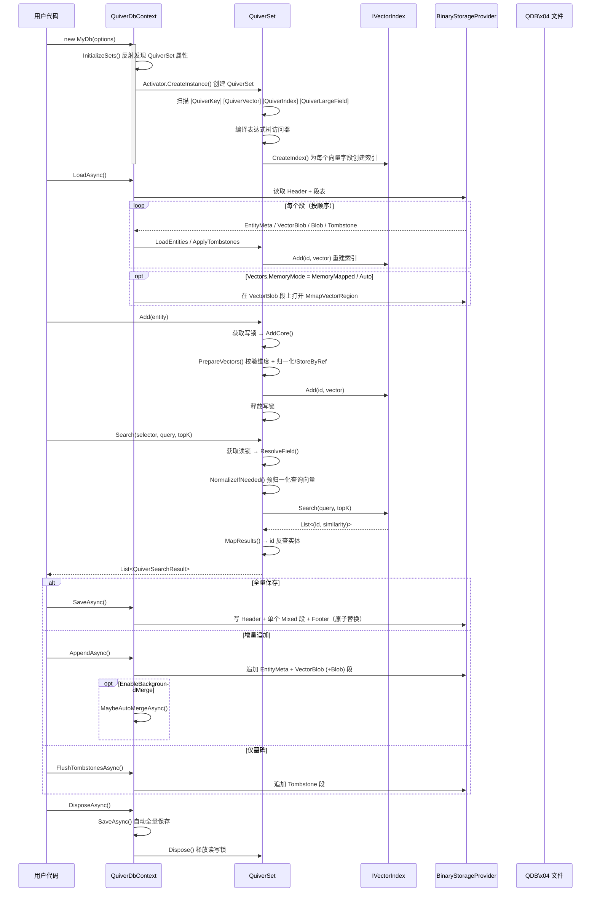

## 2. 快速开始

### 2.1 定义实体类

```csharp
using Vorcyc.Quiver;

public class Document
{
    [QuiverKey]
    public string Id { get; set; } = string.Empty;

    public string Title { get; set; } = string.Empty;

    public string Category { get; set; } = string.Empty;

    [QuiverVector(384, DistanceMetric.Cosine)]
    public float[] Embedding { get; set; } = [];
}
```

### 2.2 定义数据库上下文

```csharp
public class MyDocumentDb : QuiverDbContext
{
    public QuiverSet<Document> Documents { get; set; } = null!;

    public MyDocumentDb() : base(new QuiverDbOptions
    {
        DatabasePath = "documents.vdb",
        DefaultMetric = DistanceMetric.Cosine
    })
    { }
}
```

### 2.3 基本使用

```csharp
// DisposeAsync 默认不自动保存（SaveOnDispose 默认为 false）。
// 如需持久化，请显式调用 SaveAsync()，或在 QuiverDbOptions 中设置 SaveOnDispose = true。
await using var db = new MyDocumentDb();
await db.LoadAsync(); // 加载已有数据（文件不存在时静默返回）

// 添加实体
db.Documents.Add(new Document
{
    Id = "doc-001",
    Title = "向量数据库入门",
    Category = "教程",
    Embedding = new float[384] // 实际应为模型输出的嵌入向量
});

// 搜索 Top-5 最相似的文档
float[] queryVector = new float[384]; // 查询向量
var results = db.Documents.Search(
    e => e.Embedding,
    queryVector,
    topK: 5
);

foreach (var result in results)
{
    Console.WriteLine($"文档: {result.Entity.Title}, 相似度: {result.Similarity:F4}");
}

await db.SaveAsync(); // 显式保存数据到磁盘
```

### 2.4 增量追加模式快速开始

v4 不再使用 WAL；通过 `AppendAsync()` 把本批实体写为新段并仅重写 footer，磁盘代价 O(Δ)，且没有 WAL 那种内存翻倍：

```csharp
public class MyDb : QuiverDbContext
{
    public QuiverSet<Document> Documents { get; set; } = null!;

    public MyDb() : base(new QuiverDbOptions
    {
        DatabasePath = "documents.vdb",
        EnableBackgroundMerge = true,   // 段数/墓碑比例超阈值时自动触发 Merge
        AutoMergeMaxSegments = 32,
        AutoMergeTombstoneRatio = 0.25
    }) { }
}

// ⚠️ 分阶段批量入库推荐使用同步 using，并显式调用 AppendAsync / SaveAsync。
// DisposeAsync 只有在 SaveOnDispose = true 时才会自动 SaveAsync。
using var db = new MyDb();
await db.LoadAsync();

foreach (var batch in batches)
{
    db.Documents.AddRange(batch);
    await db.AppendAsync();         // 仅追加本批，O(Δ)
    db.Documents.Clear();           // 释放内存，磁盘段不受影响
}

// 周期性碎片整理（可选；后台 Merge 启用时也可由框架自动触发）
await db.SaveAsync();
```

### 2.5 端到端流程



---

