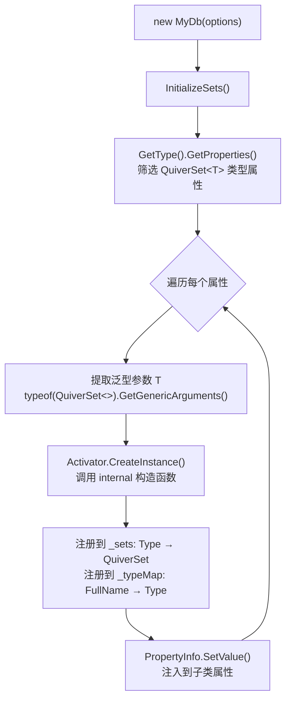
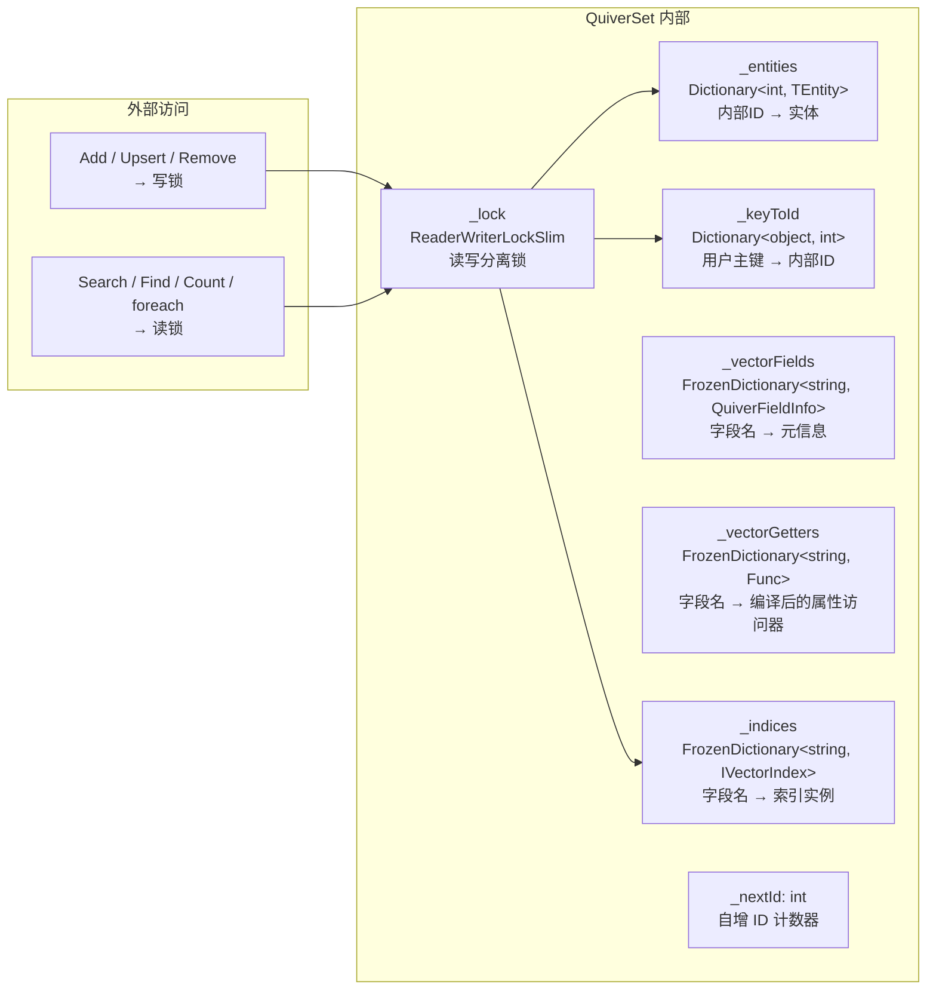
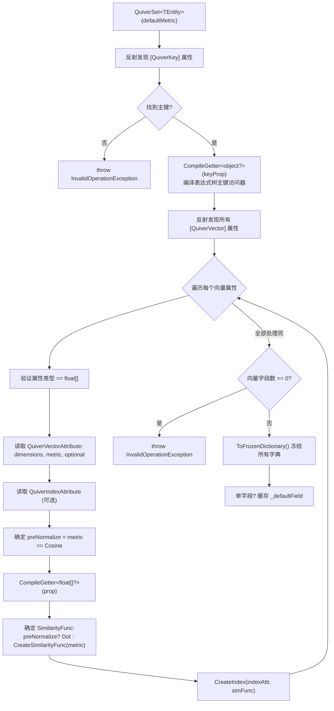

## 3. 核心概念

### 3.1 实体定义与特性标记

实体类通过 Attribute 声明向量数据库的元数据。`QuiverSet<TEntity>` 构造时通过反射扫描这些特性来自动发现和注册字段。

#### `[QuiverKey]` — 主键标记

每个实体**必须有且仅有**一个 `[QuiverKey]` 属性。支持任意类型（`string`、`int`、`Guid` 等）。运行时主键值通过编译后的表达式树访问器读取，内部以 `object` 装箱存储在 `Dictionary<object, int>` 中实现 O(1) 查找和去重。

```csharp
[QuiverKey]
public string PersonId { get; set; } = string.Empty;
```

**约束**：
- 主键值不能为 `null`（写入时校验）
- 主键在集合内必须唯一（`Add` 时校验，`Upsert` 时自动处理）
- 缺少 `[QuiverKey]` 属性时，`QuiverSet` 构造抛出 `InvalidOperationException`

#### `[QuiverVector(dimensions, metric)]` — 向量字段标记

标记属性为向量特征字段。**属性类型支持 `float[]`（单精度）和 `Half[]`（半精度 fp16）**。一个实体可标记多个向量字段（多模态场景）。

```csharp
// 128 维 float 向量，使用余弦相似度（默认）
[QuiverVector(128)]
public float[] Embedding { get; set; } = [];

// 384 维 float 向量，显式指定欧几里得距离
[QuiverVector(384, DistanceMetric.Euclidean)]
public float[] TextFeature { get; set; } = [];

// 128 维可空向量（适用于并非所有实体都具有此特征的场景）
[QuiverVector(128, DistanceMetric.Cosine, Nullable = true)]
public float[]? FaceEmbedding { get; set; }

// 16 维 Half（fp16）向量 — 内存/磁盘占用减半，适合大规模低精度场景
[QuiverVector(16, DistanceMetric.Cosine)]
public Half[] LightVec { get; set; } = [];
```

#### Half[] fp16 向量

`Half[]` 字段采用**存储原生 fp16 + 计算侧 widen 到 float** 的设计：

- **内存**：使用 `HalfHeapVectorStore`，每维 2 字节（相比 float 节省 50%）
- **磁盘**：以 `VectorBlobEncoding.Float16` 格式落盘，每行占 `dim × 2` 字节
- **计算**：相似度计算前自动 widen 到 `float`，精度损失仅为 fp16 本身精度（约 3 位有效小数）
- **查询**：同时支持 `float[]` 和 `Half[]` 查询向量，两种重载均可使用

```csharp
// Half 向量实体
public class LightDoc
{
    [QuiverKey] public string Id { get; set; } = string.Empty;
    [QuiverVector(16, DistanceMetric.Cosine)]
    public Half[] Vec { get; set; } = [];
}

// Half[] 查询重载
Half[] query = ...;
var results = db.Docs.Search(e => e.Vec, query, topK: 10);

// float[] 查询重载（先 widen 再查询）
float[] queryF = ...;
var results = db.Docs.Search(e => e.Vec, Array.ConvertAll(queryF, v => (Half)v), topK: 10);
```

> ⚠️ **限制**：`Half[]` 向量字段目前不支持 Native AOT（源生成器尚未为 `Half[]` 生成延迟属性）。此外，Quiver 整体均不兼容 Native AOT 发布——详见[产品概述](02-Product-Overview.md)。

**参数说明**：

| 参数 | 类型 | 默认值 | 说明 |
|------|------|--------|------|
| `dimensions` | `int` | — (必填) | 向量维度，运行时校验 `vector.Length == dimensions` |
| `metric` | `DistanceMetric` | `Cosine` | 距离度量类型 |
| `Nullable` | `bool` | `false` | 是否允许向量为 `null`。为 `true` 时，null 向量的实体仍可写入但不加入该字段索引 |

> **常见维度**：128（轻量模型）、384（MiniLM）、768（BERT-base）、1024（BERT-large）、1536（OpenAI Ada-002）、3072（OpenAI text-embedding-3-large）。

**运行时行为**：
- 写入时（`AddCore` / `PrepareVectors`）：校验维度是否匹配，不匹配抛出 `ArgumentException`
- `float[]` + `Cosine` 度量：执行 L2 归一化后存入索引（`NormalizeToArray`）
- `float[]` + 非 `Cosine` 度量：执行防御性复制（`vector.Clone()`），防止外部修改数组导致索引损坏
- `Half[]` + `Cosine` 度量：widen 到 float 后归一化，再 narrow 回 Half 存入 `HalfHeapVectorStore`
- `Half[]` + 非 `Cosine` 度量：直接存入 `HalfHeapVectorStore`（不归一化）
- `Nullable = false`（默认）：向量为 `null` 时抛出 `ArgumentNullException`
- `Nullable = true`：向量为 `null` 时跳过该字段的索引，实体仍正常写入；搜索该字段时不返回此实体

#### `[QuiverIndex(indexType)]` — 索引配置（可选）

与 `[QuiverVector]` 标记在同一属性上使用，为该向量字段指定索引策略。**未标记时默认使用 Flat 暴力搜索**。

```csharp
// HNSW 索引：高维向量的近似搜索首选
[QuiverVector(768)]
[QuiverIndex(VectorIndexType.HNSW, M = 32, EfConstruction = 300, EfSearch = 100)]
public float[] Embedding { get; set; } = [];

// IVF 索引：大数据量场景
[QuiverVector(128)]
[QuiverIndex(VectorIndexType.IVF, NumClusters = 100, NumProbes = 15)]
public float[] Feature { get; set; } = [];

// KDTree 索引：仅适合低维 < 20
[QuiverVector(16)]
[QuiverIndex(VectorIndexType.KDTree)]
public float[] LowDimFeature { get; set; } = [];
```

**`QuiverIndexAttribute` 完整参数**：

| 参数 | 适用索引 | 默认值 | 说明 |
|------|---------|--------|------|
| `IndexType` | 全部 | `Flat` | 索引类型枚举 |
| `M` | HNSW | 16 | 每层最大邻居连接数，第 0 层自动 `M × 2` |
| `EfConstruction` | HNSW | 200 | 构建时候选集大小 |
| `EfSearch` | HNSW | 50 | 搜索时候选集大小，须 ≥ topK |
| `NumClusters` | IVF | 0 (自动 √n) | K-Means 聚类数量 |
| `NumProbes` | IVF | 10 | 搜索时探测的聚类数 |

### 3.2 数据库上下文 QuiverDbContext

`QuiverDbContext` 是向量数据库的核心入口，设计上模仿 EF Core 的 `DbContext`。

#### 自动发现机制



**关键行为**：

- **自动发现**：构造时通过反射扫描子类的**所有** `QuiverSet<T>` 公共属性，自动创建实例并注入（无需手动 `new`）。
- **持久化**：通过 `SaveAsync()` / `LoadAsync()` 将所有集合数据委托给 `IStorageProvider` 序列化/反序列化。
- **生命周期**：实现 `IDisposable` 和 `IAsyncDisposable`。默认情况下两者都仅释放资源；`DisposeAsync` 只有在 `SaveOnDispose = true` 时才会先自动保存。

```csharp
public class MyDb : QuiverDbContext
{
    // 声明即注册，无需手动初始化。构造后属性值由框架自动注入。
    public QuiverSet<FaceFeature> Faces { get; set; } = null!;
    public QuiverSet<Document> Documents { get; set; } = null!;

    public MyDb(string path)
        : base(new QuiverDbOptions
        {
            DatabasePath = path
        })
    { }
}
```

**泛型方法访问**：

```csharp
// 以下两种方式等价：
var set1 = db.Faces;              // 直接属性访问
var set2 = db.Set<FaceFeature>(); // 泛型方法访问（支持动态类型查找）
// Set<T>() 内部查找 _sets 字典，未找到抛出 InvalidOperationException
```

### 3.3 向量集合 QuiverSet\<TEntity\>

`QuiverSet<TEntity>` 是面向单个实体类型的向量集合，实现 `IEnumerable<TEntity>` 接口，提供完整的 CRUD、搜索和枚举能力，支持 `foreach` 循环和 LINQ 查询。

> **实现说明**：`QuiverSet<TEntity>` 使用 `partial class` 拆分为多个文件，按职责分离：
> - `QuiverSet.cs` — 字段、构造函数、属性、枚举器、Dispose、私有工具方法
> - `QuiverSet.Crud.cs` — CRUD 操作（Add / AddRange / Upsert / Remove / Find / Clear）
> - `QuiverSet.Search.cs` — 向量检索（同步 + 异步 + 默认字段 + 核心搜索辅助）
> - `QuiverSet.Persistence.cs` — 段快照、增量追加与墓碑别名持久化辅助方法

#### 内部数据结构



#### 构造时初始化流程



**性能优化要点**：

| 优化点 | 技术 | 效果 |
|--------|------|------|
| 属性访问 | 表达式树编译 `Func<TEntity, T>` | 纳秒级，比反射 `PropertyInfo.GetValue` 快 ~100 倍 |
| 元数据查找 | `FrozenDictionary` | 零堆分配，针对小 key 集优化哈希策略 |
| Cosine 计算 | 预归一化 + 内部 `VectorMath.Dot` | 避免每次搜索重复计算范数 |
| L2 归一化 | 内部 `VectorMath.Norm` + `Divide` | SIMD 加速 |
| 相似度函数 | `ISimilarity<float>` 静态分派到内部实现 | 零 lambda 开销 |

---

