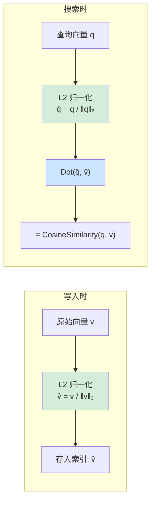

## 4. 距离度量

`DistanceMetric` 枚举定义了九种向量相似度计算方式：

| 度量类型 | 数学公式 | 值域 | 适用场景 | 预归一化 |
|---------|----------|------|---------|---------|
| `Cosine` | $\cos(\theta) = \frac{a \cdot b}{\|a\| \times \|b\|}$ | [-1, 1] | 文本嵌入、语义搜索 | ✅ 自动启用 |
| `Euclidean` | $\frac{1}{1 + \|a - b\|_2}$ | (0, 1] | 空间坐标、物理距离 | ❌ |
| `DotProduct` | $a \cdot b = \sum_i a_i b_i$ | $(-\infty, +\infty)$ | 已归一化向量、MIPS | ❌ |
| `Manhattan` | $\frac{1}{1 + \sum|a_i - b_i|}$ | (0, 1] | 稀疏特征、推荐系统 | ❌ |
| `Chebyshev` | $\frac{1}{1 + \max|a_i - b_i|}$ | (0, 1] | 特征偏差检测、棋盘距离 | ❌ |
| `Pearson` | $\frac{\sum(a_i-\bar{a})(b_i-\bar{b})}{\sqrt{\sum(a_i-\bar{a})^2 \sum(b_i-\bar{b})^2}}$ | [-1, 1] | 文本嵌入（去偏置）、TF-IDF、评分向量 | ❌ |
| `Hamming` | $1 - \frac{\text{不等元素数}}{n}$ | [0, 1] | 二值哈希码、LSH、SimHash/MinHash 指纹 | ❌ |
| `Jaccard` | $\frac{\sum\min(a_i,b_i)}{\sum\max(a_i,b_i)}$ | [0, 1] | BoW/TF-IDF 稀疏特征、直方图比较 | ❌ |
| `Canberra` | $1 - \frac{1}{n}\sum\frac{|a_i-b_i|}{|a_i|+|b_i|}$ | [0, 1] | 稀疏数据（权重敏感）、化学指纹 | ❌ |

### 4.1 Cosine 预归一化优化原理



**为什么 Dot 替代 Cosine 更快？**

- `CosineSimilarity(a, b)` = 一次点积 + 两次范数计算 = **3 次向量遍历**
- 预归一化后，`Dot(â, b̂)` = 一次点积 = **1 次向量遍历**
- 归一化开销在写入/查询时各只执行一次，搜索时对 N 个候选只做点积

**SIMD 加速实现**：

```csharp
// 使用内部 VectorMath 的 SIMD 优化实现
private static void NormalizeVector(ReadOnlySpan<float> source, Span<float> destination)
{
    var norm = VectorMath.Norm(source);    // SIMD 加速 L2 范数
    if (norm > 0f)
        VectorMath.Divide(source, norm, destination); // SIMD 加速向量除法
    else
        destination.Clear(); // 零向量安全处理，避免 NaN
}
```

### 4.2 度量选择建议

```csharp
// Cosine — 最常用，文本/语义搜索
[QuiverVector(384, DistanceMetric.Cosine)]
public float[] TextEmbedding { get; set; } = [];

// Euclidean — 关心绝对距离的场景（地理坐标、物理空间）
[QuiverVector(3, DistanceMetric.Euclidean)]
public float[] Position { get; set; } = [];

// DotProduct — 向量已预归一化或需要最大内积搜索 (MIPS)
[QuiverVector(128, DistanceMetric.DotProduct)]
public float[] Feature { get; set; } = [];

// Manhattan — 稀疏特征、推荐系统
[QuiverVector(256, DistanceMetric.Manhattan)]
public float[] SparseFeature { get; set; } = [];

// Hamming — 二值哈希码、LSH 指纹
[QuiverVector(64, DistanceMetric.Hamming)]
public float[] BinaryHash { get; set; } = [];
```

### 4.3 自定义相似度

实现 `ISimilarity<float>` 接口定义自定义度量，然后通过 `[QuiverVector]` 的 `CustomSimilarity` 属性指定。设置 `CustomSimilarity` 后，`metric` 参数将被忽略。

```csharp
// 1. 定义自定义相似度（readonly struct + ISimilarity<float>）
public readonly struct WeightedL1Similarity : ISimilarity<float>
{
    public static float Compute(ReadOnlySpan<float> x, ReadOnlySpan<float> y)
    {
        float sum = 0f;
        for (int i = 0; i < x.Length; i++)
            sum += MathF.Abs(x[i] - y[i]) * (i < 128 ? 2f : 1f); // 前 128 维权重 2倍
        return 1f / (1f + sum);
    }
}

// 2. 在实体上使用
public class MyEntity
{
    [QuiverKey]
    public string Id { get; set; } = string.Empty;

    [QuiverVector(256, CustomSimilarity = typeof(WeightedL1Similarity))]
    public float[] Embedding { get; set; } = [];
}
```

**要求**：
- 必须是实现 `ISimilarity<float>` 的 `readonly struct`
- 必须有公共无参构造函数（结构体默认满足）
- JIT 会在调用站点内联 `TSim.Compute()` —— 与内置度量零开销等价

### 4.4 相似度函数映射

框架内部根据度量类型解析对应的 `ISimilarity<float>` 实现。所有实现均使用 SIMD 加速计算：

| 度量 | PreNormalize | ISimilarity 类型 | SIMD 后端 |
|------|-------------|-----------------|----------|
| `Cosine` | `true` | `DotProductSimilarity` | `VectorMath.Dot` |
| `Cosine` (fallback) | `false` | `CosineSimilarity` | `VectorMath.CosineSimilarity` |
| `DotProduct` | `false` | `DotProductSimilarity` | `VectorMath.Dot` |
| `Euclidean` | `false` | `EuclideanSimilarity` | `VectorMath.Distance` |
| `Manhattan` | `false` | `ManhattanSimilarity` | `Vector<float>` 绝对差累加 |
| `Chebyshev` | `false` | `ChebyshevSimilarity` | `Vector<float>` 绝对差最大值追踪 |
| `Pearson` | `false` | `PearsonCorrelationSimilarity` | `VectorMath.Sum` + `Vector<float>` 去均值点积 |
| `Hamming` | `false` | `HammingSimilarity` | `Vector<float>` 等值掩码 + ConditionalSelect |
| `Jaccard` | `false` | `JaccardSimilarity` | `Vector<float>` Min/Max 累加 |
| `Canberra` | `false` | `CanberraSimilarity` | `Vector<float>` 加权除法 |
| (自定义) | 用户定义 | 用户的 `ISimilarity<float>` | 用户定义 |

---

