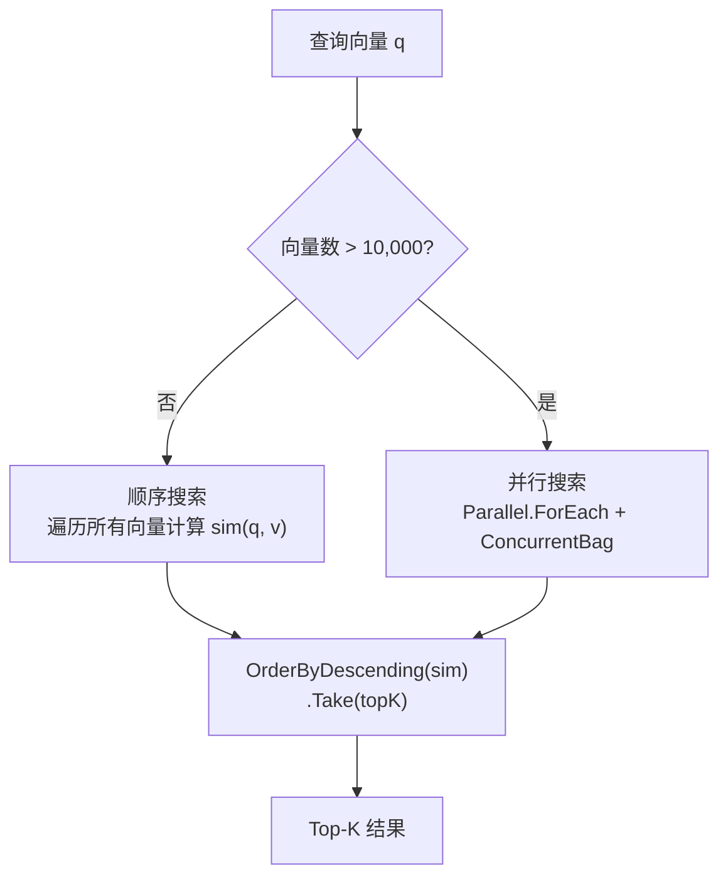
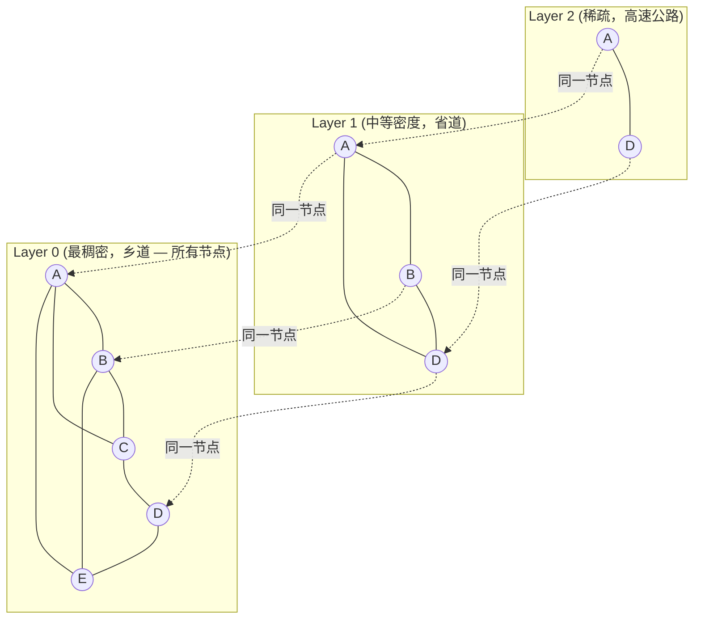
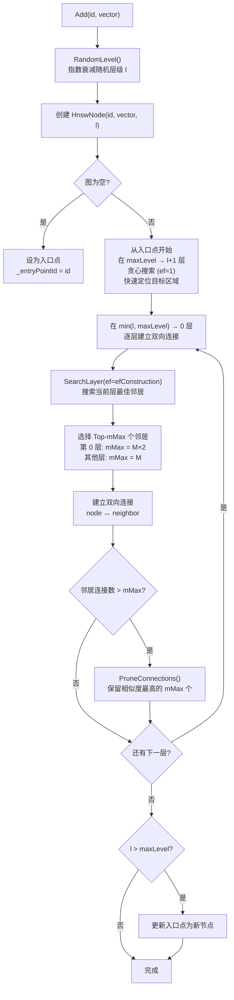
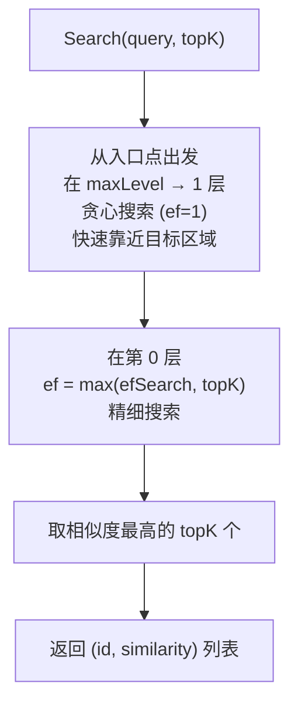
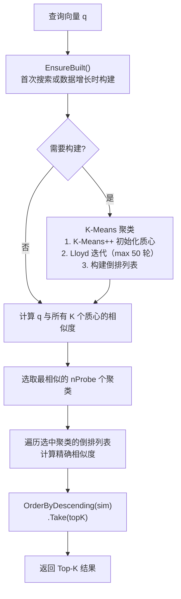
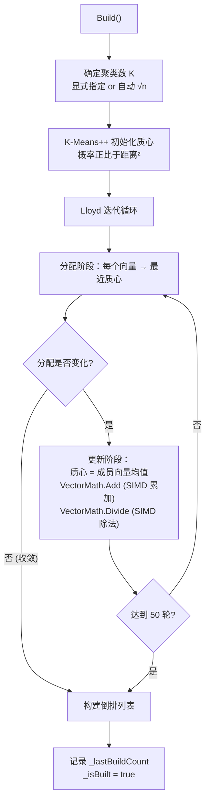
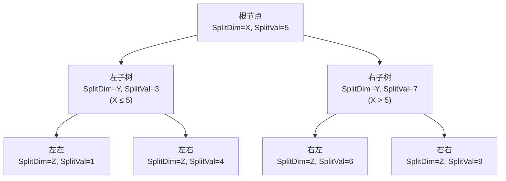
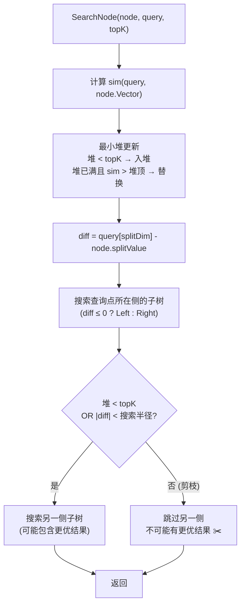
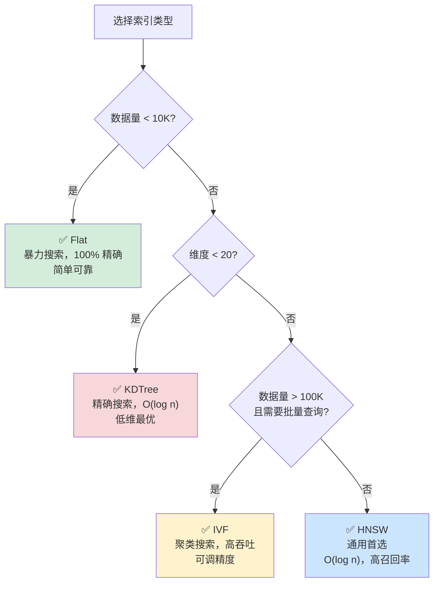

## 5. 索引类型

### 5.1 Flat（暴力搜索）

遍历所有向量计算相似度，结果 **100% 精确**，是默认索引类型。

| 属性 | 值 |
|------|-----|
| 实现类 | `FlatIndex` |
| 时间复杂度 | O(n × d) |
| 空间复杂度 | O(n × d) |
| 精确度 | 100% |
| 适合数据量 | < 10,000 |
| 并行阈值 | > 10,000 条时自动启用 `Parallel.ForEach` |



**搜索策略切换**：

```csharp
// 小数据量（≤ 10K）：顺序遍历更快，避免线程调度开销
private List<(int Id, float Similarity)> SequentialSearchCore(float[] query, int topK)
{
    var results = new List<(int Id, float Sim)>(_vectors.Count);
    foreach (var (id, vector) in _vectors)
        results.Add((id, similarityFunc(query, vector)));
    return results.OrderByDescending(r => r.Sim).Take(topK).ToList();
}

// 大数据量（> 10K）：Parallel.ForEach 多线程并行计算
private List<(int Id, float Similarity)> ParallelSearchCore(float[] query, int topK)
{
    var results = new ConcurrentBag<(int Id, float Similarity)>();
    Parallel.ForEach(_vectors, kvp =>
    {
        results.Add((kvp.Key, similarityFunc(query, kvp.Value)));
    });
    return results.OrderByDescending(r => r.Similarity).Take(topK).ToList();
}
```

```csharp
// 使用方式：默认索引，无需标记 [QuiverIndex]
[QuiverVector(128)]
public float[] Embedding { get; set; } = [];
```

### 5.2 HNSW（分层可导航小世界图）

多层近邻图结构，**近似搜索的通用首选**。类似"高速公路 → 省道 → 乡道"的分层导航。

| 属性 | 值 |
|------|-----|
| 实现类 | `HnswIndex` |
| 搜索复杂度 | O(log n) |
| 插入复杂度 | O(log n) × efConstruction |
| 空间复杂度 | O(n × M) |
| 适合数据量 | 10K ~ 10M |
| 删除策略 | 惰性删除（残留引用自动清理） |
| 持久化优化 | `SaveAsync` 写入 `IndexSnapshot`，加载时优先恢复图拓扑 |

#### HNSW 快照持久化

HNSW 图构建成本高于实体和向量的二进制读取成本。Quiver 会在全量保存时把 HNSW 拓扑写入 `SegmentKind.IndexSnapshot` 段，包含入口点、最大层级、节点层数、每层邻居列表和快照覆盖的 `NextId`。下一次 `LoadAsync()` 时，如果快照指纹与当前相似度、参数和有效维度匹配，就直接恢复图结构，并跳过已覆盖 id 的 `Add(id)` 重建。

该机制是自动的，无需额外配置。旧文件、损坏快照或参数不匹配时会安全回退到完整重建。快照只保存索引拓扑，不保存实体或向量副本，因此不会破坏 mmap 向量读取、非 InMemory 向量属性或 `[QuiverLargeField]` 大对象加载。

#### HNSW 分层结构



#### 插入算法流程



#### 搜索算法流程



**参数调优指南**：

| 参数 | 默认值 | 推荐范围 | 增大效果 | 减小效果 |
|------|--------|---------|---------|---------|
| `M` | 16 | 12 ~ 48 | ↑召回率 ↑内存 ↑构建时间 | ↓内存 ↓召回率 |
| `EfConstruction` | 200 | 100 ~ 500 | ↑图质量 ↓插入速度 | ↑插入速度 ↓图质量 |
| `EfSearch` | 50 | 50 ~ 500 | ↑召回率 ↓搜索速度 | ↑搜索速度 ↓召回率 |

> **`EfSearch` 可运行时动态调整**，无需重建索引：`hnswIndex.EfSearch = 200;`

```csharp
[QuiverVector(768, DistanceMetric.Cosine)]
[QuiverIndex(VectorIndexType.HNSW, M = 32, EfConstruction = 300, EfSearch = 100)]
public float[] Embedding { get; set; } = [];
```

### 5.3 IVF（倒排文件索引）

基于 **K-Means 聚类**划分向量空间，搜索时只探测最近的几个聚类。

| 属性 | 值 |
|------|-----|
| 实现类 | `IvfIndex` |
| 构建复杂度 | O(n × k × d × iter) |
| 搜索复杂度 | O(k × d + nProbe × n/k × d) |
| 适合数据量 | 100K+ |
| 构建方式 | 惰性（首次搜索时触发） |
| 自动重建 | 数据量增长 50% 后标记重建 |
| 质心初始化 | K-Means++ |
| 迭代算法 | Lloyd（最大 50 轮） |
| SIMD 加速 | 内部 `VectorMath.Add` / `VectorMath.Divide` |

#### IVF 搜索流程



#### K-Means 聚类构建



**参数调优**：

| 参数 | 默认值 | 推荐范围 | 说明 |
|------|--------|---------|------|
| `NumClusters` | 0（自动 √n） | √n ~ 4√n | 聚类数。增大 → 每个聚类更小 → 搜索更快但质心比较增多 |
| `NumProbes` | 10 | 1 ~ 20 | 探测聚类数。= 聚类总数时退化为暴力搜索 |

> **阈值搜索**时探测范围自动扩大为 `nProbe × 2`，降低因聚类划分导致的漏检。

```csharp
[QuiverVector(128, DistanceMetric.Cosine)]
[QuiverIndex(VectorIndexType.IVF, NumClusters = 100, NumProbes = 15)]
public float[] Feature { get; set; } = [];
```

### 5.4 KDTree（KD 树）

空间二叉划分树，**精确搜索**。沿各维度交替切分空间，利用剪枝跳过不可能的子树。

| 属性 | 值 |
|------|-----|
| 实现类 | `KDTreeIndex` |
| 搜索复杂度 | O(log n)（低维），O(n)（高维） |
| 精确度 | 100% |
| 适合维度 | < 20 维 |
| 构建方式 | 惰性（首次搜索触发全量重建） |
| 重建触发 | 每次 Add/Remove 后标记重建 |

#### KD-Tree 结构示意



#### 搜索剪枝策略



> ⚠️ **维度诅咒**：维度超过约 20 时，几乎每个子树都需要访问（剪枝失效），退化为 O(n)。高维场景应使用 HNSW。  
> ⚠️ **阈值搜索**退化为暴力遍历（KD-Tree 的剪枝难以直接应用于阈值搜索）。

```csharp
[QuiverVector(16, DistanceMetric.Euclidean)]
[QuiverIndex(VectorIndexType.KDTree)]
public float[] LowDimFeature { get; set; } = [];
```

### 5.5 索引选择决策指南



**综合对比表**：

| 维度 | Flat | HNSW | IVF | KDTree |
|------|------|------|-----|--------|
| 搜索速度 | O(n×d) | O(log n) | O(n/k×d) | O(log n) ~ O(n) |
| 精确度 | 100% | ~95-99%+ | ~90-99% | 100% |
| 插入速度 | O(1) | O(log n) | O(1)* | O(1)** |
| 内存 | n×d | n×(d+M) | n×d + k×d | n×d + 树结构 |
| 适合数据量 | <10K | 10K~10M | 100K+ | <10K (低维) |
| 适合维度 | 任意 | 任意 | 任意 | <20 |
| 构建方式 | 即时 | 即时 | 惰性 | 惰性 |
| 并行化 | ✅ >10K | ❌ | ❌ | ❌ |

> \* IVF 插入即时，但索引需重建  
> \*\* KDTree 插入即时，但树需重建

---

