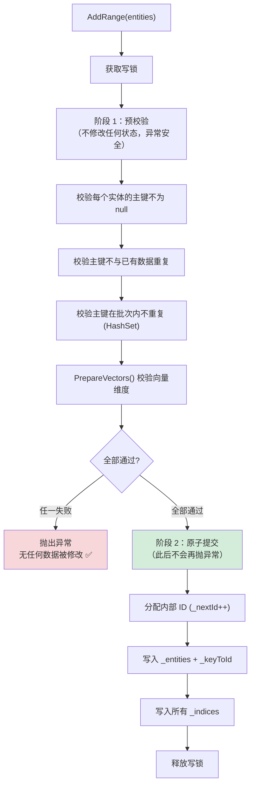

## 6. CRUD 操作

### 6.1 添加实体

```csharp
// 添加单个实体
db.Documents.Add(new Document
{
    Id = "doc-001",
    Title = "入门指南",
    Embedding = new float[384]
});

// 批量注册（原子语义：任一校验失败则全部回滚）
var batch = new List<Document>
{
    new() { Id = "doc-002", Title = "进阶教程", Embedding = new float[384] },
    new() { Id = "doc-003", Title = "最佳实践", Embedding = new float[384] },
};
db.Documents.AddRange(batch);

// 异步批量添加（CPU 密集计算卸载到线程池）
await db.Documents.AddRangeAsync(batch, cancellationToken);
```

#### `AddRange` 两阶段提交



### 6.2 插入或更新（Upsert）

在**单次写锁**内完成，比外部 `Remove + Add` 更高效且原子。

```csharp
db.Documents.Upsert(new Document
{
    Id = "doc-001",
    Title = "更新后的入门指南",
    Embedding = new float[384]
});
// 主键存在 → RemoveCore() + AddCore()
// 主键不存在 → 直接 AddCore()
```

### 6.3 删除实体

```csharp
// 按实体删除（通过主键匹配，非引用比较）
bool removed = db.Documents.Remove(entity);

// 按主键直接删除（无需持有实体引用）
bool removed = db.Documents.RemoveByKey("doc-001");
```

**删除内部流程**（`RemoveCore`）：

1. 通过 `_keyToId` 反查内部 ID
2. 从 `_entities` 字典移除实体
3. 从 `_keyToId` 字典移除主键映射
4. 从**所有** `_indices` 中移除向量（索引实现自行处理残留引用）

### 6.4 查找实体

```csharp
// 按主键查找，O(1) 复杂度（双层字典：主键 → 内部ID → 实体）
Document? doc = db.Documents.Find("doc-001");
```

### 6.5 存在性判断

```csharp
// 按主键判断，O(1) 复杂度（仅查 _keyToId 字典，比 Find 少一次字典查找）
bool exists = db.Documents.Exists("doc-001");

// 按条件判断，O(n) 最坏（读锁内遍历，命中即短路返回）
bool hasTutorial = db.Documents.Exists(e => e.Category == "教程");
```

**与其他方式的对比**：

| 方式 | 复杂度 | 内存分配 | 适用场景 |
|------|--------|---------|----------|
| `Exists(key)` | O(1) | 无 | 按主键判断 |
| `Exists(predicate)` | O(n) 短路 | 无 | 按属性条件判断 |
| `Find(key) != null` | O(1) | 无 | 需要同时获取实体时 |
| LINQ `.Any(predicate)` | O(n) | O(n) 快照 | 不推荐，会创建完整快照 |

> **性能提示**：`Exists(predicate)` 直接在读锁内遍历 `_entities.Values`，命中即返回，**不会创建快照数组**。相比 LINQ 的 `Any()` 走 `GetEnumerator()` 拍摄 O(n) 快照后再遍历，内存零分配且更快。

### 6.6 清空集合

```csharp
db.Documents.Clear();
// 清空 _entities + _keyToId + 所有索引
// 重置 _nextId = 0
```

### 6.7 获取信息

```csharp
int count = db.Documents.Count; // 线程安全（读锁）

// 查看向量字段元信息
foreach (var (name, dimensions) in db.Documents.VectorFields)
    Console.WriteLine($"字段: {name}, 维度: {dimensions}");
```

### 6.8 枚举与 LINQ 查询

`QuiverSet<TEntity>` 实现 `IEnumerable<TEntity>`，支持 `foreach` 循环和 LINQ 查询。

```csharp
// foreach 遍历所有实体
foreach (var doc in db.Documents)
    Console.WriteLine($"{doc.Id}: {doc.Title}");

// LINQ 过滤 + 排序
var tutorials = db.Documents
    .Where(e => e.Category == "教程")
    .OrderBy(e => e.Title)
    .ToList();

// LINQ 聚合
var categoryCount = db.Documents
    .GroupBy(e => e.Category)
    .Select(g => new { Category = g.Key, Count = g.Count() })
    .ToList();

// LINQ 条件计数
int tutorialCount = db.Documents.Count(e => e.Category == "教程");
```

**线程安全语义**：

枚举在**读锁内拍摄实体快照**（浅拷贝），释放锁后再逐一 `yield return`。这意味着：

- ✅ 枚举期间不持有锁，不会阻塞写操作
- ✅ 枚举期间的并发写操作不影响已拍摄的快照
- ✅ `foreach` body 中可以安全执行任意代码，无死锁风险
- ⚠️ 每次枚举都会创建一次 O(n) 的快照拷贝，大数据量场景注意性能

> **性能提示**：如果只需要按主键查找，使用 `Find(key)` 方法（O(1)）；如果需要向量相似度排序，使用 `Search(...)` 方法。`foreach` / LINQ 适合需要遍历全集或按非向量属性过滤的场景。

---

