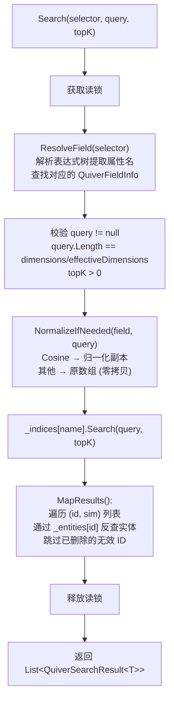
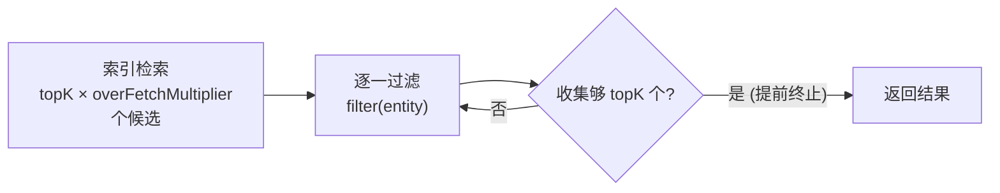

## 7. 向量搜索

### 7.1 Top-K 搜索

返回相似度最高的前 K 个实体，按相似度降序排列。

```csharp
float[] queryVector = GetEmbedding("搜索关键词");

var results = db.Documents.Search(
    vectorSelector: e => e.Embedding,  // 表达式树选择器
    queryVector: queryVector,
    topK: 10
);

foreach (var result in results)
{
    Console.WriteLine($"ID: {result.Entity.Id}");
    Console.WriteLine($"标题: {result.Entity.Title}");
    Console.WriteLine($"相似度: {result.Similarity:F4}");
}
```

**内部流程**：



### 7.2 阈值搜索

返回所有相似度不低于指定阈值的实体，结果数量不固定。

```csharp
var results = db.Documents.SearchByThreshold(
    vectorSelector: e => e.Embedding,
    queryVector: queryVector,
    threshold: 0.85f
);

Console.WriteLine($"找到 {results.Count} 个相似度 ≥ 0.85 的结果");
```

### 7.3 带过滤的搜索

支持**表达式过滤**和**委托过滤**两种方式。

```csharp
// 方式 1：表达式过滤
// ⚠️ 每次调用编译表达式树，开销 ~50μs
var results = db.Documents.Search(
    e => e.Embedding,
    queryVector,
    topK: 10,
    filter: e => e.Title.Contains("教程")
);

// 方式 2：委托过滤（推荐高频调用场景）
// 外部缓存编译后的委托，避免重复编译
Func<Document, bool> myFilter = e => e.Title.Contains("教程");
var results = db.Documents.Search(
    e => e.Embedding,
    queryVector,
    topK: 10,
    filter: myFilter,
    overFetchMultiplier: 4
);
```

#### 过采样策略



| `overFetchMultiplier` | 说明 |
|----------------------|------|
| 4（默认） | 适合过滤率 < 75% |
| 8~16 | 高过滤率场景（如按类别筛选） |
| 更大值 | 极端过滤率（如仅搜索特定标签） |

### 7.4 Top-1 搜索

搜索最相似的单个实体。内部优化路径：避免中间 `List` 分配，`MapTop1` 仅取第一个有效结果。

```csharp
var top1 = db.Documents.SearchTop1(
    e => e.Embedding,
    queryVector
);

if (top1 != null)
    Console.WriteLine($"最相似: {top1.Entity.Title} ({top1.Similarity:F4})");
else
    Console.WriteLine("未找到相似文档");
```

### 7.5 异步搜索

所有搜索方法均提供 `Async` 后缀重载，通过 `Task.Run` 将 CPU 密集计算卸载到线程池。这些方法是 CPU-bound 便利封装，不是真正的 I/O 异步。它们适合 UI 应用避免阻塞界面线程；在服务端高并发场景中，建议优先使用同步重载，并由调用方自行控制调度。取消令牌只在任务开始前生效；一旦进入同步搜索循环，不会中途打断。

```csharp
// 异步 Top-K
var results = await db.Documents.SearchAsync(
    e => e.Embedding, queryVector, topK: 10, cancellationToken);

// 异步带过滤
var results = await db.Documents.SearchAsync(
    e => e.Embedding, queryVector, topK: 10,
    filter: e => e.Category == "教程",
    overFetchMultiplier: 4, cancellationToken);

// 异步阈值搜索
var results = await db.Documents.SearchByThresholdAsync(
    e => e.Embedding, queryVector, threshold: 0.8f, cancellationToken);

// 异步 Top-1
var top1 = await db.Documents.SearchTop1Async(
    e => e.Embedding, queryVector, cancellationToken);
```

### 7.6 Half[] 查询重载

当向量字段类型为 `Half[]`（fp16）时，`Search` / `SearchByThreshold` / `SearchTop1` / `SearchAsync` 均提供专用重载，接受 `Half[]` 查询向量。查询向量在入口处一次性 widen 为 `float[]` 后复用相同的 float 搜索管线。

```csharp
// Half[] 查询重载
Half[] queryH = GetHalfEmbedding("搜索关键词");

var results = db.Docs.Search(
    e => e.Vec,        // Expression<Func<T, Half[]>>
    queryH,            // Half[] 查询向量
    topK: 10
);

// Top-1
var top1 = db.Docs.SearchTop1(e => e.Vec, queryH);

// 阈值搜索
var aboveThreshold = db.Docs.SearchByThreshold(e => e.Vec, queryH, threshold: 0.8f);

// 异步
var results = await db.Docs.SearchAsync(e => e.Vec, queryH, topK: 10);
```

**内部流程**：`Half[]` 查询向量 → `WidenQuery(Half[])` 转为 `float[]` → `NormalizeIfNeeded(...)` → 同 float 查询管线执行索引搜索。

> **设计说明**：`float[]` 查询重载不接受 `Half[]` 字段的 `Expression<Func<T, float[]>>`，因为字段属性类型不同。需要以 float 精度查询 Half 字段时，先手动转换再使用 `Half[]` 重载：
> ```csharp
> float[] qf = ...;
> var qh = Array.ConvertAll(qf, v => (Half)v);
> var r = db.Docs.Search(e => e.Vec, qh, topK: 5);
> ```

### 7.7 默认字段便捷方法

当实体仅有一个 `[QuiverVector]` 字段时，可省略 `vectorSelector` 参数。框架缓存 `_defaultField` 避免每次调用 `_vectorFields.First()`。

```csharp
// 单向量字段实体 — 省略 vectorSelector
var results = db.Documents.Search(queryVector, topK: 5);
var top1 = db.Documents.SearchTop1(queryVector);

// 异步版本
var results = await db.Documents.SearchAsync(queryVector, topK: 5);
var top1 = await db.Documents.SearchTop1Async(queryVector);
```

> ⚠️ 多向量字段实体调用默认方法时抛出 `InvalidOperationException("Entity has N vector fields. Use the overload with a vectorSelector expression.")`
> 
> ⚠️ **Half 字段不支持无 selector 的便捷方法**：默认字段机制仅适用于 `float[]` 字段。

---

