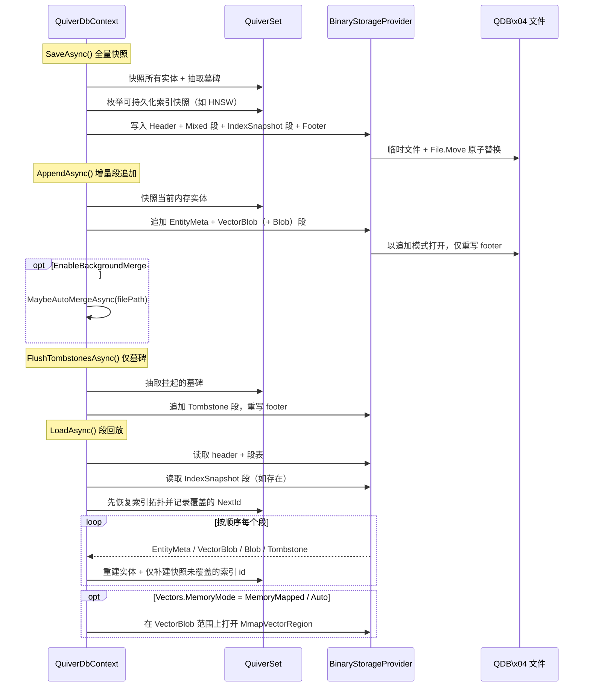
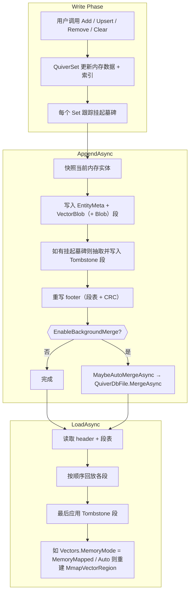

## 8. 持久化存储

### 8.1 保存与加载

Quiver 4.0 使用**段式二进制文件**（`QDB\x04`）作为唯一的主存储格式。WAL 已被移除，取而代之的是三个显式的持久化方法，覆盖从全量快照到增量写入的完整谱系：

```csharp
// 全量快照 —— 原子重写整个文件（临时文件 + File.Move）
await db.SaveAsync();
await db.SaveAsync(@"C:\backup\mydata.vdb");

// 增量追加 —— 把当前内存中的实体作为一个**新段**追加到现有 v4 文件，
// 仅重写 footer。磁盘开销 O(Δ)，无 WAL 那种内存翻倍问题。
await db.AppendAsync();

// 仅追加墓碑段 —— 把挂起的删除作为 Tombstone 段写入，不重写存活实体，
// 适合“只删不增”的批次。
await db.FlushTombstonesAsync();

// 加载 —— 读取 header + 段表，按顺序回放每段，最后应用墓碑；
// 当 Vectors.MemoryMode = MemoryMapped / Auto 时还会重新建立 mmap region。
await db.LoadAsync();
await db.LoadAsync(@"C:\backup\mydata.vdb");

// 导出 / 导入旁路（不参与主存储持久化）
await db.ExportAsync("backup.json", ExportFormat.Json);
await db.ImportAsync("backup.json", ExportFormat.Json);
await db.ExportAsync("backup.xml", ExportFormat.Xml);
```

> ⚠️ **`await using` 默认不会自动保存**：`DisposeAsync()` 只有在 `QuiverDbOptions.SaveOnDispose = true` 时才会对当前内存状态执行一次完整的 `SaveAsync()`。批量入库管线使用 `AppendAsync()` + `Clear()` 释放内存时，建议使用同步 `using` 并显式调用 `AppendAsync` / `SaveAsync`，避免启用自动保存后用空快照覆盖刚追加的段。

#### 持久化内部流程



### 8.2 存储架构

Quiver 4.0 的主存储持久化是**二进制独占**的，JSON / XML 仅作为导出/导入旁路。

| 角色 | 实现 | 说明 |
|------|------|------|
| **主存储** | `BinaryStorageProvider`（v4 `QDB\x04`） | `SaveAsync` / `LoadAsync` / `AppendAsync` / `FlushTombstonesAsync` 均使用此路径。段式格式，每段 CRC32，`MemoryMarshal` 零拷贝 |
| **文件工具** | `QuiverDbFile` 静态类 | `InspectAsync`（版本 + 段表 + CRC 校验）与 `MergeAsync`（多文件合并，支持 `Append` / `FirstWriterWins` / `LastWriterWins` 三种策略） |
| **mmap 视图** | `MmapVectorRegion` | 在 `VectorBlob` 段上的只读 `MemoryMappedFile` 视图，由 `MmapVectorStore` 在 `Vectors.MemoryMode = MemoryMapped / Auto` 时使用 |
| **导出 / 导入** | `JsonExportProvider` | 可读 JSON，调试与互操作 |
| **导出 / 导入** | `XmlExportProvider` | Base64 向量的 XML，兼容性场景 |

```csharp
// 不加载文件就检查它的版本与段表
var info = await QuiverDbFile.InspectAsync("mydata.vdb", verifyCrc: true);
foreach (var seg in info.Segments)
    Console.WriteLine($"{seg.Kind} offset={seg.Offset} size={seg.Size} crc={(seg.CrcOk ? "OK" : "FAIL")}");

// 合并多个文件，按主键去重
await QuiverDbFile.MergeAsync(
    sources: ["shard-0.vdb", "shard-1.vdb", "shard-2.vdb"],
    destination: "merged.vdb",
    options: new MergeOptions { ConflictPolicy = MergeConflictPolicy.LastWriterWins },
    typeMap: db.GetTypeMap());
```

### 8.3 JSON 导出格式详解

仅通过 `ExportAsync` / `ImportAsync` 使用，不参与主存储持久化。输出结构：

```json
{
  "MyNamespace.FaceFeature": [
    { "personId": "P001", "name": "Alice", "embedding": [0.1, 0.2, ...] },
    { "personId": "P002", "name": "Bob", "embedding": [0.3, 0.4, ...] }
  ]
}
```

- JSON 选项（`WriteIndented`、命名策略）直接传给 `ExportAsync`
- 默认 `WriteIndented = true` + `CamelCase`
- 导入时使用 `JsonDocument` DOM 逐元素反序列化
- 未知的类型名自动跳过（向前兼容）

### 8.4 XML 导出格式详解

仅通过 `ExportAsync` / `ImportAsync` 使用，不参与主存储持久化。输出结构：

```xml
<?xml version="1.0" encoding="utf-8"?>
<QuiverDb version="1">
  <Set type="FaceFeature" count="2">
    <Entity>
      <PersonId>P001</PersonId>
      <Name>Alice</Name>
      <Embedding>Base64EncodedBytes...</Embedding>
    </Entity>
  </Set>
</QuiverDb>
```

- 向量数据使用 **Base64 编码**（`MemoryMarshal.AsBytes` → `Convert.ToBase64String`），紧凑且无精度损失
- DateTime 使用 **ISO 8601 往返格式**（`"O"`）
- 数字值使用 `CultureInfo.InvariantCulture`，确保跨地区一致性

### 8.5 v4 段式文件格式（主存储）

Quiver 4.0 使用**段式**二进制容器。文件由一系列有类型的段构成，末尾是顶层 footer；footer 列出每个段的类型、字节范围和 CRC32。

```
┌─ 文件头 ──────────────────────────────────────────────────
│  Magic: "QDB\x04" (4B)              ← v4 标识（v1–v3 旧文件读取时也被接受）
├─ Segment × N ─────────────────────────────────────────────
│  [Kind 1B]  Mixed / EntityMeta / VectorBlob / Blob / Tombstone / IndexSnapshot
│  [Length u64]                       ← 有效载荷字节数
│  [Payload …]                        ← 各类型对应的内容
│  [CRC32 u32]                        ← 覆盖有效载荷
├─ Footer（顶层）───────────────────────────────────────────
│  [SegmentTable]   (offset, length, kind, crc) × N
│  [Trailer Magic + Footer offset/length + CRC]
└───────────────────────────────────────────────────────────
```

**段类型（`SegmentKind`）**：

| Kind | 内容 | 写入者 |
|------|------|--------|
| `Mixed` | EntityMeta + VectorBlob（+ Blob），单段完整表达一个类型 | `SaveAsync` |
| `EntityMeta` | 仅属性记录（键 + 标量字段 + 向量引用） | `AppendAsync`（拆分路径） |
| `VectorBlob` | 原始 `float[]` 连续布局，mmap 友好 | `AppendAsync`（拆分路径） |
| `Blob` | `[QuiverLargeField] byte[]` 有效载荷，位于 `EntityMeta` 之外 | `AppendAsync` / `SaveAsync` |
| `Tombstone` | 删除记录（类型 + 键），加载时过滤 | `FlushTombstonesAsync` / `AppendAsync` |
| `IndexSnapshot` | 可选索引拓扑快照，目前由 HNSW 使用 | `SaveAsync` |

#### HNSW `IndexSnapshot` 段

`SaveAsync()` 会为支持快照的索引写出 `IndexSnapshot` 段。HNSW 快照包含图入口点、最大层级、每个节点的层数和邻居列表，以及快照覆盖的 `NextId`。加载时，如果快照与当前相似度类型、HNSW 参数和有效维度匹配，`LoadAsync()` 会先恢复图拓扑，再跳过已覆盖 id 的 `index.Add(id)`，只补建新增段或未覆盖段。

快照是纯优化：旧文件没有快照、快照 CRC 失败、参数不匹配或索引类型不支持快照时，自动回退到原来的重建流程。快照不保存实体数据或向量副本，因此不会改变非 InMemory 向量、`[QuiverLargeField]` 大对象或 mmap 向量读取的语义。

**支持的属性 TypeCode**（用于 `EntityMeta` / `Mixed` 内部）：

| TypeCode | CLR 类型 | 存储方式 |
|----------|---------|---------|
| 0 | `string` | BinaryWriter.Write（长度前缀） |
| 1 | `int` | 4 字节 |
| 2 | `long` | 8 字节 |
| 3 | `float` | 4 字节 |
| 4 | `double` | 8 字节 |
| 5 | `bool` | 1 字节 |
| 6 | `DateTime` | ToBinary() → 8 字节 |
| 7 | `Guid` | 16 字节 |
| 8 | `decimal` | 16 字节 |
| 9 | `float[]` | [length int32] + [原始字节零拷贝] |
| 10 | `string[]` | [length int32] + [逐元素字符串] |
| 11 | `byte` | 1 字节 |
| 12 | `short` | 2 字节 |
| 13 | `Half` | 2 字节（半精度浮点，ML/AI 常见） |
| 14 | `DateTimeOffset` | [Ticks int64] + [OffsetMinutes int16] = 10 字节 |
| 15 | `TimeSpan` | Ticks → 8 字节 |
| 16 | `byte[]` | [length int32] + [原始字节] |
| 17 | `double[]` | [length int32] + [原始字节零拷贝] |
| 18 | `ushort` | 2 字节 |
| 19 | `uint` | 4 字节 |
| 20 | `ulong` | 8 字节 |
| 21 | `sbyte` | 1 字节 |
| 22 | `char` | 以 UInt16 存储，2 字节 |
| 23 | `DateOnly` | DayNumber → 4 字节 |
| 24 | `TimeOnly` | Ticks → 8 字节 |
| 25 | `ushort[]` | [length int32] + [原始字节零拷贝] |
| 26 | `uint[]` | [length int32] + [原始字节零拷贝] |
| 27 | `ulong[]` | [length int32] + [原始字节零拷贝] |
| 28 | `sbyte[]` | [length int32] + [原始字节零拷贝] |
| 29 | _（保留）_ | 曾用于 `char[]`，已移除：`char[]` 语义与 `string` 重叠，请改用 `string` |
| 30 | `DateOnly[]` | [length int32] + [逐元素 DayNumber int32] |
| 31 | `TimeOnly[]` | [length int32] + [逐元素 Ticks int64] |
| 32 | `short[]` | [length int32] + [原始字节零拷贝] |
| 33 | `int[]` | [length int32] + [原始字节零拷贝] |
| 34 | `long[]` | [length int32] + [原始字节零拷贝] |
| 35 | `bool[]` | [length int32] + [每元素 1 字节] |
| 36 | `Half[]` | [length int32] + [原始字节零拷贝，每元素 2 字节] |

> 类型**不在**上表中的属性（例如 `int?` 等可空值类型、`List<T>` 等泛型集合、自定义/复杂类型）**不受支持**。持久化此类属性会在首次 `SaveAsync()` 时抛出 `NotSupportedException`，错误信息会指明出错的实体、属性，并列出全部受支持类型。

### 8.6 增量追加模式（v4 段式持久化）

4.0 中 WAL 子系统已被**彻底移除**。增量持久化现在直接在文件层面表达：每次保存调用写入一个或多个新段，并只重写 footer。

#### 三种持久化粒度对比

| 维度 | `SaveAsync()` | `AppendAsync()` | `FlushTombstonesAsync()` |
|------|---------------------------------|-----------------|--------------------------|
| 持久化内容 | 所有存活实体，单个 `Mixed` 段 | 当前内存实体的新 `EntityMeta` + `VectorBlob`（+ `Blob`）段 | 仅挂起删除的 `Tombstone` 段 |
| 磁盘复杂度 | O(N)（全量重写） | O(Δ)（段追加） | O(Δ)（墓碑追加） |
| 文件写入策略 | 临时文件 + `File.Move` 原子替换 | 打开已有文件，追加 + 重写 footer | 同 `AppendAsync` |
| 内存特征 | 单一内存镜像 | 无双缓冲；mmap 友好 | 极小 |
| 典型场景 | 初始保存、定期碎片整理 | 流式 / 批量入库 | 删除密集型工作负载 |

#### 后台自动合并

当 `EnableBackgroundMerge = true` 时，每次 `AppendAsync` 和 `FlushTombstonesAsync` 调用结束后都会执行一次 `MaybeAutoMergeAsync` 检查，满足条件时触发 `QuiverDbFile.MergeAsync` 进行进程内合并：

| 选项 | 默认值 | 含义 |
|------|--------|------|
| `EnableBackgroundMerge` | `false` | 自动合并总开关 |
| `AutoMergeMaxSegments` | `32` | 活跃段数超过此值时触发合并 |
| `AutoMergeTombstoneRatio` | `0.25` | 墓碑与存活实体之比超过此值时触发合并 |

#### 工作流



#### 崩溃恢复安全性

- 每个段都携带自己的 CRC32；加载时任何段校验失败，回放即在该处停止，文件的剩余部分被视为截断/未提交。
- footer 最后写入，且是原子操作；半途中断的追加永远不会破坏已提交的段。
- `QuiverDbFile.InspectAsync(path, verifyCrc: true)` 可在不修改文件的情况下生成逐段健康报告。

#### 多文件合并

```csharp
await QuiverDbFile.MergeAsync(
    sources: ["a.vdb", "b.vdb", "c.vdb"],
    destination: "merged.vdb",
    options: new MergeOptions
    {
        ConflictPolicy = MergeConflictPolicy.LastWriterWins,   // 或 FirstWriterWins / Append
    },
    typeMap: db.GetTypeMap());
```

`Append` 按原样保留所有条目；`FirstWriterWins` / `LastWriterWins` 按主键去重。

---

