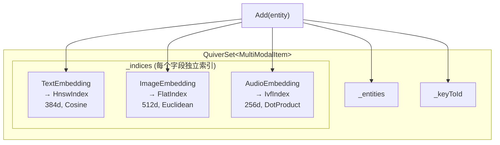

## 10. 多向量字段支持

一个实体可标记多个 `[QuiverVector]` 属性，每个字段**独立维护索引**，支持不同的维度、度量和索引策略。

### 10.1 定义多向量实体

```csharp
public class MultiModalItem
{
    [QuiverKey]
    public string Id { get; set; } = string.Empty;

    public string Title { get; set; } = string.Empty;
    public string Category { get; set; } = string.Empty;
    public bool IsPublished { get; set; }

    [QuiverVector(384, DistanceMetric.Cosine)]
    [QuiverIndex(VectorIndexType.HNSW, M = 32, EfConstruction = 200, EfSearch = 100)]
    public float[] TextEmbedding { get; set; } = [];

    [QuiverVector(512, DistanceMetric.Cosine)]
    [QuiverIndex(VectorIndexType.HNSW, M = 24, EfConstruction = 200, EfSearch = 80)]
    public float[] ImageEmbedding { get; set; } = [];
}
```

### 10.2 内部结构



### 10.3 分字段搜索

```csharp
// 按文本向量搜索
var textResults = db.Items.Search(e => e.TextEmbedding, textQuery, topK: 5);

// 按图像向量搜索
var imageResults = db.Items.Search(e => e.ImageEmbedding, imageQuery, topK: 5);

// 按音频向量搜索
var audioResults = db.Items.Search(e => e.AudioEmbedding, audioQuery, topK: 5);

// 三个字段的搜索结果互相独立（不同向量空间）
```

### 10.4 查看向量字段信息

```csharp
foreach (var (name, dimensions) in db.Items.VectorFields)
    Console.WriteLine($"字段: {name}, 维度: {dimensions}");
// 输出：
// 字段: TextEmbedding, 维度: 384
// 字段: ImageEmbedding, 维度: 512
// 字段: AudioEmbedding, 维度: 256
```

### 10.5 可空向量字段（Nullable）

通过 `Nullable = true` 标记允许向量字段为 `null`。适用于并非所有实体都具有某个特征的场景——例如图片集合中只有部分图片包含人脸。

#### 定义可空向量实体

```csharp
public class ImageEntity
{
    [QuiverKey]
    public string Id { get; set; } = string.Empty;

    public string FileName { get; set; } = string.Empty;

    /// <summary>图像整体特征向量（必填）</summary>
    [QuiverVector(512, DistanceMetric.Cosine)]
    public float[] ImageEmbedding { get; set; } = [];

    /// <summary>人脸特征向量（可空，无人脸时为 null）</summary>
    [QuiverVector(128, DistanceMetric.Cosine, Nullable = true)]
    public float[]? FaceEmbedding { get; set; }
}
```

#### 行为语义

| 操作 | `FaceEmbedding = null` 时 | `FaceEmbedding` 有值时 |
|------|--------------------------|----------------------|
| `Add` / `Upsert` | 实体正常写入，**不加入** FaceEmbedding 索引 | 正常校验维度并加入索引 |
| `Search(e => e.FaceEmbedding, ...)` | 该实体**不会出现**在结果中 | 正常参与相似度计算 |
| `Search(e => e.ImageEmbedding, ...)` | 正常参与搜索 | 正常参与搜索 |
| `Remove` | 所有索引静默移除 | 正常移除 |

#### 使用示例

```csharp
await using var db = new ImageDb();
await db.LoadAsync();

// 写入：有人脸的图片
db.Images.Add(new ImageEntity
{
    Id = "img-001",
    FileName = "portrait.jpg",
    ImageEmbedding = GetImageEmbedding("portrait.jpg"),
    FaceEmbedding = GetFaceEmbedding("portrait.jpg") // 检测到人脸
});

// 写入：无人脸的风景照（FaceEmbedding 为 null）
db.Images.Add(new ImageEntity
{
    Id = "img-002",
    FileName = "landscape.jpg",
    ImageEmbedding = GetImageEmbedding("landscape.jpg"),
    FaceEmbedding = null // 无人脸，Nullable 字段允许 null
});

// 按图像搜索 — 两张图片都参与
var allResults = db.Images.Search(e => e.ImageEmbedding, imageQuery, topK: 10);
// allResults 可能包含 img-001 和 img-002

// 按人脸搜索 — 只有有人脸的图片参与
var faceResults = db.Images.Search(e => e.FaceEmbedding, faceQuery, topK: 10);
// faceResults 只可能包含 img-001，img-002 不在 FaceEmbedding 索引中
```

> ⚠️ **注意**：非 Nullable 的向量字段（默认）如果传入 `null`，会抛出 `ArgumentNullException` 并给出明确的提示信息：  
> `"Vector field 'FieldName' is required but was null or empty. Mark [QuiverVector(Nullable = true)] to allow null."`

---

