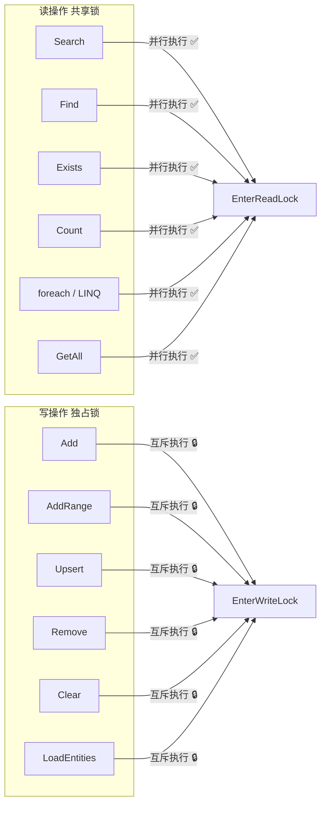

## 11. 线程安全与并发

### 11.1 锁模型

`QuiverSet<TEntity>` 内部使用 `ReaderWriterLockSlim` 实现读写分离：



### 11.2 并发安全示例

```csharp
var db = new MyDocumentDb();

// ✅ 安全：多线程并发搜索（读锁共享）
var tasks = Enumerable.Range(0, 24).Select(_ => Task.Run(() =>
{
    var query = GenerateRandomVector(384);
    return db.Documents.Search(e => e.Embedding, query, topK: 5);
}));
await Task.WhenAll(tasks);

// ✅ 安全：读写并发（写操作持有独占锁时，读操作等待）
var writerTask = Task.Run(() =>
{
    db.Documents.Upsert(new Document
    {
        Id = "new-doc",
        Title = "新文档",
        Embedding = new float[384]
    });
});

var readerTask = Task.Run(() =>
    db.Documents.Search(e => e.Embedding, queryVector, topK: 5));

await Task.WhenAll(writerTask, readerTask);
```

### 11.3 Dispose 线程安全

`QuiverSet` 使用 `Interlocked.Exchange(ref _disposed, 1)` 保证并发 Dispose 安全。所有操作入口调用 `ThrowIfDisposed()`，使用 `Volatile.Read` 保证跨线程可见性。

### 11.4 并发性能参考

| 测试场景 | 数据量 | 配置 | 结果 |
|---------|--------|------|------|
| 纯读并发 | 3,000 条 × 3 向量 | 24 线程 × 100 次搜索 | 2,400 次零异常 |
| 读写混合 | 1,000 条 × 3 向量 | 4 写 + 8 读 + 2 删除，3 秒 | 零异常 |
| 批量写 + 搜索 | 动态增长 | 3 写线程 (每批 50 条) + 6 搜索线程，3 秒 | 零异常 |

---

