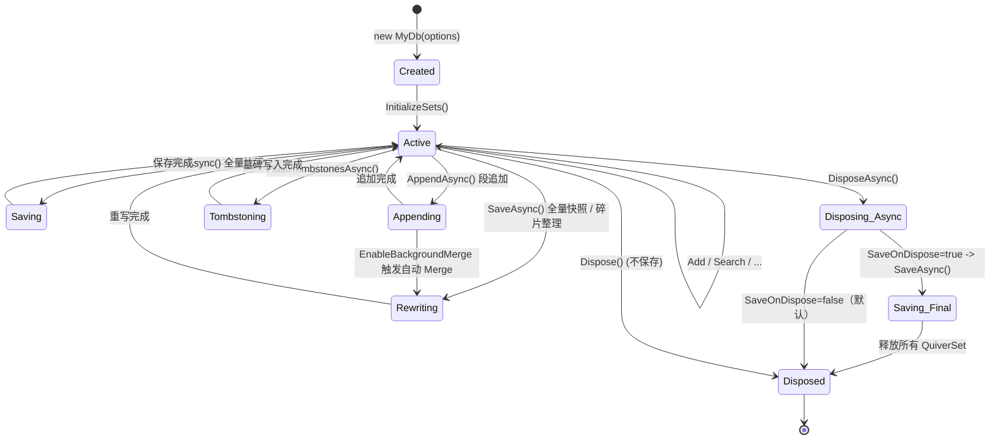

## 12. 生命周期管理

### 12.1 QuiverDbContext 生命周期



| 释放方式 | 自动保存 | 行为 | 推荐场景 |
|---------|---------|------|--------|
| `Dispose()` | ❌ 不保存 | 仅释放资源 | 需要手动控制保存时机 / 分阶段 `AppendAsync` 批量入库 |
| `DisposeAsync()` | ❌ 默认不保存 | 仅释放资源；只有 `SaveOnDispose = true` 时才先调用 `SaveAsync()` | 显式 `SaveAsync()` 后释放 / 分阶段 `AppendAsync` 批量入库 |

> ⚠：在批量 `AppendAsync()` + `Clear()` 释放内存的管线中，建议使用同步 `using` 并显式控制 `AppendAsync` / `SaveAsync`。`DisposeAsync` 只有在 `SaveOnDispose = true` 时才会自动 `SaveAsync()`，此时可能用空快照覆盖刚刚追加的段。

### 12.2 推荐用法

```csharp
// ✅ 交互式：显式保存后释放
await using var db = new MyDocumentDb();
await db.LoadAsync();
db.Documents.Add(new Document { ... });
await db.SaveAsync();
// 作用域结束 → DisposeAsync → Dispose 所有资源

// ✅ 批量入库（分阶段 Append + Clear）：用同步 using。
using var bulkDb = new MyDocumentDb();
await bulkDb.LoadAsync();
foreach (var batch in batches)
{
    bulkDb.Documents.AddRange(batch);
    await bulkDb.AppendAsync();   // 仅追加本批，O(Δ)
    bulkDb.Documents.Clear();     // 释放内存，不影响磁盘段
}
await bulkDb.SaveAsync();         // 可选的碎片整理

// 手动控制方式
var db2 = new MyDocumentDb();
try
{
    db2.Documents.Add(new Document { ... });
    await db2.SaveAsync();        // 手动全量保存
}
finally
{
    db2.Dispose();                // 仅释放资源，不保存
}
```

### 12.3 QuiverSet 释放

`QuiverSet` 实现 `IDisposable`，释放内部的 `ReaderWriterLockSlim`。释放后所有操作抛出 `ObjectDisposedException`。

---

